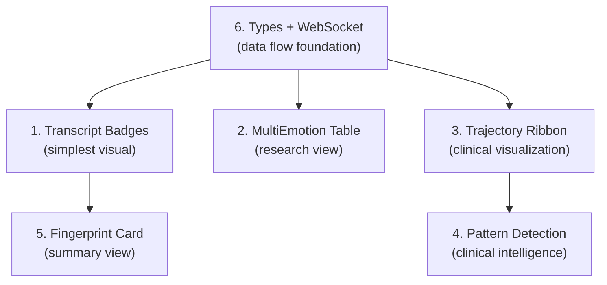

# Making Octonion Dimensions *Useful* — Integration Plan

## The Core Problem

Right now, the octonion dimensions are **plumbing without faucets**. We have:
- ✅ Math engine (SLERP, angular distance)
- ✅ WebGL shells (Coping, Velocity, Novelty)
- ✅ Fano HUD (dimension map)
- ✅ LLM prompt (extracts Depth, Coping, Velocity, Novelty)
- ✅ DB column (stores them)

But the data doesn't flow *through* the interface yet. Here's where it should.

---

## Clinical Journeys That Highlight 8D Value

These three scenarios show why 7 dimensions reveal things 3 dimensions can't:

### Journey 1: "I'm fine" → Hidden Crisis

> **Patient says**: "Yeah, I'm doing okay. Everything's fine."  
> **3D VAC**: Valence +0.1, Arousal -0.2, Connection +0.1 → Looks neutral/calm ✅  
> **7D Octonion**: Depth **+0.8**, Coping **-0.7**, Velocity **-0.9**, Novelty **-0.6**  
> **Clinical insight**: This "fine" is **profoundly felt** (deep), the person feels **helpless** (low coping), **stuck** (frozen velocity), and this is a **familiar pattern** (low novelty). This is clinical depression hiding in neutral VAC.

Without the extended dimensions, this looks like a healthy session. With them, it's a red flag.

### Journey 2: First-Time Grief vs. Chronic Grief

> **Same VAC**: Valence -0.8, Arousal -0.3, Connection +0.7  
> **First-time grief**: Depth +0.9, Coping -0.4, Velocity +0.3, **Novelty +0.8**  
> **Chronic grief**: Depth +0.9, Coping -0.4, Velocity **-0.8**, **Novelty -0.9**  

Same position in 3D space, completely different clinical picture. One needs acute support, the other needs pattern-breaking interventions.

### Journey 3: Anxiety → Empowerment Arc

> **Start**: Anxiety — V:-0.4, A:+0.7, C:+0.2 | D:0.3, **P:-0.6**, Ė:0.1, N:0.4  
> **Mid**: Determination — V:+0.2, A:+0.6, C:+0.5 | D:0.5, **P:+0.2**, Ė:0.4, N:0.2  
> **End**: Confidence — V:+0.7, A:+0.3, C:+0.8 | D:0.4, **P:+0.8**, Ė:-0.3, N:-0.2  

The **coping dimension** tells the therapist's story: the patient went from helpless → agency → empowered. The VAC alone misses this arc.

---

## 6 Integration Points (Priority Order)

### 1. 🎯 Session Transcript — Extended Dimension Badges

**Where**: [session detail page](file:///Users/jrgochan/code/github.com/jrgochan/l_o_v_e/experience/web/app/admin/sessions/detail/page.tsx) — the per-message emotion display (line 168)

**What**: Below the existing "Emotion" + "Certainty" row for each message, add a compact 4-bar indicator strip showing Depth, Coping, Velocity, Novelty.

**Why**: This is where clinicians **read conversations**. Seeing the extended dimensions inline gives immediate context without switching views.

**Design**:
```
┌─────────────────────────────────────┐
│ Emotion: Anxiety (85%)              │
│ VAC: V:-0.4  A:+0.7  C:+0.2        │
│ ──────────────────────────────────  │
│ D ████░░░░ +0.3   P ██░░░░░░ -0.6  │
│ Ė ███░░░░░ +0.1   N █████░░░ +0.4  │
└─────────────────────────────────────┘
```

---

### 2. 📊 Multi-Emotion Table — Extended Column

**Where**: [MultiEmotionTable.tsx](file:///Users/jrgochan/code/github.com/jrgochan/l_o_v_e/experience/web/components/admin/clinical/MultiEmotionTable.tsx) — the sortable clinical table

**What**: Add an "Extended" column (collapsible) showing D/P/Ė/N as colored mini-bars. Include in CSV export.

**Why**: This is the **research-grade** view. Clinicians and researchers who want to sort by coping or filter by novelty need it here.

**Design**: New column between "VAC Coordinates" and "Voice Match":
```
│ Extended (D, P, Ė, N) │
│ D: +0.3  P: -0.6      │
│ Ė: +0.1  N: +0.4      │
```

Also extend the expanded row's "VAC Interpretation" with 4 more cards for the new dimensions.

---

### 3. 📈 VAC Trajectory Plot — Coping Ribbon

**Where**: [VACTrajectoryPlot.tsx](file:///Users/jrgochan/code/github.com/jrgochan/l_o_v_e/experience/web/components/admin/clinical/VACTrajectoryPlot.tsx) — the 2D emotional journey chart

**What**:
1. Add **coping as ribbon width** on the trajectory line (wider = empowered, thinner = helpless)
2. Add **novelty as dashed vs solid** (novel = dashed, familiar = solid)
3. Extended hover tooltip: show D, P, Ė, N alongside V, A, C
4. New clinical pattern: "Coping Collapse" (sudden drop in P dimension)
5. Summary stats: add Coping Change and Depth Change alongside existing Valence/Arousal change

**Why**: The trajectory is the **most important clinical visualization**. Encoding coping and novelty visually transforms it from "where feelings moved" to "how agency and familiarity evolved."

---

### 4. 🧠 Clinical Pattern Detection — 4 New Patterns

**Where**: [VACTrajectoryPlot.tsx](file:///Users/jrgochan/code/github.com/jrgochan/l_o_v_e/experience/web/components/admin/clinical/VACTrajectoryPlot.tsx) detectPatterns() + [SessionMetrics.tsx](file:///Users/jrgochan/code/github.com/jrgochan/l_o_v_e/experience/web/components/admin/clinical/SessionMetrics.tsx)

**What**: Four new clinically meaningful pattern detections:

| Pattern | Condition | Clinical Meaning |  
|---------|-----------|------------------|
| 🛡️ Coping Collapse | P drops > 0.5 in 2 messages | Sudden loss of agency |
| 🧊 Emotional Freezing | Velocity < -0.5 for 3+ messages | Stuck/frozen pattern |
| 🆕 Novel Distress | Novelty > 0.6 AND Valence < -0.3 | First-time difficult emotion |
| 🔄 Habitual Loop | Novelty < -0.5 for 3+ messages | Familiar negative spiral |

**Why**: These are clinical insights that **only octonion data can provide**. They're the answer to "why should I care about 8 dimensions?"

---

### 5. 🔮 Aggregate State Card — "Emotional Fingerprint"

**Where**: [ClinicalPortal.tsx](file:///Users/jrgochan/code/github.com/jrgochan/l_o_v_e/experience/web/components/admin/clinical/ClinicalPortal.tsx), new component

**What**: A compact "Emotional Fingerprint" card showing the current 7D state as a radar/spider chart with labeled axes (V, A, C, D, P, Ė, N). This replaces the flat "aggregate VAC" with a full 7D portrait.

**Design**:
```
🔮 Emotional Fingerprint
┌────────────────────────┐
│      V(+0.2)           │
│    /    \              │
│  N(-0.3)--A(+0.7)      │
│  |   ⬡   |            │  (7-sided radar chart)
│  P(-0.6)--C(+0.2)      │
│    \    /              │
│      D(+0.3)           │
│                        │
│  Ė: +0.1 (stable)     │
└────────────────────────┘
```

**Why**: The radar chart makes the 7D state instantly scannable. A collapsing coping spike or a high depth/low novelty pattern becomes visually obvious.

---

### 6. 💬 Chat WebSocket — Extended Dimensions in Real-Time

**Where**: [chat.ts types](file:///Users/jrgochan/code/github.com/jrgochan/l_o_v_e/experience/web/types/chat.ts) — `DetectedEmotion`, `AggregateState`, `ServerMessage`

**What**:
1. Add `extended?: { depth: number; coping: number; velocity: number; novelty: number }` to `DetectedEmotion`
2. Add `extended?: ...` to `AggregateState` and `VACHistoryPoint`
3. Add `extended` to the `analysis` ServerMessage type
4. Update `useExperienceStore.setOctonionExtended()` to be called when WebSocket receives extended data

**Why**: This connects the LLM extraction pipeline to the frontend store, making ALL of the above visualizations live. Without this, the extended dimensions are static.

---

## Implementation Order



> [!IMPORTANT]
> **Item 6 (types + WebSocket) must come first** — it's the data plumbing that everything else reads from. Without it, items 1-5 have no data to display.

## Open Questions

> [!WARNING]
> 1. **Should extended dimensions appear in the user-facing chat UI too**, or only in the clinician/admin views? Showing "you scored -0.6 on coping" to a user might be harmful without proper framing.

> [!IMPORTANT]
> 2. **Do you want all 6 integration points**, or should we prioritize a subset? I'd recommend starting with items 6 → 1 → 3 → 4 (WebSocket + Transcript + Trajectory + Patterns) as the highest-impact group.

> [!NOTE]
> 3. **Radar chart library**: Should the Emotional Fingerprint (item 5) use lightweight SVG (custom), or a charting lib like Recharts? SVG keeps the bundle lean.
