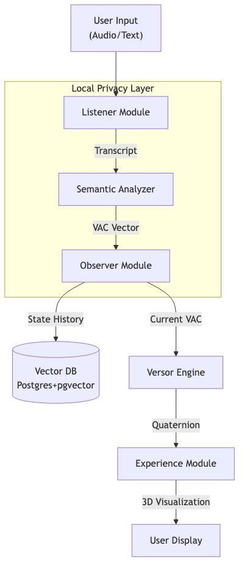
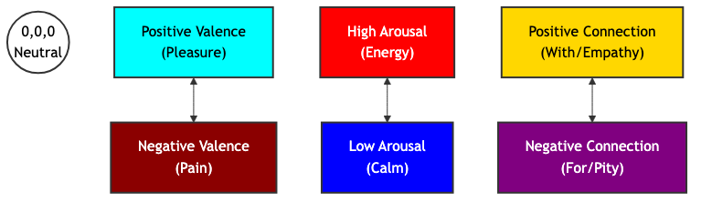
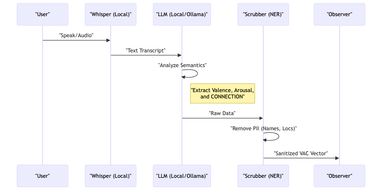
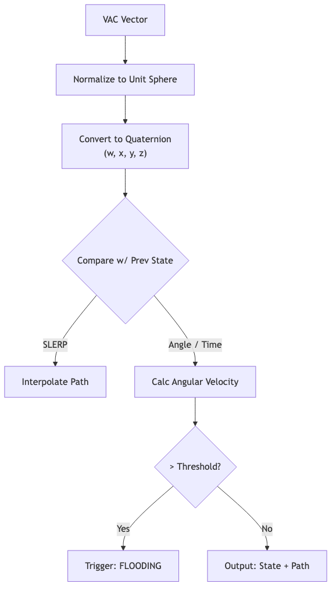
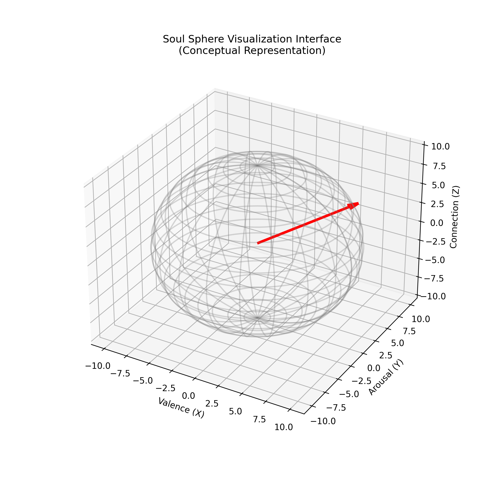
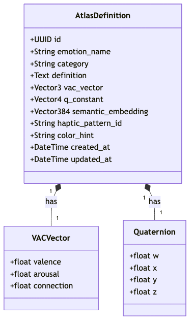

# PROVISIONAL PATENT APPLICATION

**INVENTOR(S):** Jason Robert Gochanour

**TITLE:** SYSTEM AND METHOD FOR GEOMETRIC REPRESENTATION, ANALYSIS, AND VISUALIZATION OF EMOTIONAL STATES USING QUATERNION MATHEMATICS

---

## ABSTRACT

A system and method for processing, analyzing, and visualizing emotional states using a multi-dimensional geometric model. The system includes a listener module that ingests audio or text, a semantic analyzer that maps inputs to a novel three-dimensional Vector-Arousal-Connection (VAC) vector, and a versor engine that converts these vectors into quaternions. This approach distinguishes between emotional states with similar valence and arousal but differing levels of interpersonal connection (e.g., pity vs. compassion). The system further calculates an "emotional work" metric based on the angular distance between quaternions and detects emotional flooding by analyzing the rate of change (angular velocity) of these states over time.

---

## BACKGROUND OF THE INVENTION

**1. Field of the Invention**  
The present invention relates generally to affective computing and human-computer interaction, and more specifically to systems and methods for mathematically representing and visualizing complex emotional states in a three-dimensional geometric space.

**2. Description of Related Art**  
Traditional emotion AI systems typically rely on the Circumplex Model of Affect, which maps emotions onto a two-dimensional plane defined by Valence (positivity/negativity) and Arousal (energy/activation). While useful for basic sentiment analysis, this model often fails to distinguish between complex social emotions. For example, "pity" and "compassion" may share similar negative valence and moderate arousal, yet they represent fundamentally different relational stances (separation vs. connection). Furthermore, existing systems often struggle with the "gimbal lock" problem or singularities when attempting to model continuous emotional transitions in 3D space using Euler angles. There is a need for a more robust mathematical framework that can accurately capture the relational dimension of emotion and model smooth, continuous transitions between states.

---

## SUMMARY OF THE INVENTION

The present invention provides a "L.O.V.E." (Listener-Observer-Versor-Experience) stack that addresses these limitations through a novel geometric approach.

The invention introduces a third axis, **Connection**, to the standard Valence-Arousal model, creating a VAC coordinate system. "Connection" quantifies the degree of interpersonal alignment, effectively distinguishing between empathetic states (positive connection) and sympathetic or judgmental states (negative connection).

To enable smooth, singularity-free interpolation between these states, the invention utilizes **quaternions** (4D hyper-complex numbers) rather than traditional vector addition or Euler angles. This allows the system to:

1.  Represent emotions as orientations in a 4D hypersphere.
2.  Calculate the "emotional work" mandated by a transition as the geodesic distance (angle) between two quaternions.
3.  Detect "emotional flooding" or overwhelm by monitoring the angular velocity of state changes against a configurable threshold (e.g., > 2.0 rad/s).

The system architecture prioritizes privacy by performing transcription and semantic extraction locally, ensuring sensitive emotional data is processed without external cloud dependencies.

---

## BRIEF DESCRIPTION OF THE DRAWINGS

**FIG. 1** is a block diagram illustrating the high-level architecture of the L.O.V.E. systems.

{ width=75% }

**FIG. 2** is a conceptual diagram of the VAC (Valence-Arousal-Connection) Coordinate System.

**FIG. 3** is a flowchart dealing with the Listener module's ingestion and semantic processing.

**FIG. 4** is a flowchart of the Versor engine's mathematical operations.

**FIG. 5** is an illustration of the "Soul Sphere" visualization interface.

{ width=75% }

**FIG. 6** is a schematic of the "Emotional Atlas" data structure.

{ width=75% }

---

\newpage

## DETAILED DESCRIPTION OF THE INVENTION

### 1. The Connection Axis & Semantic Extraction Logic
Unlike standard sentiment analysis, the present invention analyzes text and audio for a third dimension: Connection. This axis ranges from -1 (Separation) to +1 (Alignment).

The system employs a specific "Chain of Thought" prompt strategy to extract these coordinates, teaching a Large Language Model (LLM) to differentiate similar emotional states through relational context. The method comprises:

1.  **Valence Analysis**: Identifying hedonic keywords (pleasure/displeasure).
2.  **Arousal Analysis**: Identifying energy markers (activation/calm).
3.  **Connection Analysis**: Detecting relational vectors. The system is explicitly trained to distinguish:
    *   **Pity (Connection < 0)**: Defined as "Feeling FOR someone," which implies a hierarchical distance or separation.
    *   **Compassion (Connection > 0)**: Defined as "Feeling WITH someone," which implies shared space, vulnerability, and alignment.
    *   **Grief (Connection > 0)**: Even though valence is negative (pain), the connection remains positive (love persists).

The semantic analyzer uses a few-shot prompting technique where the LLM is provided with pre-analyzed examples (e.g., "I feel sorry for them" vs. "I'm here with them") to calibrate its output on the Connection axis.

### 2. Quaternion Representation (The Versor)
The system eschews Cartesian vectors for state manipulation in favor of unit quaternions $q = w + xi + yj + zk$. The invention uses a **scalar-first convention** $[w, x, y, z]$.

The conversion from the 3D VAC vector to a 4D quaternion is achieved by treating the VAC vector as an axis-angle rotation, where the magnitude of the emotion determines the angle $\theta$ and the normalized VAC vector defines the axis of rotation.

$$ w = \cos(\theta/2) $$

$$ x, y, z = \sin(\theta/2) \cdot \text{axis}_{x,y,z} $$

The transition between two emotional states $q_1$ and $q_2$ is calculated using **Spherical Linear Interpolation (SLERP)**:

$$ \text{Slerp}(q_1, q_2; t) = \frac{\sin((1-t)\Omega)}{\sin(\Omega)}q_1 + \frac{\sin(t\Omega)}{\sin(\Omega)}q_2 $$

where $\Omega$ is the angle subtended by the arc. This ensures a constant-speed emotional transition in the visualization, representing a "natural" flow of feeling rather than a mechanical snap.

### 3. Emotional Work & Flooding
The invention defines "Emotional Work" as the geodesic distance (angle $\theta$) traveled on the hypersphere between two states.
The invention further defines "Emotional Flooding" based on the rate of change:

$$ \omega = \frac{d\theta}{dt} $$

This rate of change serves as a quantitative proxy for emotional volatility or intensity. Mathematically, a high angular velocity represents a rapid traversal across the emotional hypersphere; psychologically, this corresponds to the phenomenon of "flooding," where the speed of an emotional transition outpaces an individual's capacity to regulate it.

If $\omega$ exceeds a pre-defined bio-feedback threshold (e.g., 2.0 radians/second), the system flags a "Flooding" event. This is used in the Experience module to trigger specific visual cues (e.g., the sphere becoming unstable or "shattering"), providing immediate feedback to the user to slow down.

### 4. The Emotional Atlas (Observer Module)
The system persists emotional states using a specialized schema within a PostgreSQL database extended with `pgvector`. Each of the 87 canonical emotional states (derived from affective research, such as Brené Brown's *Atlas of the Heart*) is stored with three simultaneous representations to enable multi-modal access:

*   **VAC Vector (3D)**: For geometric pathfinding and spatial queries (e.g., "Find emotions near 'Anxiety'").
*   **Quaternion (4D)**: For smooth rotational transitions and animation in the UI.
*   **Semantic Embedding (~384D)**: A high-dimensional vector generated by a transformer model (e.g., `all-MiniLM-L6-v2`) to enable natural language similarity search (e.g., mapping user input "I feel crushed" to "Despair").

This "Atlas" serves as a immutable reference map, allowing the system to snap vague user inputs to precise, clinically recognized emotional coordinates.

### 5. Privacy-Centric Architecture
A key component of the invention is the **Local-First Processing Pipeline**.
1.  **Ingestion**: Audio is captured on-device.
2.  **Transcription**: A local instance of a speech-to-text model (e.g., `faster-whisper`) converts audio to text without sending data to the cloud.
3.  **Analysis**: A local Large Language Model (e.g., `Ollama` running `Llama 3` or `Phi-3`) extracts the VAC parameters.
4.  **Sanitization**: A Named Entity Recognition (NER) system identifies and scrubs Person Identifiable Information (PII) before any data is passed to the persistence layer (Observer).

---

\newpage

## CLAIMS

1.  A system for determining an emotional state of a user, comprising:
    *   a processor configured to receive a natural language input;
    *   a semantic analyzer module configured to derive a three-dimensional vector from said input, wherein the three dimensions consist of valence, arousal, and interpersonal connection; and
    *   a geometric engine configured to convert said three-dimensional vector into a quaternion representation for non-singular spatial manipulation.

2.  The system of Claim 1, wherein the "interpersonal connection" dimension quantifies a distinct relational stance of the user, distinguishing between aligned empathy (positive value) and distant sympathy (negative value).

3.  The system of Claim 1, further comprising a database storing a plurality of pre-defined emotional states, wherein each state is represented simultaneously by a three-dimensional vector, a four-dimensional quaternion, and a high-dimensional semantic embedding.

4.  A method for visualizing emotional transitions, comprising:
    *   calculating a first quaternion representing an initial emotional state;
    *   calculating a second quaternion representing a subsequent emotional state;
    *   interpolating between said first and second quaternions using spherical linear interpolation (SLERP) to generate a smooth path; and
    *   rendering a three-dimensional object whose orientation corresponds to the interpolated path.

5.  The method of Claim 4, further comprising calculating an angular velocity of the transition and triggering a user alert if said velocity exceeds a predetermined "flooding" threshold.
