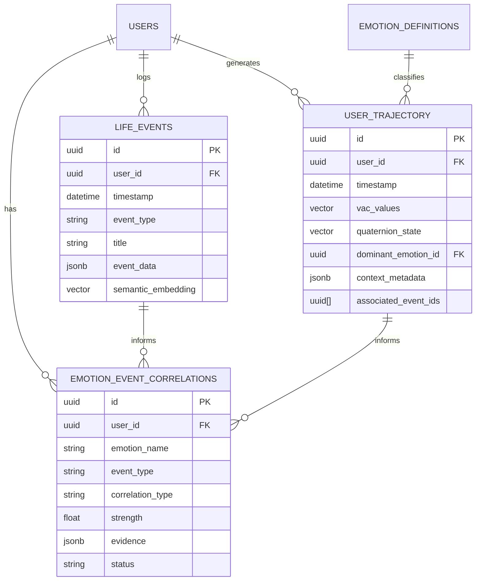

# Life Journal: Data Models

## Overview

The Life Journal introduces two new SQLAlchemy models and enriches one existing model. All models follow the Observer's established patterns: UUID primary keys, JSONB for flexible metadata, pgvector for embeddings, and timestamp-indexed temporal queries.

## New Models

### `LifeEvent` — The Core Event Record

```python
class LifeEvent(Base):
    """A user-reported or system-inferred life event.

    Represents any occurrence in a user's life that may correlate with
    emotional states — from daily routines (meals, exercise, sleep) to
    major milestones (career changes, relationship events).

    Design Decisions:

        Two-Level Classification (domain.type):
            Uses a dot-notation taxonomy (e.g., "wellness.exercise", "work.deadline")
            rather than a flat enum or deep hierarchy.

            Benefits:
            - Queryable at both domain and type levels
            - New types added without migration
            - Intuitive for users and developers
            - Maps to event stream subjects (journal.{user}.event.{domain}.{type})

        JSONB for event_data:
            Type-specific structured data varies widely:
            - Exercise: {duration_minutes, intensity, activity_type, heart_rate_avg}
            - Sleep: {hours, quality, disturbances, dream_recall}
            - Meal: {meal_type, nutrition_quality, social_context}

            JSONB allows each event type to carry its own schema
            without requiring a separate table per type.

        Optional mood_before / mood_after:
            Allows users to self-report emotional state around events,
            creating "ground truth" for correlation validation.
            Stored as VAC arrays for direct comparison with trajectory data.

        Semantic Embedding:
            Every event description is embedded for similarity search.
            "Find events similar to 'stressful work meeting'"
            Uses the same 384D model as ChatMessage embeddings.
    """

    __tablename__ = "life_events"

    # ═══════════════════════════════════════════════════════════════
    # Identity
    # ═══════════════════════════════════════════════════════════════
    id: UUID                          # PK, auto-generated
    user_id: UUID                     # FK → users.id, indexed

    # ═══════════════════════════════════════════════════════════════
    # Temporal
    # ═══════════════════════════════════════════════════════════════
    timestamp: datetime               # When the event occurred (indexed)
    duration_minutes: Optional[int]   # How long it lasted

    # ═══════════════════════════════════════════════════════════════
    # Classification (see 02-ontology.md)
    # ═══════════════════════════════════════════════════════════════
    event_type: str                   # "domain.type" notation, e.g., "wellness.exercise"
                                      # Indexed for filtering and aggregation

    # ═══════════════════════════════════════════════════════════════
    # Content
    # ═══════════════════════════════════════════════════════════════
    title: str                        # Short label: "Morning run", "Team standup"
    description: Optional[str]        # Longer free-text (PII considerations apply)

    # Type-specific structured data
    event_data: Dict[str, Any]        # JSONB — varies by event_type
                                      # Exercise: {intensity, activity_type, ...}
                                      # Sleep: {hours, quality, ...}
                                      # See ontology doc for schemas per type

    # ═══════════════════════════════════════════════════════════════
    # Emotional Context (optional self-report)
    # ═══════════════════════════════════════════════════════════════
    mood_before: Optional[List[float]]  # VAC self-report before event [V, A, C]
    mood_after: Optional[List[float]]   # VAC self-report after event [V, A, C]

    # ═══════════════════════════════════════════════════════════════
    # Searchability
    # ═══════════════════════════════════════════════════════════════
    tags: List[str]                   # User-defined tags: ["morning", "routine", "outdoor"]
                                      # Stored as ARRAY(Text) for efficient queries

    semantic_embedding: Vector(384)   # For similarity search
                                      # HNSW index for fast KNN queries

    # ═══════════════════════════════════════════════════════════════
    # Provenance
    # ═══════════════════════════════════════════════════════════════
    source: str                       # "manual" | "chat_inferred" | "calendar_import" |
                                      # "wearable" | "pattern_engine"

    # Dimensional properties (see ontology doc)
    impact: Optional[float]           # [0, 1] — how significant
    predictability: Optional[float]   # [0, 1] — how expected
    controllability: Optional[float]  # [0, 1] — how much agency felt

    # ═══════════════════════════════════════════════════════════════
    # Recurrence
    # ═══════════════════════════════════════════════════════════════
    is_recurring: bool                # Whether this is a recurring event type
    recurrence_pattern: Optional[str] # "daily" | "weekly" | "monthly" | "custom"
    recurrence_id: Optional[UUID]     # Groups recurring instances together

    # ═══════════════════════════════════════════════════════════════
    # Timestamps
    # ═══════════════════════════════════════════════════════════════
    created_at: datetime
    updated_at: datetime
```

**Table Indexes:**
```sql
-- Primary access patterns
CREATE INDEX idx_life_events_user_time ON life_events (user_id, timestamp DESC);
CREATE INDEX idx_life_events_type ON life_events (event_type);
CREATE INDEX idx_life_events_tags ON life_events USING GIN (tags);

-- Semantic search
CREATE INDEX idx_life_events_embedding_hnsw ON life_events
    USING hnsw (semantic_embedding vector_cosine_ops)
    WITH (m = 16, ef_construction = 64);

-- JSONB queries
CREATE INDEX idx_life_events_data ON life_events USING GIN (event_data);
```

---

### `EmotionEventCorrelation` — Discovered Patterns

```python
class EmotionEventCorrelation(Base):
    """A computed correlation between emotional states and life events.

    Represents a discovered or user-confirmed pattern linking life events
    to emotional changes. Created by the Correlation Engine and refined
    over time as more data accumulates.

    Correlation Types:

        temporal_proximity:
            "Your anxiety spikes within 2 hours of drinking coffee"

            Method: Window-based co-occurrence analysis
            Evidence: Count of co-occurrences, expected vs actual rate

        pattern_recurrence:
            "Every Monday morning you feel dread before standup"

            Method: Periodic pattern detection (FFT / autocorrelation)
            Evidence: Period, phase, amplitude, p-value

        trajectory_shift:
            "Since you started exercising, your baseline valence improved 0.3"

            Method: Before/after analysis around event onset
            Evidence: Mean shift, confidence interval, effect size

        semantic_cluster:
            "Work-related events cluster with anxiety; social events with joy"

            Method: Embedding-based clustering + VAC aggregation
            Evidence: Cluster centroids, silhouette scores

        user_tagged:
            "User explicitly linked 'bad sleep' to 'irritable morning'"

            Method: User-reported association
            Evidence: User confirmation count, consistency with data

    Lifecycle:
        1. Discovered: Correlation Engine finds pattern (strength > threshold)
        2. Active: Pattern continues to hold with new data
        3. Weakening: Pattern strength declining (data contradicting)
        4. Expired: Pattern no longer statistically significant
        5. User-confirmed: User validated the pattern (boosts weight)
        6. User-dismissed: User rejected the pattern (suppressed from insights)
    """

    __tablename__ = "emotion_event_correlations"

    # ═══════════════════════════════════════════════════════════════
    # Identity
    # ═══════════════════════════════════════════════════════════════
    id: UUID                          # PK
    user_id: UUID                     # FK → users.id, indexed

    # ═══════════════════════════════════════════════════════════════
    # The Emotional Side
    # ═══════════════════════════════════════════════════════════════
    emotion_name: str                 # e.g., "Anxiety", "Joy"
    emotion_category: Optional[str]   # e.g., "When Things Are Uncertain"
    vac_centroid: List[float]         # Average VAC of correlated emotional states

    # ═══════════════════════════════════════════════════════════════
    # The Event Side
    # ═══════════════════════════════════════════════════════════════
    event_type: str                   # e.g., "wellness.exercise", "work.deadline"
    event_pattern: Optional[str]      # Description of event pattern

    # ═══════════════════════════════════════════════════════════════
    # Correlation Metrics
    # ═══════════════════════════════════════════════════════════════
    correlation_type: str             # "temporal_proximity" | "pattern_recurrence" |
                                      # "trajectory_shift" | "semantic_cluster" | "user_tagged"

    strength: float                   # [0, 1] — correlation strength
    direction: str                    # "positive" | "negative" | "neutral"
    confidence: float                 # [0, 1] — statistical confidence

    lag_seconds: Optional[int]        # Time between event and emotional shift
                                      # Positive = emotion follows event
                                      # Negative = emotion precedes event

    sample_size: int                  # Number of observations supporting this

    # ═══════════════════════════════════════════════════════════════
    # Evidence & Detail
    # ═══════════════════════════════════════════════════════════════
    evidence: Dict[str, Any]          # JSONB — statistical details
                                      # {
                                      #   "p_value": 0.003,
                                      #   "effect_size": 0.45,
                                      #   "ci_lower": 0.32,
                                      #   "ci_upper": 0.58,
                                      #   "observations": [...trajectory_ids...],
                                      #   "method": "pearson_r"
                                      # }

    # ═══════════════════════════════════════════════════════════════
    # Lifecycle
    # ═══════════════════════════════════════════════════════════════
    status: str                       # "discovered" | "active" | "weakening" |
                                      # "expired" | "user_confirmed" | "user_dismissed"

    first_detected: datetime
    last_validated: datetime           # Last time the pattern was re-checked

    # User interaction
    user_feedback: Optional[str]      # "confirmed" | "dismissed" | None
    user_feedback_at: Optional[datetime]

    created_at: datetime
    updated_at: datetime
```

---

## Enriched Existing Model

### `UserTrajectory` — Added Event Association

The existing `UserTrajectory` model (which stores each emotional state point) gains:

```python
# New fields on UserTrajectory:

# Links to life events that occurred around this emotional state
associated_event_ids: Optional[List[UUID]]  # ARRAY(UUID)
                                             # Populated by correlation engine
                                             # Based on temporal proximity

# Formalized context (previously unstructured JSONB)
# The context_metadata field remains JSONB but we document expected keys:
#
# context_metadata = {
#     "trigger": "work presentation",    # What prompted the emotional state
#     "location": "office",              # Where the user was  
#     "coping_used": "deep breathing",   # Any coping strategy applied
#     "energy_level": 6,                 # Self-reported energy (1-10)
#     "sleep_quality": "poor",           # Previous night's sleep
#     "social_context": "alone",         # Social setting
#     "time_of_day": "morning",          # Derived from timestamp
#     "day_of_week": "Monday",           # Derived from timestamp
#     "life_event_refs": ["uuid1", ...], # Cross-references to life_events
# }
```

---

## Relationships Diagram



## Migration Strategy

The new models will be added via Alembic migrations:

1. **Migration 1**: Create `life_events` table with all indexes
2. **Migration 2**: Create `emotion_event_correlations` table
3. **Migration 3**: Add `associated_event_ids` column to `user_trajectory`
4. **Migration 4**: Create vector indexes (HNSW) on `life_events.semantic_embedding`

All migrations are additive — no existing tables or columns are modified destructively.
