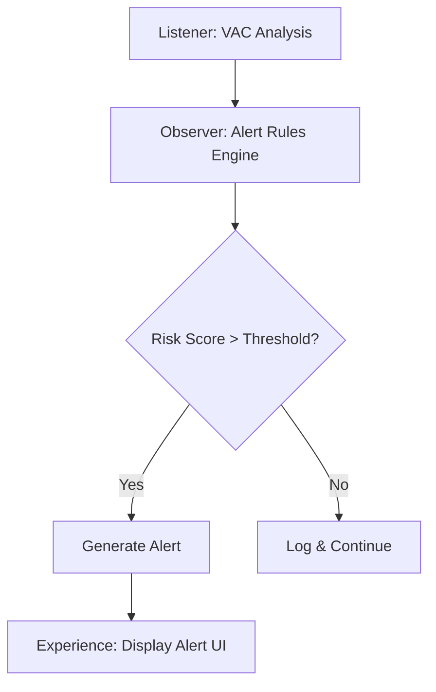

# Clinical Alerts Implementation Guide

This guide covers the implementation of the clinical alerts system across the L.O.V.E. stack.

## Overview

Clinical alerts monitor emotional states for patterns that may require professional attention. The system identifies risk signals without making clinical diagnoses.

## Architecture

## Alert Types

| Alert | Trigger | Severity |
|-------|---------|----------|
| **Sustained Negative Valence** | V < -0.7 for 3+ sessions | Warning |
| **Emotional Flatness** | Arousal range < 0.2 over 5+ sessions | Notice |
| **Isolation Pattern** | Connection < -0.5 for 3+ sessions | Warning |
| **Rapid Cycling** | Angular distance > 2.0 between consecutive sessions | Notice |

## Implementation

### Observer Service

See [clinical/alerts.py](file:///observer/app/services/clinical/alerts.py) for the alert rules engine (~15KB).

### Key Endpoints

- `GET /admin/alerts` — Retrieve all active alerts for a user
- Alert data is included in session analysis responses

## Configuration

Alert thresholds are configurable via the Observer's environment variables. See [Observer Configuration](../modules/observer/reference/configuration.md) for details.
