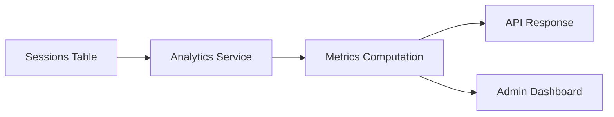

# Session Analytics Implementation Guide

This guide covers the implementation of session analytics across the L.O.V.E. stack.

## Overview

Session analytics track and aggregate emotional data across user sessions. The system computes metrics like emotional range, trend direction, and session-over-session changes.

## Architecture

## Key Components

| Component | File | Purpose |
|-----------|------|---------|
| **Session Service** | `observer/app/services/analytics/session.py` | Session aggregation (~20KB) |
| **Metrics Service** | `observer/app/services/analytics/metrics.py` | Statistical metrics (~8KB) |

## Metrics Computed

| Metric | Description |
|--------|-------------|
| **Emotional Range** | Max angular distance between session states |
| **Trend Direction** | Moving average of valence/arousal/connection over N sessions |
| **Session Duration** | Time between first and last interactions |
| **State Transitions** | Count and pattern of emotion changes |
| **Strategy Effectiveness** | Which recommended strategies correlate with positive shifts |

## API Endpoints

- `GET /admin/users/{user_id}/sessions` — Session history for a user
- `GET /admin/users/{user_id}/trajectory` — Emotional trajectory data
- `GET /admin/sessions` — All sessions (admin)

## Related Documentation

- [Observer Services Architecture](../modules/observer/architecture/02-services.md)
- [Observer API Reference](../modules/observer/reference/api-reference.md)
