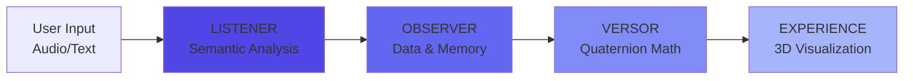

<!-- markdownlint-disable MD046 -->
# L.O.V.E. Platform Documentation

## Welcome to the L.O.V.E. (Listener-Observer-Versor-Experience) Platform Documentation


---

## :rocket: What is L.O.V.E.?

The **L.O.V.E. Platform** is a revolutionary **3D emotional intelligence system** that transforms human emotional expression into visual, mathematical representations using quaternion mathematics and the VAC (Valence-Arousal-Connection) model.

### Feature Specifications & Implementation Status

### Supporting features and utilities

### The Innovation: The Connection Axis

While standard sentiment analysis measures **Valence** and **Arousal** (energy), L.O.V.E. introduces the **Connection axis**—a novel third dimension measuring interpersonal alignment from separation to unity.

!!! example "The Connection Difference"
    **Pity** vs **Compassion**: Both involve witnessing suffering, but:

    - **Pity**: "I feel *for* them" → Connection = -0.7 (separation)
    - **Compassion**: "I feel *with* them" → Connection = +0.9 (alignment)

---

## :package: The Four Modules



### :ear: **Listener** - The Sensory Cortex

Transforms voice and text into VAC coordinates using local LLM inference.

**Key Features:**

- Local transcription (faster-whisper)
- Semantic VAC extraction (Ollama + Llama 3.1)
- PII sanitization (Spacy NER)
- Privacy-first architecture

[:octicons-arrow-right-24: Listener Documentation](modules/listener/index.md)

---

### :brain: **Observer** - The Hippocampus

Stores emotional states, finds patterns, and provides therapeutic guidance.

**Key Features:**

- PostgreSQL + pgvector for similarity search
- 87-emotion atlas (Brené Brown's taxonomy)
- A* pathfinding with 107 evidence-based strategies
- Transition system for emotional journeys

[:octicons-arrow-right-24: Observer Documentation](modules/observer/index.md)

---

### :1234: **Versor** - The Mathematical Engine

Pure quaternion mathematics for smooth 3D rotations.

**Key Features:**

- VAC → quaternion conversion
- SLERP interpolation (60-frame animations)
- Angular distance & elasticity metrics
- Stateless microservice

[:octicons-arrow-right-24: Versor Documentation](modules/versor/index.md)

---

### :art: **Experience** - The Presentation Layer

Real-time 3D visualization of emotional states as "Soul Spheres."

**Key Features:**

- React Three Fiber + custom GLSL shaders
- VAC → visual mapping (color, geometry, glow)
- Journey tracking with transition paths
- Web and mobile interfaces

[:octicons-arrow-right-24: Experience Documentation](modules/experience/index.md)

---

## :book: Documentation by Audience

This documentation is organized for different audiences:

### :necktie: **For Executives**

Quick overview of business value, ROI, and strategic positioning.

- [Listener Overview](modules/listener/overview/01-executive-summary.md)
- [Business Value](modules/listener/overview/02-business-value.md)

### :office: **For Managers**

Architecture overview, team structure, and operational guidelines.

### Structured, compassionate emotional insight generation

- [Architecture Overview](modules/listener/architecture/00-high-level-overview.md)
- [Monitoring & Operations](modules/listener/operations/01-monitoring.md)

### :superhero: **For Senior Developers**

Deep technical documentation, architecture decisions, and advanced topics.

- [Deep Dive Architecture](modules/listener/architecture/01-deep-dive.md)
- [Semantic Analysis Internals](modules/listener/architecture/02-semantic-analysis.md)

### :student: **For Junior Developers**

Step-by-step guides, tutorials, and beginner-friendly explanations.

- [Getting Started](modules/listener/guides/01-getting-started.md)
- [Codebase Tour](modules/listener/guides/02-codebase-tour.md)

---

## :rocket: Quick Start

### Prerequisites

```bash
# Required
## Backend (Python 3.12)
Python 3.12+
Node.js 18+
PostgreSQL 16+
Redis 7+
Ollama

# Optional (for containers)
Podman or Docker
```

### Installation

=== "Full Stack"

    ```bash
    cd infra
    ./setup-love-stack.sh
    ./run-love-stack.sh
    ```

=== "Individual Modules"

    ```bash
    # Versor (Port 8001)
    cd versor
    python3 -m .venv .venv
    source .venv/bin/activate
    pip install -r requirements.txt
    uvicorn app.main:app --port 8001

    # Observer (Port 8000)
    cd observer
    python3 -m .venv .venv
    source .venv/bin/activate
    pip install -r requirements.txt
    uvicorn app.main:app --port 8000

    # Listener (Port 8002)
    cd listener
    python3 -m .venv .venv
    source .venv/bin/activate
    pip install -r requirements.txt
    ollama pull llama3.1:8b-instruct-q4_0
    uvicorn app.main:app --port 8002

    # Experience (Port 3000)
    cd experience/web
    npm install
    npm run dev
    ```

### Test the System

```bash
# Test Listener
curl -X POST http://localhost:8002/listener/analyze \
  -F "text=I'm feeling overwhelmed but hopeful"

# Test Observer
curl http://localhost:8000/observer/atlas/emotions

# Test Versor
curl -X POST http://localhost:8001/versor/calculate \
  -H "Content-Type: application/json" \
  -d '{"valence": 0.5, "arousal": 0.7, "connection": 0.8}'
```

---

## :books: Key Resources

### Architecture

- [System Overview](architecture/01-system-overview.md)
- [VAC Model Deep Dive](architecture/02-vac-model.md)
- [Architectural Review](architecture/03-architectural-review-dec-2025.md)

### Features

### Multi-emotion detection and relationship mapping

- [Deep Feeling Mode](features/deep-feeling/OVERVIEW.md) - Multi-emotion analysis
- [Voice Analysis](features/voice-analysis/THREE-WAY-ANALYSIS.md) - Prosody + semantic

### Beautiful, adaptive progress indicators for analysis

- [Beautiful Insights](features/beautiful-insights/00-OVERVIEW.md) - Therapeutic responses

### Guides

- [Refactoring Guide](guides/REFACTORING.md)
- [Testing Strategy](modules/listener/guides/05-testing-guide.md)

---

## :chart_with_upwards_trend: Current Status

| Module | Status | Tests | Documentation | Deployment |
|--------|--------|-------|---------------|------------|
| **Versor** | :white_check_mark: Complete | 56/56 passing | :white_check_mark: Complete | :white_check_mark: Ready |
| **Observer** | :white_check_mark: Complete | Passing | :white_check_mark: Complete | :white_check_mark: Ready |
| **Listener** | :white_check_mark: Complete | Passing | :white_check_mark: Complete | :white_check_mark: Ready |
| **Experience** | :construction: 90% | 43/43 (shared) | :white_check_mark: Complete | :hourglass: Dependency fix |

---

## :handshake: Contributing

We welcome contributions! See our [Contributing Guide](contributing.md) for details.

### Development Workflow

1. Fork the repository
2. Create a feature branch
3. Make your changes
4. Write/update tests
5. Update documentation
6. Submit a pull request

---

## :page_facing_up: License

The L.O.V.E. Platform is released under the MIT License. See [LICENSE](https://gitlab.com/l_o_v_e/platform/-/blob/main/LICENSE) for details.

---

## :email: Contact

- **GitLab:** [gitlab.com/l_o_v_e/platform](https://gitlab.com/l_o_v_e/platform)
- **Issues:** [GitLab Issues](https://gitlab.com/l_o_v_e/platform/-/issues)

---

## Quick Links

### Built with :heart: for emotional intelligence and mental wellness
