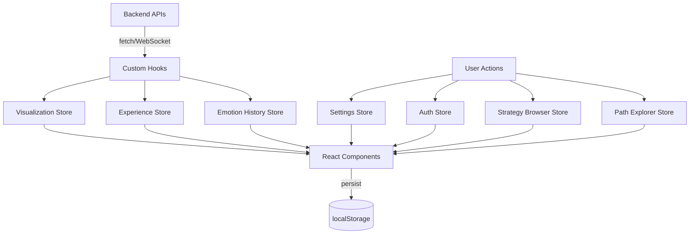

# State Management

**Last Updated:** February 2026
**Audience:** Frontend Developers

---

## Overview

The Experience module uses **Zustand** for state management with **7 stores** totaling ~58KB. Each store manages a specific domain and persists to `localStorage` for cross-session continuity.

---

## Store Inventory

| Store | Size | Domain |
|-------|------|--------|
| `useSettingsStore` | 18KB | UI preferences, animation, display settings |
| `useVisualizationStore` | 16KB | Active emotion, paths, sphere configuration |
| `useExperienceStore` | 9KB | Core session state, user context |
| `usePathExplorerStore` | 4KB | Path exploration and browsing |
| `useEmotionHistoryStore` | 4KB | Emotional trajectory tracking |
| `authStore` | 4KB | JWT authentication, user identity |
| `useStrategyBrowserStore` | 3KB | Strategy browsing and filtering |

---

## Store Details

### `useSettingsStore` (18KB)

The largest store. Manages all user-configurable settings.

**Key State:**
- Animation speed, quality, and mode preferences
- Display options (labels, grid, tooltips, axes)
- Sound settings (ambient audio, volume)
- Theme preferences (color scheme, glow intensity)
- Performance settings (rendering quality, LOD)
- Logging verbosity
- Command palette preferences

**Persistence:** Full state persisted to `localStorage` with the key `love-settings`.

### `useVisualizationStore` (16KB)

Manages the active 3D visualization state.

**Key State:**
- `currentEmotion` — Currently displayed emotion with VAC coordinates
- `targetEmotion` — Emotion being transitioned to
- `activePath` — Current A* transition path with waypoints
- `pathProgress` — Progress along active path (0-1)
- `sphereConfig` — Sphere visual parameters (color, geometry, glow)
- `cameraPosition` — Current camera position and target
- `selectedWaypoint` — Currently selected waypoint in a path
- `animationState` — Animation mode (idle, transitioning, celebrating)

**Key Actions:**
- `setCurrentEmotion(emotion)` — Update displayed emotional state
- `startTransition(path)` — Begin animated transition along path
- `advanceWaypoint()` — Move to next waypoint
- `resetVisualization()` — Clear all path and transition state

### `useExperienceStore` (9KB)

Core session state management.

**Key State:**
- `user` — Current user identity
- `sessionId` — Active session identifier
- `isConnected` — WebSocket connection status
- `activePanel` — Currently displayed admin panel
- `mode` — Application mode (viewer, admin, zen, clinical)
- `chatMessages` — Active chat message history
- `insights` — Generated emotional insights

### `usePathExplorerStore` (4KB)

Path browsing and exploration state.

**Key State:**
- `exploredPaths` — Paths being compared
- `selectedPathIndex` — Currently selected path
- `filterCriteria` — Path filter settings (categories, difficulty)
- `sortOrder` — Sort preference for path listing

### `useEmotionHistoryStore` (4KB)

Emotional trajectory tracking over time.

**Key State:**
- `history` — Array of past emotional states with timestamps
- `trajectory` — Computed trajectory data (trend direction, velocity)
- `checkpoints` — Significant emotional milestones

### `authStore` (4KB)

JWT-based authentication state.

**Key State:**
- `token` — JWT access token
- `user` — Authenticated user object
- `isAuthenticated` — Boolean auth status
- `loginError` — Error from last login attempt

**Key Actions:**
- `login(username, password)` — Authenticate and store token
- `logout()` — Clear token and user state
- `refreshToken()` — Refresh expired token

### `useStrategyBrowserStore` (3KB)

Strategy browsing and filtering state.

**Key State:**
- `strategies` — Loaded strategies list
- `selectedCategory` — Active filter category (ACT, DBT, Somatic, etc.)
- `searchQuery` — Text search filter
- `favoriteStrategies` — User's favorited strategies

---

## Architecture Patterns

### Persistence
All stores use Zustand's `persist` middleware with `localStorage`:

```typescript
export const useSettingsStore = create(
  persist(
    (set, get) => ({
      animationSpeed: 1.0,
      setAnimationSpeed: (speed: number) => set({ animationSpeed: speed }),
      // ...
    }),
    { name: 'love-settings' }
  )
);
```

### Cross-Store Communication
Stores communicate via hooks that compose multiple stores:

```typescript
function useSphereSync() {
  const emotion = useVisualizationStore(s => s.currentEmotion);
  const settings = useSettingsStore(s => s.animationSpeed);
  // Combine state from multiple stores
}
```

### Selective Subscriptions
Components subscribe to specific slices to minimize re-renders:

```typescript
// Good: selective subscription
const emotion = useVisualizationStore(s => s.currentEmotion);

// Avoid: subscribing to entire store
const store = useVisualizationStore(); // triggers on any change
```

---

## Data Flow



---

## See Also

- [Component Architecture](01-component-architecture.md) — Component documentation
- [Hooks Reference](02-hooks-reference.md) — Custom hook documentation
