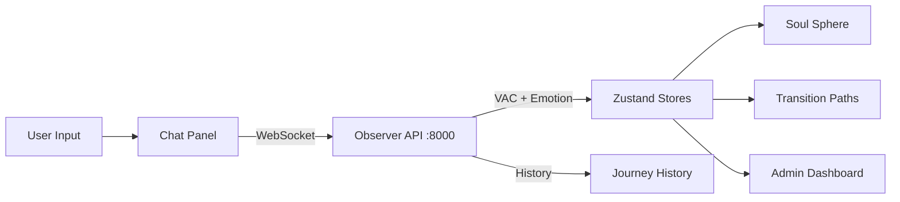

# Experience Module

**The Visualization Layer of L.O.V.E.**

---

## Overview

The **Experience Module** is the user-facing frontend of the L.O.V.E. stack — a real-time 3D visualization application that renders emotional states as dynamic "Soul Spheres" in three-dimensional space.

Built with Next.js and React Three Fiber, it provides:

- 🌐 **3D Soul Sphere** — VAC coordinates rendered as animated geometry with custom GLSL shaders
- 🛤️ **Transition Paths** — Visualized emotional journeys with therapeutic waypoints
- 💬 **Chat Interface** — WebSocket-connected emotional check-in
- 📊 **Admin Dashboard** — Clinical tools, data management, analytics
- ⚙️ **Settings** — Comprehensive configuration panel
- 🎮 **Command Palette** — Power-user keyboard navigation (Cmd+K)

---

## Quick Facts

- **Status:** ✅ Production Ready (deployed at love.jrgochan.io)
- **Framework:** Next.js 16.1.1 (App Router)
- **UI Library:** React 19.2.1
- **3D Engine:** React Three Fiber v9 + Three.js 0.170
- **State Management:** Zustand (7 stores)
- **Language:** TypeScript
- **Port:** 3000

---

## Technology Stack

| Component | Technology | Version | Purpose |
|-----------|-----------|---------|---------|
| **Framework** | Next.js | 16.1.1 | React meta-framework (App Router) |
| **UI** | React | 19.2.1 | Component library |
| **3D Rendering** | React Three Fiber | v9 | Declarative Three.js |
| **3D Core** | Three.js | 0.170 | WebGL rendering engine |
| **State** | Zustand | latest | Lightweight state management |
| **Language** | TypeScript | latest | Type safety |
| **Shaders** | GLSL | — | Custom vertex + fragment shaders |

---

## Architecture

### Component Hierarchy

```text
experience/web/
├── app/                    # Next.js App Router pages
├── components/             # 35 top-level components
│   ├── SoulSphere.tsx      # Core 3D visualization
│   ├── Settings.tsx        # Settings panel (26KB)
│   ├── CommandPalette.tsx  # Cmd+K command palette
│   ├── GoalSetting.tsx     # Emotional goal setting
│   ├── TransitionPathRenderer.tsx  # 3D path rendering
│   ├── JourneyProgress.tsx # Journey tracking
│   └── admin/              # Admin dashboard (18 subdirs)
│       ├── ChatPanel.tsx   # Chat interface
│       ├── ClinicalDashboard.tsx  # Clinical tools
│       ├── panels/         # Admin panels (16 components)
│       ├── visualizations/ # Data visualizations (13 components)
│       ├── settings/       # Admin settings (12 components)
│       ├── chat/           # Chat components (12 components)
│       ├── clinical/       # Clinical tools (11 components)
│       └── ...             # 13 more subdirectories
├── hooks/                  # 20 root hooks + 15 subdirectories
│   ├── useEmotionData.ts   # Emotion data fetching
│   ├── useWebSocketChat.ts # WebSocket chat connection
│   ├── useObserverPolling.ts # Observer API polling
│   ├── useCommandPalette.ts  # Command palette logic
│   ├── chat/               # Chat hooks (16 files)
│   ├── command-palette/    # Command palette (13 files)
│   ├── admin/              # Admin hooks (7 files)
│   └── ...                 # 12 more hook directories
├── stores/                 # 7 Zustand stores
│   ├── useSettingsStore.ts # Application settings (18KB)
│   ├── useVisualizationStore.ts  # Visualization state (16KB)
│   ├── useExperienceStore.ts     # Core experience state (8KB)
│   ├── usePathExplorerStore.ts   # Path explorer (4KB)
│   ├── useEmotionHistoryStore.ts # Emotion history (4KB)
│   ├── authStore.ts              # Authentication (4KB)
│   └── useStrategyBrowserStore.ts # Strategy browser (3KB)
├── shaders/                # GLSL vertex + fragment shaders
└── lib/                    # Utility libraries
```

### Data Flow



### API Communication

The Experience module communicates with backend services through Next.js API routes that proxy to the backend:

- **Observer API** (`:8000`) — State management, emotions, paths, journeys
- **Versor API** (`:8001`) — Quaternion calculations, SLERP interpolation
- **Listener API** (`:8002`) — Audio analysis, text analysis, AI models

### State Management (Zustand)

Seven Zustand stores manage application state with localStorage persistence:

| Store | Responsibility |
|-------|---------------|
| `useSettingsStore` | UI preferences, animation settings, display options |
| `useVisualizationStore` | Active emotion, path data, sphere configuration |
| `useExperienceStore` | Core session state, user context |
| `usePathExplorerStore` | Path exploration and browsing state |
| `useEmotionHistoryStore` | Emotional trajectory history |
| `authStore` | JWT authentication, user identity |
| `useStrategyBrowserStore` | Strategy browsing and filtering |

---

## Visual Mapping

The Soul Sphere translates VAC coordinates into visual properties:

| VAC Axis | Visual Property | Range |
|----------|----------------|-------|
| **Valence** | Color | Crimson (negative) → Cyan (positive) |
| **Arousal** | Geometry distortion | Smooth sphere (calm) → Spiky (activated) |
| **Connection** | Glow intensity | Dim (disconnected) → Radiant (connected) |

Custom GLSL shaders implement:

- Vertex displacement based on arousal
- Fragment color based on valence
- Emission/glow based on connection
- Smooth transitions via SLERP animation

---

## Key Features

### Soul Sphere Visualization

The core 3D component (`SoulSphere.tsx`) renders emotional state as a procedurally deformed sphere with custom shaders. It updates in real-time as emotional state changes.

### Transition Path Rendering

`TransitionPathRenderer.tsx` displays A*-computed emotional paths as 3D curves through VAC space, with waypoint markers and strategy annotations.

### Admin Dashboard

A comprehensive dashboard providing:

- **Data Management** — Import/export emotions, strategies, bootstrap data
- **Clinical Tools** — Alerts, risk assessment, session analytics
- **Chat Panel** — WebSocket-connected emotional check-in with AI
- **Path Matrix** — Visualization of all possible emotional transitions
- **Strategy Browser** — Browse and manage regulation strategies

### Command Palette

Keyboard-driven navigation (Cmd+K) with 13+ hook files supporting:

- Quick emotion selection
- Navigation between views
- Settings access
- Admin actions

---

## Documentation

- [Soul Sphere Specification](04-soul-sphere-specification.md) — Detailed spec for the 3D visualization
- [System Overview](../../architecture/01-system-overview.md) — Where Experience fits in the L.O.V.E. stack

---

## Quick Start

```bash
# Navigate to experience web
cd experience/web

# Install dependencies
npm install

# Start development server
npm run dev

# Open browser
open http://localhost:3000
```

---

## Contributing

Before contributing to Experience:

1. **Setup**: Follow the quick start above
2. **Understand**: Review the component hierarchy and state management
3. **Test**: Run `npm test` to verify changes
4. **Type-check**: Run `npx tsc --noEmit` for type safety
5. **Lint**: Run `npm run lint` for code style

---

**Remember:** The Experience module transforms abstract mathematical representations (quaternions, VAC vectors) into intuitive visual experiences that help users understand and navigate their emotional landscape.
