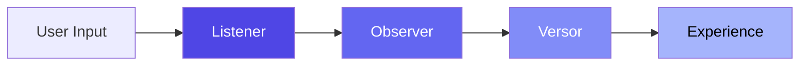

# Modules Overview

The L.O.V.E. platform is composed of four core modules, each handling a distinct layer of the emotional intelligence pipeline.

---

## Module Architecture

## Core Modules

| Module | Role | Stack | Port |
|--------|------|-------|------|
| **[Listener](listener/index.md)** | Audio/text → VAC coordinates | Python 3.12 / FastAPI | 8002 |
| **[Observer](observer/index.md)** | Data persistence & vector search | Python 3.12 / FastAPI + PostgreSQL 18 | 8000 |
| **[Versor](versor/index.md)** | Quaternion math engine | Python 3.12 / FastAPI | 8001 |
| **[Experience](experience/index.md)** | 3D visualization & UI | Next.js / React 19 / Three.js | 3000 |

## Data Flow

1. **Listener** receives audio or text input. It transcribes audio (faster-whisper), runs semantic analysis (Ollama + Llama 3.1), and extracts VAC coordinates.
2. **Observer** stores the VAC state, finds the nearest emotions in the 87-emotion atlas, and identifies therapeutic transition strategies.
3. **Versor** converts VAC coordinates to quaternions and computes SLERP interpolation paths for smooth 3D animation.
4. **Experience** renders the emotional state as a Soul Sphere with real-time shaders, color mapping, and path visualization.

## Module Documentation

Each module has its own documentation section with:

- **Overview** — Executive summary, business value, and roadmap
- **Architecture** — High-level design, deep dives, and service layer docs
- **Guides** — Getting started, codebase tour, and common tasks
- **Reference** — API reference, configuration, error codes, and glossary
- **Operations** — Monitoring, team structure, and incident response
