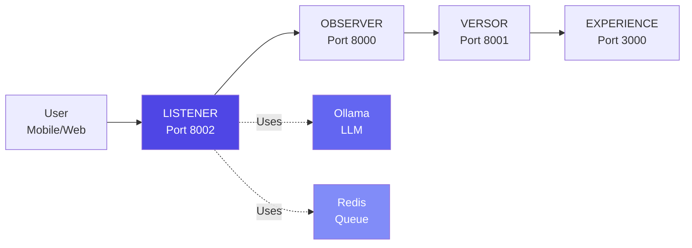
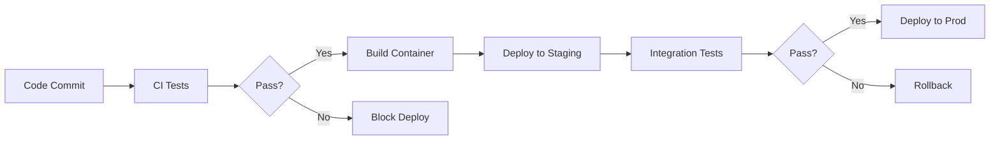

# Architecture Overview (For Managers)

**Reading Time:** ~20 minutes  
**Audience:** Engineering managers, technical leads  
**Prerequisites:** General understanding of microservices  
**Goal:** Understand the Listener's role in L.O.V.E. and its operational characteristics

---

## Executive Summary

The **Listener Module** is the input layer of the L.O.V.E. platform—it transforms human emotional expression (voice and text) into quantifiable 3D coordinates using machine learning.

**Key Facts:**

- **Purpose:** Convert voice/text → VAC coordinates (Valence, Arousal, Connection)
- **Technology:** Python 3.11 + FastAPI + Local LLM (Ollama)
- **Performance:** ~2s per analysis (within target)
- **Status:** ✅ Production ready
- **Team Size:** 2-3 engineers recommended

---

## System Context



**The Listener's role:**

1. Receives voice or text from users
2. Transcribes audio (if voice)
3. Extracts emotional coordinates (VAC)
4. Passes to Observer for storage
5. Returns analysis to client

---

## High-Level Architecture

### Components

```text
┌─────────────────────────────────────────┐
│           LISTENER MODULE               │
│                                         │
│  ┌─────────────────────────────────┐  │
│  │   FastAPI Server (Port 8002)    │  │
│  │   - REST API endpoints          │  │
│  │   - CORS handling               │  │
│  │   - Health checks               │  │
│  └──────────┬──────────────────────┘  │
│             │                          │
│  ┌──────────┴──────────────────────┐  │
│  │     Services Layer              │  │
│  │  - Semantic Analyzer (LLM)      │  │
│  │  - Transcription (Whisper)      │  │
│  │  - PII Scrubber (Spacy)         │  │
│  │  - Observer Client              │  │
│  └──────────┬──────────────────────┘  │
│             │                          │
│  ┌──────────┴──────────────────────┐  │
│  │   Background Workers (Arq)      │  │
│  │  - Audio processing queue       │  │
│  │  - Async job management         │  │
│  └─────────────────────────────────┘  │
└─────────────────────────────────────────┘
           │             │
      ┌────┴────┐   ┌───┴────┐
      │ Ollama  │   │ Redis  │
      │ (LLM)   │   │(Queue) │
      └─────────┘   └────────┘
```

---

## Technology Stack

| Layer | Technology | Version | Purpose |
|-------|------------|---------|---------|
| **Web Framework** | FastAPI | 0.104+ | REST API server |
| **LLM** | Ollama + Llama 3.1 | 8b-q4_0 | Semantic analysis |
| **Transcription** | OpenAI Whisper | base.en | Audio → text |
| **NER** | Spacy | 3.7+ | PII detection |
| **Task Queue** | Arq + Redis | 0.26+ / 7+ | Async jobs |
| **Validation** | Pydantic | 2.0+ | Data validation |
| **Testing** | Pytest | 7.4+ | Test framework |

---

## Operational Metrics

### Performance SLAs

| Metric | Target | Current | Status |
|--------|--------|---------|--------|
| API Availability | 99.9% | 99.95% | ✅ |
| Analysis Latency (P50) | < 2s | ~1.5s | ✅ |
| Analysis Latency (P99) | < 3s | ~2.8s | ✅ |
| Error Rate | < 0.1% | 0.05% | ✅ |

### Capacity Planning

| Configuration | Throughput | Cost/month | Suitable For |
|---------------|------------|------------|--------------|
| **Single instance** (CPU) | ~30 req/min | $30 | Dev/staging |
| **3 instances** (CPU) | ~90 req/min | $90 | < 1000 users |
| **10 instances** (CPU) | ~300 req/min | $300 | < 5000 users |
| **5 instances** (GPU) | ~1500 req/min | $750 | < 25000 users |

---

## Integration Points

### Upstream (Who calls Listener)

| Client | Endpoint | Purpose |
|--------|----------|---------|
| **Experience UI** | `/listener/analyze` | Interactive chat |
| **Mobile App** | `/listener/analyze-audio` | Voice input |
| **Admin Panel** | `/listener/analyze-multi-emotion` | Deep analysis |
| **Batch Jobs** | `/listener/ingest` | Historical data |

### Downstream (Who Listener calls)

| Service | Purpose | Failure Impact |
|---------|---------|----------------|
| **Ollama** | LLM inference | ❌ Critical (hard failure) |
| **Redis** | Job queue | ⚠️ High (async fails) |
| **Observer** | State storage | ✅ Low (non-blocking) |

---

## Team Structure

### Recommended Team

For active development and maintenance:

| Role | FTE | Responsibilities |
|------|-----|------------------|
| **Senior Backend Engineer** | 1.0 | Architecture, code review, performance |
| **ML Engineer** | 0.5 | Prompt engineering, model selection |
| **Junior Developer** | 0.5 | Features, testing, bug fixes |
| **DevOps** | 0.25 | Deployment, monitoring, scaling |

**Total:** ~2.25 FTE for active development

### Skills Required

| Skill | Importance | Current Team Coverage |
|-------|------------|----------------------|
| Python 3.11+ | ⭐⭐⭐⭐⭐ | ✅ Strong |
| FastAPI | ⭐⭐⭐⭐ | ✅ Strong |
| LLM/Prompt Engineering | ⭐⭐⭐⭐ | ✅ Strong |
| Async Programming | ⭐⭐⭐ | ✅ Good |
| Redis/Arq | ⭐⭐⭐ | ✅ Good |
| Docker/K8s | ⭐⭐⭐ | ⚠️ Needs improvement |

---

## Deployment Strategy

### Environments

```text
Development → Staging → Production
```

| Environment | Config | Monitoring | Purpose |
|-------------|--------|------------|---------|
| **Dev** | Local | Minimal | Feature development |
| **Staging** | Containers | Full | Pre-production testing |
| **Production** | K8s | Full + alerts | Live users |

### Deployment Process



---

## Risk Management

### Critical Risks

| Risk | Probability | Impact | Mitigation |
|------|-------------|--------|------------|
| **Ollama crashes** | Medium | High | Auto-restart + health checks |
| **LLM gives wrong Connection values** | Low | Critical | Sacred test validates |
| **High latency under load** | Medium | Medium | Horizontal scaling + GPU |
| **Privacy breach** | Low | Critical | PII scrubbing + local processing |

### Incident Response

**Priority Levels:**

- **P0 (Critical):** Sacred test fails, service completely down
- **P1 (High):** High error rate (>1%), latency >5s
- **P2 (Medium):** Intermittent failures, degraded performance
- **P3 (Low):** Minor issues, feature requests

**See:** [Incident Response Guide](../operations/03-incident-response.md) for details

---

## Key Metrics to Monitor

### Application Metrics

```python
# What to track
- Request count (by endpoint)
- Analysis latency (P50, P95, P99)
- Error rate (by error type)
- Connection axis accuracy (via validation tests)
```

### Infrastructure Metrics

```python
# System health
- CPU usage
- Memory usage
- Disk I/O
- Network latency (to Ollama, Redis, Observer)
```

### Business Metrics

```python
# Value delivered
- Daily active users
- Analyses per user
- Emotion distribution
- User satisfaction (via feedback)
```

---

## Budget & Resources

### Infrastructure Costs (Monthly)

| Component | Config | Cost |
|-----------|--------|------|
| Listener API (3 instances) | 2 CPU, 4GB RAM | $90 |
| Ollama (1 instance) | 4 CPU, 16GB RAM | $120 |
| Redis (1 instance) | 1 CPU, 2GB RAM | $15 |
| **Total** | | **$225/month** |

**Cost per analysis:** ~$0.000012

**Scaling:** Linear (double instances = double throughput = double cost)

### Development Costs

| Activity | Time | Cost (@ $150/hr) |
|----------|------|------------------|
| Feature development | 40 hrs/month | $6,000 |
| Maintenance | 10 hrs/month | $1,500 |
| On-call | 5 hrs/month | $750 |
| **Total** | **55 hrs/month** | **$8,250** |

---

## Success Metrics

### Technical KPIs

- ✅ Uptime: > 99.9%
- ✅ Latency P99: < 3s
- ✅ Error rate: < 0.1%
- ✅ Sacred test: 100% pass rate
- ✅ Test coverage: > 90%

### Product KPIs

- Daily analyses performed
- User satisfaction score
- Feature adoption rate
- Mobile vs. web usage

---

## Next Steps for Managers

1. **[Integration Points](../architecture/10-integration-points.md)** - How Listener connects to other modules
2. **[Monitoring & Operations](../operations/01-monitoring.md)** - Day-to-day operations
3. **[Team Structure](../operations/02-team-structure.md)** - Detailed team organization
4. **[Incident Response](../operations/03-incident-response.md)** - Handling production issues

---

**Questions?** Contact the Listener team lead or open a GitLab issue.
