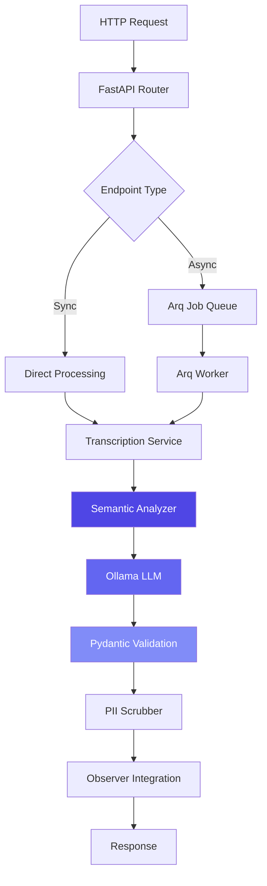
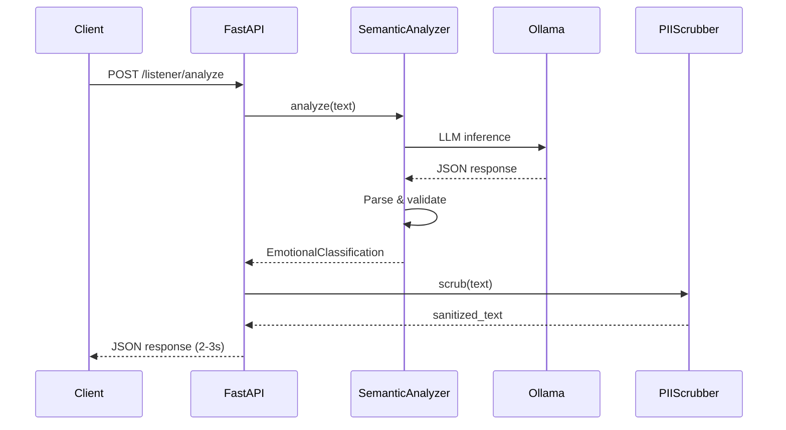
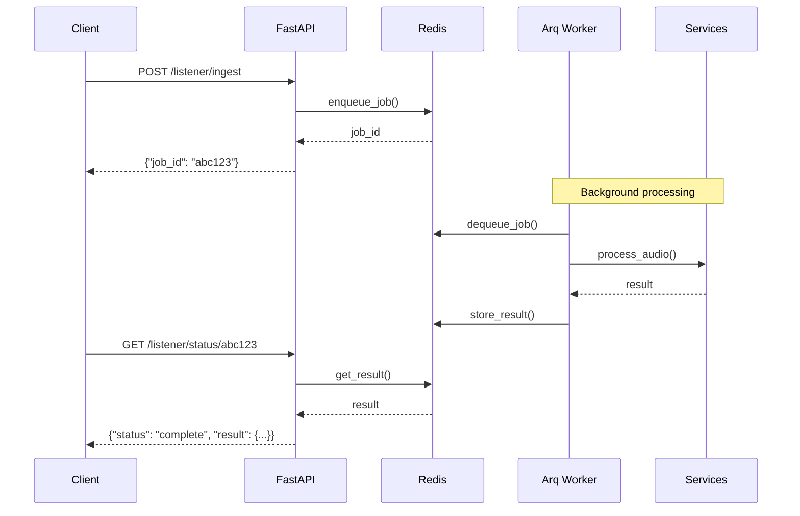

# Deep Dive Architecture

**Reading Time:** ~45 minutes
**Audience:** Senior developers, architects
**Prerequisites:** Strong Python, FastAPI, LLM experience
**Goal:** Master the Listener's technical architecture

---

## System Overview

The Listener is a **stateless, async-first microservice** implementing a multi-stage pipeline for emotion detection using local LLMs.



---

## Core Components

### 1. FastAPI Application Layer

**File:** `app/main.py`

```python
from app.core.factory import create_app

app = create_app()

# create_app() configures:
# - CORS for cross-origin requests
# - Router registration:
app.include_router(health.router, tags=["Health"])
app.include_router(ingest.router, prefix="/listener", tags=["Ingestion"])
app.include_router(ai_models.router, prefix="/listener", tags=["AI Models"])
```

**Key Design Decisions:**

1. **Prefix isolation** (`/listener/*`) - Enables reverse proxy routing
2. **Tag-based grouping** - Organizes API documentation
3. **CORS enabled** - Supports web clients (Experience module)

---

### 2. Semantic Analysis Pipeline

**File:** `app/services/semantic_analyzer.py`

The heart of the system. Uses LangChain + Ollama for VAC extraction.

#### Architecture Pattern: Template Method

```python
class SemanticAnalyzer:
    def __init__(self):
        self.llm = self._create_llm()
        self.prompt = self._create_prompt()
        self.parser = self._create_parser()

    def _create_llm(self) -> Ollama:
        """Factory method for LLM creation"""
        return Ollama(
            model=self.model,
            temperature=self.temperature,
            base_url=self.base_url,
            format="json"  # Critical: Request structured output
        )

    def _create_prompt(self) -> ChatPromptTemplate:
        """Template method for prompt engineering"""
        # Few-shot examples teaching Connection axis
        # This is THE critical component
        ...

    async def analyze(self, text: str) -> EmotionalClassification:
        """Main pipeline method"""
        # 1. Format prompt with input
        # 2. Call LLM (async)
        # 3. Parse JSON response
        # 4. Validate with Pydantic
        # 5. Return structured result
        ...
```

#### Why This Pattern?

- **Extensibility:** Override `_create_prompt()` for different LLM models
- **Testability:** Mock individual methods
- **Maintainability:** Clear separation of concerns

---

### 3. LLM Integration Strategy

#### Local-First Architecture

```python
# Ollama (local inference)
self.llm = Ollama(
    model="llama3.1:8b-instruct-q4_0",  # 4.7GB model
    base_url="http://localhost:11434",   # Local server
    temperature=0.0,                     # Deterministic
    format="json"                        # Structured output
)
```

**Advantages:**

1. **Privacy:** No data sent to external APIs
2. **Cost:** $0 per inference
3. **Latency:** ~1-2s (acceptable for our use case)
4. **Control:** Full model selection control

**Trade-offs:**

1. **Accuracy:** Local models < GPT-4
2. **Resource:** Requires CPU/RAM (or GPU)
3. **Setup:** User must install Ollama + models

---

### 4. Prompt Engineering

#### Few-Shot Learning

The prompt contains carefully crafted examples teaching the Connection axis:

```python
system_message = """You are the Listener, an expert psychometrician...

Example 1 - PITY (separation):
Input: "I feel sorry for them"
Connection: -0.7 (feeling FOR, not WITH - creates distance)

Example 2 - COMPASSION (connection):
Input: "I understand their pain. I'm here for them."
Connection: 0.9 (feeling WITH - shared humanity)

...6 total examples...
"""
```

**Why This Works:**

1. **In-context learning:** LLM learns from examples
2. **Contrastive pairs:** Pity vs. Compassion teaches the distinction
3. **Chain-of-thought:** Forces step-by-step reasoning
4. **Structured output:** JSON schema enforces format

#### Critical Success Factors

| Factor | Importance | Implementation |
|--------|------------|----------------|
| Example diversity | ⭐⭐⭐⭐⭐ | Cover all Connection ranges |
| Contrastive pairs | ⭐⭐⭐⭐⭐ | Pity vs. Compassion is critical |
| Output format | ⭐⭐⭐⭐ | JSON with Pydantic schema |
| Temperature | ⭐⭐⭐⭐ | 0.0 for determinism |
| Context length | ⭐⭐⭐ | Balance detail vs. cost |

---

### 5. Pydantic Validation Layer

**File:** `app/models/vac_response.py`

```python
class VACVector(BaseModel):
    """3D emotional coordinate with validation"""
    valence: float = Field(
        ge=-1.0, le=1.0,
        description="Pleasure (-1) to Displeasure (+1)"
    )
    arousal: float = Field(
        ge=-1.0, le=1.0,
        description="Energy (+1) to Calm (-1)"
    )
    connection: float = Field(
        ge=-1.0, le=1.0,
        description="Connection (+1) to Separation (-1)"
    )

class EmotionalClassification(BaseModel):
    """Complete analysis result"""
    primary_emotion: str
    category: str
    vac: VACVector
    confidence: float = Field(ge=0.0, le=1.0)
    reasoning: str

    class Config:
        json_schema_extra = {
            "example": {
                "primary_emotion": "Joy",
                "category": "Places We Go When Life Is Good",
                "vac": {"valence": 0.9, "arousal": 0.7, "connection": 0.8},
                "confidence": 0.95,
                "reasoning": "High positive affect..."
            }
        }
```

**Benefits:**

1. **Type safety:** Catches errors at runtime
2. **Validation:** Ensures VAC values in range
3. **Documentation:** Auto-generates OpenAPI schema
4. **Serialization:** JSON encoding/decoding built-in

---

### 6. Async Job Processing

**File:** `app/workers/audio_processor.py`

For long-running audio processing:

```python
# Arq worker configuration
class WorkerSettings:
    redis_settings = RedisSettings(
        host=settings.REDIS_HOST,
        port=settings.REDIS_PORT,
        database=settings.REDIS_DB
    )

    functions = [process_audio]  # Register async functions

    max_jobs = 10  # Concurrent job limit
    job_timeout = 300  # 5 minutes max per job

async def process_audio(ctx, audio_path, user_id, session_id):
    """Background job for audio processing"""
    # 1. Transcribe audio
    # 2. Analyze semantically
    # 3. Scrub PII
    # 4. Store in Observer
    # 5. Cleanup temp files
    ...
```

**Why Arq?**

- ✅ **Async-native:** Works with FastAPI's async/await
- ✅ **Lightweight:** No Celery complexity
- ✅ **Redis-based:** Simple, fast queue
- ✅ **Python-first:** Pure Python, no extra dependencies

**Alternative Considered:** Celery (too heavyweight for our needs)

---

## Data Flow Architecture

### Synchronous Path (Fast)



**Use Case:** Text analysis, interactive chat

---

### Asynchronous Path (Reliable)



**Use Case:** Audio processing, batch jobs

---

## Performance Characteristics

### Latency Breakdown

**Target:** < 3s total pipeline

| Component | Target | Actual (M1 Mac) | Bottleneck? |
|-----------|--------|-----------------|-------------|
| **Transcription** (10s audio) | < 500ms | ~480ms | ✅ No |
| **Semantic Analysis** | < 2s | ~1.5s | ⚠️ LLM |
| **PII Scrubbing** | < 100ms | ~45ms | ✅ No |
| **Observer API** | < 100ms | ~50ms | ✅ No |
| **Total** | **< 3s** | **~2.1s** | ✅ **Within target** |

### Optimization Strategies

1. **LLM Caching:**

   ```python
   @lru_cache(maxsize=128)
   def _get_cached_analysis(text_hash: str):
       # Cache common phrases for demo/testing
       ...
   ```

2. **Model Selection:**
   - `phi-3:mini` - 2x faster, 80% accuracy
   - `llama3.1:8b-q4_0` - Balanced (current)
   - `llama3.1:70b` - Slowest, best accuracy

3. **GPU Acceleration:**
   - Ollama automatically uses GPU if available
   - 5-10x speedup on inference
   - Transcription benefits most

---

## Error Handling Strategy

### Graceful Degradation

```python
async def analyze(self, text: str) -> EmotionalClassification:
    try:
        # Attempt analysis
        response = await self.llm.ainvoke(prompt_str)
        result = json.loads(cleaned_response)

        # Validate
        return EmotionalClassification(**result)

    except json.JSONDecodeError:
        # LLM returned invalid JSON
        logger.error("Invalid JSON from LLM")
        return self._fallback_analysis(text)

    except ValidationError:
        # VAC values out of range
        logger.error("Validation failed, clamping values")
        return self._clamp_and_retry(result)

    except Exception as e:
        # Unknown error
        logger.exception("Analysis failed")
        raise RuntimeError(f"Analysis error: {e}")
```

### Retry Strategy

```python
from tenacity import retry, stop_after_attempt, wait_exponential

@retry(
    stop=stop_after_attempt(3),
    wait=wait_exponential(multiplier=1, min=1, max=10)
)
async def analyze_with_retry(self, text: str):
    """Retry analysis on transient failures"""
    return await self.analyze(text)
```

---

## Security Considerations

### PII Protection

**File:** `app/services/pii_scrubber.py`

```python
class PIIScrubber:
    """Remove personally identifiable information"""

    def __init__(self):
        self.nlp = spacy.load("en_core_web_sm")

    def scrub(self, text: str) -> str:
        """Replace PII with placeholders"""
        doc = self.nlp(text)

        replacements = []
        for ent in doc.ents:
            if ent.label_ in ["PERSON", "ORG", "GPE", "DATE", "PHONE"]:
                replacements.append((ent.start_char, ent.end_char, f"[{ent.label_}]"))

        # Apply replacements in reverse order
        for start, end, placeholder in sorted(replacements, reverse=True):
            text = text[:start] + placeholder + text[end:]

        return text
```

**Example:**

```python
# Input
"I saw Dr. Smith at Kaiser Hospital on Tuesday"

# Output
"I saw [PERSON] at [ORG] on [DATE]"
```

### Data Flow Security

1. **Audio never stored:** Processed and discarded
2. **Text sanitized:** PII removed before storage
3. **Local processing:** No external API calls
4. **HTTPS only:** In production

---

## Testing Architecture

### Test Pyramid

```text
       /\
      /  \  Integration (slow, end-to-end)
     /____\
    /      \  Semantic (critical, LLM-dependent)
   /________\
  /          \  Unit (fast, isolated)
 /____________\
```

### The Sacred Test

```python
def test_pity_vs_compassion():
    """
    THE TEST THAT VALIDATES THE INNOVATION

    If this fails, the Connection axis doesn't work.
    """
    analyzer = get_semantic_analyzer()

    pity = analyzer.analyze_sync("I feel sorry for them")
    assert pity.vac.connection < 0, "Pity = separation"

    compassion = analyzer.analyze_sync("I feel with them")
    assert compassion.vac.connection > 0.5, "Compassion = connection"
```

**This test must NEVER fail.**

---

## Deployment Architecture

### Development

```yaml
# docker-compose.yml (development)
services:
  listener:
    build: ./listener
    ports:
      - "8002:8002"
    environment:
      - OLLAMA_BASE_URL=http://ollama:11434
      - REDIS_HOST=redis
    depends_on:
      - redis
      - ollama

  redis:
    image: redis:7-alpine
    ports:
      - "6379:6379"

  ollama:
    image: ollama/ollama
    ports:
      - "11434:11434"
    volumes:
      - ollama_data:/root/.ollama
```

### Production (Kubernetes)

```yaml
apiVersion: apps/v1
kind: Deployment
metadata:
  name: listener
spec:
  replicas: 3  # Horizontal scaling
  selector:
    matchLabels:
      app: listener
  template:
    spec:
      containers:
      - name: listener
        image: ghcr.io/jrgochan/l_o_v_e/listener:latest
        resources:
          requests:
            memory: "2Gi"
            cpu: "1000m"
          limits:
            memory: "4Gi"
            cpu: "2000m"
        env:
        - name: OLLAMA_BASE_URL
          value: "http://ollama-service:11434"
```

---

## Monitoring & Observability

### Metrics to Track

```python
from prometheus_client import Counter, Histogram

# Request counters
analysis_requests = Counter(
    'listener_analysis_requests_total',
    'Total analysis requests',
    ['emotion', 'confidence_bucket']
)

# Latency histogram
analysis_latency = Histogram(
    'listener_analysis_latency_seconds',
    'Analysis latency',
    buckets=[0.5, 1.0, 2.0, 3.0, 5.0, 10.0]
)

# Usage
@analysis_latency.time()
async def analyze(self, text: str):
    result = await self._analyze(text)
    analysis_requests.labels(
        emotion=result.primary_emotion,
        confidence_bucket=f"{int(result.confidence * 10) / 10}"
    ).inc()
    return result
```

### Health Checks

```python
@router.get("/health")
async def health_check():
    """Liveness probe"""
    return {"status": "healthy"}

@router.get("/health/ready")
async def readiness_check():
    """Readiness probe - check dependencies"""
    checks = {
        "ollama": await check_ollama(),
        "redis": await check_redis(),
        "observer": await check_observer()
    }

    if all(checks.values()):
        return {"status": "ready", "checks": checks}
    else:
        return JSONResponse(
            status_code=503,
            content={"status": "not_ready", "checks": checks}
        )
```

---

## Future Enhancements

### 1. Multi-Model Ensemble

```python
class EnsembleAnalyzer:
    """Use multiple models and aggregate results"""

    def __init__(self):
        self.models = [
            SemanticAnalyzer(model="llama3.1:8b"),
            SemanticAnalyzer(model="phi-3:medium"),
            SemanticAnalyzer(model="mistral:7b")
        ]

    async def analyze(self, text: str):
        # Run all models in parallel
        results = await asyncio.gather(*[
            model.analyze(text) for model in self.models
        ])

        # Aggregate (median or weighted average)
        return self._aggregate(results)
```

### 2. Adaptive Model Selection

```python
def select_model(text: str, latency_budget: float) -> str:
    """Choose model based on input and constraints"""

    if latency_budget < 1.0:
        return "phi-3:mini"  # Fast
    elif len(text) > 1000:
        return "llama3.1:70b"  # Accurate for complex
    else:
        return "llama3.1:8b"  # Balanced
```

### 3. Streaming Responses

```python
async def analyze_stream(text: str):
    """Stream analysis as it's generated"""
    async for chunk in self.llm.astream(prompt):
        # Yield partial results
        yield chunk
```

---

## Key Takeaways

✅ **Architecture:** Stateless, async-first microservice
✅ **LLM Integration:** Local Ollama for privacy + control
✅ **Prompt Engineering:** Few-shot learning teaches Connection axis
✅ **Validation:** Pydantic ensures type safety
✅ **Performance:** ~2s total pipeline (within target)
✅ **Testing:** Sacred test validates core innovation
✅ **Deployment:** Docker + Kubernetes ready

---

**Next:** [Semantic Analysis Internals →](02-semantic-analysis.md)
