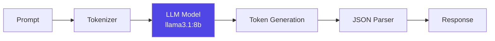

# Semantic Analysis Internals

**Reading Time:** ~40 minutes
**Audience:** Senior developers, ML engineers
**Prerequisites:** [Deep Dive Architecture](01-deep-dive.md)
**Goal:** Master the semantic analysis pipeline and LLM integration

---

## The Core Challenge

Traditional sentiment analysis outputs **Valence** and **Arousal** using statistical models (VADER, TextBlob) or neural networks (BERT fine-tuned on emotion datasets).

**The problem:** These models have no concept of **Connection** - the relational dimension we're introducing.

**Our solution:** Use an LLM's understanding of language and relationships, taught through few-shot examples, to extract all three VAC dimensions.

---

## Pipeline Architecture

```python
class SemanticAnalyzer:
    """
    Extract VAC coordinates from text using local LLM.

    Pipeline:
    1. Initialize LLM (Ollama)
    2. Create few-shot prompt with examples
    3. Format input with prompt template
    4. Call LLM for inference
    5. Parse structured JSON response
    6. Validate with Pydantic
    7. Return EmotionalClassification
    """
```

---

## Component 1: LLM Initialization

### Why Ollama?

```python
self.llm = Ollama(
    model="llama3.1:8b-instruct-q4_0",
    base_url="http://localhost:11434",
    temperature=0.0,
    format="json"
)
```

**Decision Factors:**

| Requirement | Ollama | OpenAI API | HuggingFace |
|-------------|--------|------------|-------------|
| **Privacy** | ✅ Local | ❌ External | ✅ Local |
| **Cost** | ✅ Free | ❌ Pay-per-token | ✅ Free |
| **Setup** | ✅ Easy | ✅ API key | ⚠️ Complex |
| **Performance** | ✅ Fast | ✅ Fastest | ⚠️ Varies |
| **Model Selection** | ✅ Many | ✅ GPT-4 | ✅ Many |

**Winner:** Ollama for privacy + ease of use + cost

### Model Selection Strategy

```python
def select_model_for_task(task: str, constraints: dict) -> str:
    """
    Choose appropriate model based on task and constraints.

    Args:
        task: "semantic_vac", "multi_emotion", "atlas_mapping"
        constraints: {"latency": float, "accuracy": float, "cost": float}

    Returns:
        Model identifier (e.g., "llama3.1:8b-instruct-q4_0")
    """

    if task == "semantic_vac":
        # VAC extraction needs accuracy for Connection axis
        if constraints.get("latency", 3.0) < 1.0:
            return "phi-3:mini"  # Fast but less accurate
        elif constraints.get("accuracy", 0.9) > 0.95:
            return "llama3.1:70b"  # Slow but very accurate
        else:
            return "llama3.1:8b-instruct-q4_0"  # Balanced (default)

    elif task == "multi_emotion":
        # Multi-emotion needs reasoning capability
        return "llama3.1:8b-instruct-q8_0"  # Higher precision

    else:
        return "llama3.1:8b-instruct-q4_0"  # Default
```

### Temperature Strategy

```python
temperature = 0.0  # Deterministic output
```

**Why 0.0?**

- **Consistency:** Same input → same output
- **Testability:** Tests don't flake
- **Reliability:** Production behavior is predictable

**Trade-off:** Less creative, but we want consistency for emotion detection.

---

## Component 2: Prompt Engineering

### The Prompt Structure

```python
system_message = """
[1] Role Definition
[2] Task Description
[3] VAC Model Specification
[4] Few-Shot Examples (CRITICAL)
[5] Output Format
[6] Analysis Instructions
"""
```

### [1] Role Definition

```python
"""
You are the Listener, an expert psychometrician trained in
Dr. Brené Brown's Atlas of the Heart.
"""
```

**Why this matters:**

- Sets the LLM's "persona"
- Invokes relevant training data
- Establishes authority/expertise context

### [2] Task Description

```python
"""
Your task is to analyze text and map it to the 3-dimensional VAC Model:
- Valence (X-axis): Pleasure (+1) to Displeasure (-1)
- Arousal (Y-axis): High Energy (+1) to Low Energy (-1)
- Connection (Z-axis): Connected (+1) to Disconnected (-1)
"""
```

**Explicit specifications prevent ambiguity.**

### [3] Connection Axis Teaching

```python
"""
The Connection axis is CRITICAL and novel. It measures:
- Relational stance: "with" vs "against" others
- Self-alignment vs external conformity
- Vulnerability and emotional exposure
- Feeling "for" someone (separation) vs "with" someone (alignment)
"""
```

**This is THE innovation.** The prompt must explicitly teach what Connection means.

### [4] Few-Shot Examples (THE CRITICAL COMPONENT)

```python
Example 1 - PITY (separation):
Input: "I feel sorry for them, they're struggling."
Analysis:
- Valence: Slightly negative (witnessing suffering) → -0.3
- Arousal: Low (reflective, not active) → -0.1
- Connection: NEGATIVE (feeling FOR, not WITH - creates distance) → -0.7
Output: {"primary_emotion": "Pity", ...}

Example 2 - COMPASSION (connection):
Input: "I understand their pain. I'm here for them."
Analysis:
- Valence: Neutral to slightly positive (offering support) → 0.5
- Arousal: Low to moderate (calm presence) → 0.2
- Connection: POSITIVE (feeling WITH - shared humanity) → 0.9
Output: {"primary_emotion": "Compassion", ...}

... 4 more examples covering range ...
```

#### Why These Examples Work

1. **Contrastive Pairs:**
   - Pity vs. Compassion (teaches Connection distinction)
   - Grief vs. Anguish (Connection persists vs. disappears)

2. **Explicit Reasoning:**
   - Show step-by-step VAC analysis
   - Explain WHY each value was chosen

3. **Range Coverage:**
   - Positive Connection: Compassion (+0.9), Joy (+0.8)
   - Negative Connection: Pity (-0.7), Loneliness (-0.9)
   - Neutral: (rare, but important)

4. **Edge Cases:**
   - Grief (negative Valence but positive Connection!)
   - Loneliness (Connection as defining feature)

### [5] Output Format

```python
"""
You must respond with valid JSON matching this schema:
{
  "primary_emotion": "string",
  "category": "string",
  "vac": {
    "valence": float,
    "arousal": float,
    "connection": float
  },
  "confidence": float,
  "reasoning": "string"
}
"""
```

**Structured output is enforced by:**

1. Prompt specification
2. Ollama's `format="json"` parameter
3. Pydantic validation

### [6] Analysis Instructions

```python
"""
Follow this analysis process:
1. Analyze Valence: Look for hedonic keywords
2. Analyze Arousal: Look for energy markers
3. Analyze Connection: THIS IS THE HARDEST STEP
4. Select Category: Which of the 13 Atlas categories?
5. Select Emotion: Which specific emotion from the 87?
"""
```

**Chain-of-thought reasoning improves accuracy.**

---

## Component 3: LLM Inference

### The Critical Call

```python
async def analyze(self, text: str) -> EmotionalClassification:
    # Format prompt
    formatted_prompt = self.prompt.format_messages(input_text=text)
    prompt_str = "\n\n".join([msg.content for msg in formatted_prompt])

    # Call LLM (THE MAGIC HAPPENS HERE)
    response = await self.llm.ainvoke(prompt_str)

    # Parse response
    result_dict = json.loads(cleaned_response)

    # Validate
    return EmotionalClassification(**result_dict)
```

### What Happens Inside Ollama?



1. **Tokenization:** Text → tokens (integers)
2. **Attention mechanism:** Model attends to relevant context
3. **Generation:** Autoregressively generate output tokens
4. **Detokenization:** Tokens → text
5. **JSON validation:** Ollama's `format="json"` enforces structure

### Latency Breakdown

| Step | Time (M1 Mac) | % of Total |
|------|---------------|------------|
| Prompt formatting | ~1ms | <1% |
| Ollama API call | ~1500ms | ~95% |
| JSON parsing | ~2ms | <1% |
| Pydantic validation | ~3ms | <1% |
| **Total** | **~1.5s** | **100%** |

**Bottleneck:** LLM inference (expected and acceptable)

---

## Component 4: Response Parsing

### Cleaning LLM Output

```python
def clean_llm_response(response: str) -> str:
    """
    LLMs sometimes wrap JSON in markdown code blocks.

    Input:  "```json\n{...}\n```"
    Output: "{...}"
    """
    cleaned = response.strip()

    # Remove markdown code blocks
    if cleaned.startswith("```json"):
        cleaned = cleaned.split("```json")[1]
    if cleaned.startswith("```"):
        cleaned = cleaned.split("```")[1]
    if cleaned.endswith("```"):
        cleaned = cleaned.rsplit("```", 1)[0]

    return cleaned.strip()
```

### Handling Invalid Responses

```python
try:
    result_dict = json.loads(cleaned_response)
except json.JSONDecodeError as e:
    logger.error(f"Invalid JSON from LLM: {response}")

    # Fallback strategy
    return EmotionalClassification(
        primary_emotion="Uncertainty",
        category="Places We Go When Things Are Uncertain",
        vac=VACVector(valence=0.0, arousal=0.0, connection=0.0),
        confidence=0.0,
        reasoning="Failed to parse LLM response"
    )
```

#### Graceful degradation > hard failures

---

## Component 5: Pydantic Validation

### Value Clamping

```python
def validate_and_clamp(result_dict: dict) -> dict:
    """Ensure VAC values are within valid range"""

    def clamp(value: float, min_val=-1.0, max_val=1.0) -> float:
        return max(min_val, min(max_val, value))

    if "vac" in result_dict:
        result_dict["vac"]["valence"] = clamp(result_dict["vac"]["valence"])
        result_dict["vac"]["arousal"] = clamp(result_dict["vac"]["arousal"])
        result_dict["vac"]["connection"] = clamp(result_dict["vac"]["connection"])

    return result_dict
```

**Why needed:** LLMs occasionally output values like 1.2 or -1.5

### Validation Flow

```python
# 1. Parse JSON
result_dict = json.loads(cleaned_response)

# 2. Handle null values (input too vague)
if result_dict.get("primary_emotion") is None:
    result_dict = get_uncertainty_response()

# 3. Clamp VAC values
result_dict = validate_and_clamp(result_dict)

# 4. Pydantic validation
try:
    result = EmotionalClassification(**result_dict)
except ValidationError as e:
    logger.error(f"Validation failed: {e}")
    raise
```

---

## Advanced Techniques

### 1. Dynamic Model Selection

```python
class AdaptiveSemanticAnalyzer(SemanticAnalyzer):
    """Dynamically selects model based on input complexity"""

    async def analyze(self, text: str) -> EmotionalClassification:
        # Analyze input complexity
        complexity = self._analyze_complexity(text)

        # Select appropriate model
        if complexity > 0.8:
            self.model = "llama3.1:70b"  # Complex input needs powerful model
        elif complexity < 0.3:
            self.model = "phi-3:mini"  # Simple input, use fast model
        else:
            self.model = "llama3.1:8b-instruct-q4_0"  # Default

        # Reinitialize LLM with new model
        self.llm = self._create_llm()

        # Proceed with analysis
        return await super().analyze(text)

    def _analyze_complexity(self, text: str) -> float:
        """
        Estimate input complexity.

        Factors:
        - Length (longer = more complex)
        - Vocabulary richness (unique words / total words)
        - Sentence structure (nested clauses)
        - Emotional ambiguity (mixed sentiment markers)
        """
        length_score = min(len(text) / 1000, 1.0)
        vocab_score = len(set(text.split())) / len(text.split())

        return (length_score + vocab_score) / 2
```

### 2. Confidence Calibration

```python
def calibrate_confidence(
    raw_confidence: float,
    text_length: int,
    vac_variance: float
) -> float:
    """
    Adjust LLM's self-reported confidence based on heuristics.

    Args:
        raw_confidence: LLM's reported confidence (0-1)
        text_length: Length of input text (characters)
        vac_variance: Variance across VAC dimensions

    Returns:
        Calibrated confidence (0-1)
    """
    # Penalty for very short text
    if text_length < 10:
        raw_confidence *= 0.7

    # Penalty for high VAC variance (ambiguous emotions)
    if vac_variance > 0.5:
        raw_confidence *= 0.8

    # Bonus for moderate length (sweet spot)
    if 50 <= text_length <= 500:
        raw_confidence *= 1.1

    return min(raw_confidence, 1.0)
```

### 3. Ensemble Methods

```python
class EnsembleSemanticAnalyzer:
    """Run multiple models and aggregate results"""

    def __init__(self):
        self.analyzers = [
            SemanticAnalyzer(model="llama3.1:8b"),
            SemanticAnalyzer(model="phi-3:medium"),
            SemanticAnalyzer(model="mistral:7b")
        ]

    async def analyze(self, text: str) -> EmotionalClassification:
        # Run all models in parallel
        results = await asyncio.gather(*[
            analyzer.analyze(text)
            for analyzer in self.analyzers
        ])

        # Aggregate VAC values (median is robust to outliers)
        aggregated_vac = VACVector(
            valence=np.median([r.vac.valence for r in results]),
            arousal=np.median([r.vac.arousal for r in results]),
            connection=np.median([r.vac.connection for r in results])
        )

        # Most common emotion (voting)
        emotions = [r.primary_emotion for r in results]
        primary_emotion = max(set(emotions), key=emotions.count)

        # Average confidence
        confidence = np.mean([r.confidence for r in results])

        return EmotionalClassification(
            primary_emotion=primary_emotion,
            category=results[0].category,
            vac=aggregated_vac,
            confidence=confidence,
            reasoning="Ensemble of 3 models"
        )
```

---

## Debugging Strategies

### 1. Logging LLM Reasoning

```python
logger.info(f"LLM Reasoning: {result.reasoning}")
```

This shows WHY the LLM chose specific VAC values.

### 2. Comparing Similar Inputs

```python
def compare_analyses(text1: str, text2: str):
    """Compare VAC values for similar inputs"""
    r1 = analyzer.analyze_sync(text1)
    r2 = analyzer.analyze_sync(text2)

    print(f"\nInput 1: {text1}")
    print(f"VAC: {r1.vac}")
    print(f"Reasoning: {r1.reasoning}\n")

    print(f"Input 2: {text2}")
    print(f"VAC: {r2.vac}")
    print(f"Reasoning: {r2.reasoning}\n")

    # Calculate distance
    distance = np.linalg.norm([
        r1.vac.valence - r2.vac.valence,
        r1.vac.arousal - r2.vac.arousal,
        r1.vac.connection - r2.vac.connection
    ])
    print(f"VAC Distance: {distance:.3f}")

# Example
compare_analyses(
    "I feel sorry for them",
    "I feel their pain with them"
)
```

### 3. Prompt Ablation Studies

```python
def test_prompt_variations():
    """Test how prompt changes affect output"""

    base_analyzer = SemanticAnalyzer()

    # Remove Connection explanation
    no_connection_prompt = create_prompt_without_connection_explanation()
    test_analyzer = SemanticAnalyzer(prompt=no_connection_prompt)

    # Test on critical input
    text = "I feel sorry for them"

    base_result = base_analyzer.analyze_sync(text)
    test_result = test_analyzer.analyze_sync(text)

    print(f"With Connection explanation: {base_result.vac.connection}")
    print(f"Without: {test_result.vac.connection}")
```

---

## Performance Optimization

### 1. Prompt Length Optimization

**Trade-off:** Longer prompts = better accuracy, slower inference

```python
# Minimal prompt (fast, less accurate)
minimal_examples = 3  # ~500 tokens

# Standard prompt (balanced)
standard_examples = 6  # ~1000 tokens (current)

# Detailed prompt (slow, more accurate)
detailed_examples = 12  # ~2000 tokens
```

**Recommendation:** Use 6 examples (current approach)

### 2. Batch Processing

```python
async def analyze_batch(texts: List[str]) -> List[EmotionalClassification]:
    """Process multiple texts concurrently"""

    # Create tasks
    tasks = [self.analyze(text) for text in texts]

    # Run concurrently (limited by semaphore)
    semaphore = asyncio.Semaphore(5)  # Max 5 concurrent

    async def bounded_analyze(text):
        async with semaphore:
            return await self.analyze(text)

    return await asyncio.gather(*[bounded_analyze(t) for t in texts])
```

### 3. Result Caching

```python
from functools import lru_cache
import hashlib

@lru_cache(maxsize=128)
def get_cached_analysis(text_hash: str) -> Optional[EmotionalClassification]:
    """Cache results for common inputs"""
    return cache.get(text_hash)

async def analyze_with_cache(self, text: str) -> EmotionalClassification:
    # Hash input
    text_hash = hashlib.md5(text.encode()).hexdigest()

    # Check cache
    cached = get_cached_analysis(text_hash)
    if cached:
        logger.info("Cache hit!")
        return cached

    # Analyze
    result = await self.analyze(text)

    # Store in cache
    cache[text_hash] = result

    return result
```

---

## Key Takeaways

✅ **Few-shot prompting** teaches the Connection axis
✅ **Contrastive examples** (pity vs. compassion) are critical
✅ **Temperature 0.0** ensures deterministic output
✅ **Pydantic validation** catches LLM errors
✅ **Graceful degradation** handles failures
✅ **Performance:** ~1.5s per analysis (acceptable)
✅ **Optimization:** Caching, batching, adaptive models

---

**Next:** [Prompt Engineering Guide →](03-prompt-engineering.md)
