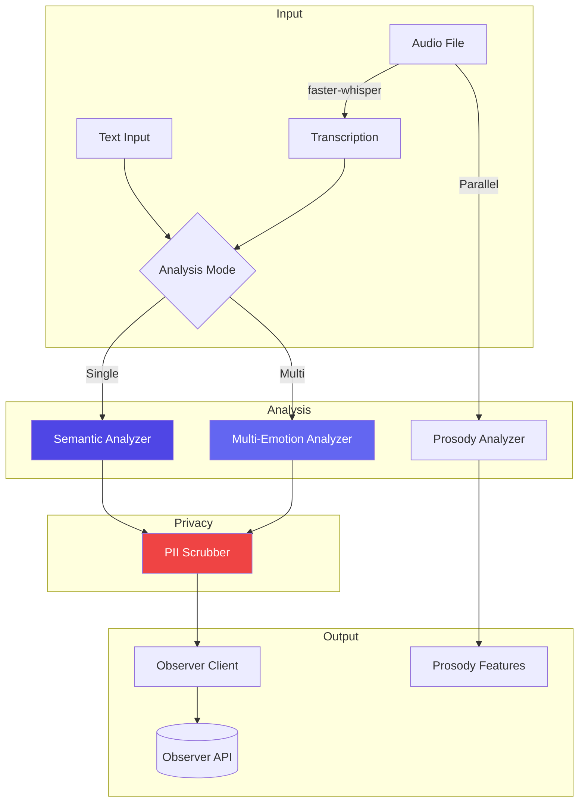

# Listener Service Layer Architecture

**Last Updated:** February 2026
**Audience:** Developers

---

## Overview

The Listener module's service layer handles the complete pipeline from raw audio/text input to structured VAC coordinates. Services are organized as flat modules in `listener/app/services/` — 9 Python files totaling ~182KB.

```text
listener/app/services/
├── transcription.py          # Audio → text (faster-whisper)
├── semantic_analyzer.py      # Text → VAC extraction (Ollama)
├── multi_emotion_analyzer.py # Multi-emotion analysis pipeline
├── prosody_analyzer.py       # Voice feature extraction
├── pii_scrubber.py           # PII detection & removal
├── observer_client.py        # Observer API client
├── ollama_manager.py         # Ollama model lifecycle
├── model_fetcher.py          # Model download & management
└── llm_factory.py            # LLM client factory
```

---

## Service Details

### Multi-Emotion Analyzer (`multi_emotion_analyzer.py`)

The largest service (52KB). Analyzes text for multiple concurrent emotions.

**Key Capabilities:**
- Detect 2-5 concurrent emotions in a single input
- Calculate prominence/weight for each emotion
- Identify relationships between detected emotions (tension, complement, etc.)
- Compute aggregate VAC from weighted emotions
- Calculate emotional complexity and clarity scores

**Pipeline:**
```text
Text Input → Semantic Analysis (×N emotions) → Relationship Detection
          → Prominence Weighting → Aggregate VAC → Response
```

### Prosody Analyzer (`prosody_analyzer.py`)

Voice feature extraction service (29KB). Analyzes audio characteristics separately from content.

**Features Extracted:**
- Pitch (mean, std, contour)
- Energy/loudness
- Speech rate (syllables/second)
- Pause patterns
- Emotional indicators from voice tone

### Semantic Analyzer (`semantic_analyzer.py`)

Core VAC extraction service (27KB). Uses Ollama + Llama 3.1 for semantic analysis.

**Pipeline:**
```text
Text → Few-shot Prompt Construction → Ollama LLM → Parse VAC Output
     → Atlas Emotion Matching → Confidence Scoring
```

**Key responsibilities:**
- Construct few-shot prompts with atlas emotion examples
- Parse structured LLM output into VAC coordinates
- Handle Connection axis (the critical innovation — distinguishing pity from compassion)
- Confidence calibration

### Transcription (`transcription.py`)

Audio transcription service (22KB). Uses faster-whisper for local speech-to-text.

**Supported formats:** WAV, M4A, WebM, MP3, AAC
**Max file size:** 25MB
**Model:** base.en (optimized for English)

### Observer Client (`observer_client.py`)

HTTP client for Observer API (15KB). Handles state storage after analysis.

**Responsibilities:**
- Store analyzed emotional states in Observer
- Fetch user history for context
- Handle connection errors and retries

### Ollama Manager (`ollama_manager.py`)

Ollama model lifecycle management (13KB).

**Capabilities:**
- List available local models
- Pull (download) new models
- Delete models
- Health checking
- Model details and metadata

### PII Scrubber (`pii_scrubber.py`)

Privacy-first PII detection and removal (11KB).

**Uses:** Spacy NER (Named Entity Recognition)
**Detects and removes:** Names, addresses, phone numbers, emails, dates of birth
**Approach:** Replace PII with generic tokens (e.g., "[NAME]", "[PHONE]")

### Model Fetcher (`model_fetcher.py`)

Model download and management (10KB).

**Responsibilities:**
- Download Ollama models with progress tracking
- Verify model integrity
- Manage model storage

### LLM Factory (`llm_factory.py`)

LLM client factory (4KB).

**Purpose:** Create configured Ollama client instances with appropriate settings for different analysis tasks.

---

## Processing Pipeline



---

## See Also

- [API Reference](../reference/api-reference.md) — Full endpoint documentation
- [Module Overview](../index.md) — Listener module overview
