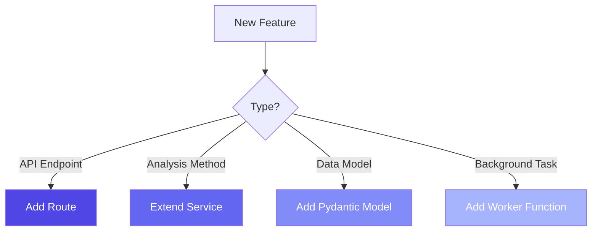

# Extending the Listener

**Reading Time:** ~35 minutes  
**Audience:** Senior developers  
**Prerequisites:** [Performance Optimization](04-performance-optimization.md)  
**Goal:** Learn how to extend the Listener with new features

---

## Extension Points

The Listener is designed for extensibility. Here are the main extension points:



---

## Extension 1: Adding a New API Endpoint

**Scenario:** Add `/listener/batch-analyze` for processing multiple texts at once.

### Step 1: Create the Route

**File:** `app/api/routes/ingest.py`

```python
@router.post("/batch-analyze")
async def batch_analyze(
    texts: List[str] = Form(...),
    user_id: str = Form("batch-user"),
    session_id: str = Form("batch-session")
):
    """
    Analyze multiple texts in parallel.
    
    Args:
        texts: List of texts to analyze
        user_id: User identifier
        session_id: Session identifier
    
    Returns:
        List of analysis results
    """
    from app.services.semantic_analyzer import get_semantic_analyzer
    import asyncio
    
    analyzer = get_semantic_analyzer()
    
    # Process concurrently with semaphore
    semaphore = asyncio.Semaphore(5)  # Max 5 concurrent
    
    async def analyze_one(text: str):
        async with semaphore:
            return await analyzer.analyze(text)
    
    # Run all analyses
    results = await asyncio.gather(*[
        analyze_one(text) for text in texts
    ])
    
    # Return as list
    return {
        "user_id": user_id,
        "session_id": session_id,
        "count": len(results),
        "results": [
            {
                "text": texts[i],
                "emotion": r.primary_emotion,
                "vac": {
                    "valence": r.vac.valence,
                    "arousal": r.vac.arousal,
                    "connection": r.vac.connection
                },
                "confidence": r.confidence
            }
            for i, r in enumerate(results)
        ]
    }
```

### Step 2: Add Tests

**File:** `tests/integration/test_batch_processing.py`

```python
import pytest
from fastapi.testclient import TestClient
from app.main import app

client = TestClient(app)

def test_batch_analyze():
    """Test batch analysis endpoint"""
    
    texts = [
        "I'm feeling happy!",
        "I'm feeling sad.",
        "I'm feeling anxious."
    ]
    
    response = client.post(
        "/listener/batch-analyze",
        data={
            "texts": texts,
            "user_id": "test",
            "session_id": "test"
        }
    )
    
    assert response.status_code == 200
    data = response.json()
    
    assert data["count"] == 3
    assert len(data["results"]) == 3
    
    # Check each result has required fields
    for result in data["results"]:
        assert "emotion" in result
        assert "vac" in result
        assert "confidence" in result
```

### Step 3: Document the Endpoint

Update `modules/listener/reference/api-reference.md`:

```markdown
### POST /listener/batch-analyze

Analyze multiple texts concurrently.

**Request:**
```http
POST /listener/batch-analyze
Content-Type: multipart/form-data

texts: ["text1", "text2", "text3"]
user_id: demo-user
session_id: demo-session
```

**Response:**

```json
{
  "count": 3,
  "results": [...]
}
```

```text

---

## Extension 2: Adding a New Service

**Scenario:** Add sentiment trend analysis over time.

### Step 1: Create the Service

**File:** `app/services/trend_analyzer.py`

```python
"""
Listener Module - Trend Analysis Service

Analyze emotional trends over time for a user.
"""
from typing import List, Dict, Optional
from datetime import datetime, timedelta
import numpy as np

from app.services.observer_client import get_observer_client
from app.models.vac_response import VACVector


class TrendAnalyzer:
    """
    Analyze emotional trends over time.
    
    Provides insights like:
    - Average VAC over period
    - Emotional volatility (variance)
    - Connection trajectory (improving/declining)
    - Most common emotions
    """
    
    def __init__(self):
        self.observer = get_observer_client()
    
    async def analyze_trend(
        self,
        user_id: str,
        days: int = 7
    ) -> Dict:
        """
        Analyze emotional trend for user over time period.
        
        Args:
            user_id: User to analyze
            days: Number of days to look back
        
        Returns:
            dict: Trend analysis with metrics
        """
        # Fetch historical states from Observer
        states = await self.observer.get_recent_states(
            user_id=user_id,
            days=days
        )
        
        if len(states) == 0:
            return {"error": "No data available"}
        
        # Extract VAC values
        vac_values = [
            (s['vac']['valence'], s['vac']['arousal'], s['vac']['connection'])
            for s in states
        ]
        
        # Calculate metrics
        valences = [v[0] for v in vac_values]
        arousals = [v[1] for v in vac_values]
        connections = [v[2] for v in vac_values]
        
        return {
            "period_days": days,
            "sample_count": len(states),
            "average_vac": {
                "valence": float(np.mean(valences)),
                "arousal": float(np.mean(arousals)),
                "connection": float(np.mean(connections))
            },
            "volatility": {
                "valence": float(np.std(valences)),
                "arousal": float(np.std(arousals)),
                "connection": float(np.std(connections))
            },
            "connection_trend": self._calculate_trend(connections),
            "most_common_emotions": self._get_top_emotions(states, n=5)
        }
    
    def _calculate_trend(self, values: List[float]) -> str:
        """Determine if values are improving, declining, or stable"""
        if len(values) < 3:
            return "insufficient_data"
        
        # Linear regression slope
        x = np.arange(len(values))
        slope = np.polyfit(x, values, 1)[0]
        
        if slope > 0.05:
            return "improving"
        elif slope < -0.05:
            return "declining"
        else:
            return "stable"
    
    def _get_top_emotions(self, states: List[Dict], n: int = 5) -> List[Dict]:
        """Get most common emotions"""
        from collections import Counter
        
        emotions = [s['emotion'] for s in states]
        counts = Counter(emotions)
        
        return [
            {"emotion": emotion, "count": count}
            for emotion, count in counts.most_common(n)
        ]


# Global instance
_trend_analyzer: Optional[TrendAnalyzer] = None

def get_trend_analyzer() -> TrendAnalyzer:
    """Get or create global TrendAnalyzer instance"""
    global _trend_analyzer
    if _trend_analyzer is None:
        _trend_analyzer = TrendAnalyzer()
    return _trend_analyzer
```

### Step 2: Add API Endpoint

**File:** `app/api/routes/ingest.py`

```python
@router.get("/trend/{user_id}")
async def get_emotional_trend(
    user_id: str,
    days: int = 7
):
    """Get emotional trend analysis for user"""
    from app.services.trend_analyzer import get_trend_analyzer
    
    analyzer = get_trend_analyzer()
    trend = await analyzer.analyze_trend(user_id, days)
    
    return trend
```

### Step 3: Add Tests

**File:** `tests/unit/test_trend_analyzer.py`

```python
import pytest
from app.services.trend_analyzer import TrendAnalyzer

@pytest.mark.asyncio
async def test_trend_analysis():
    """Test trend analysis calculation"""
    analyzer = TrendAnalyzer()
    
    # Mock Observer client
    # ... test implementation
```

---

## Extension 3: Adding a New Model

**Scenario:** Add support for emotion intensity classification.

### Step 1: Define the Model

**File:** `app/models/intensity_response.py`

```python
"""
Listener Module - Intensity Response Models

Models for emotion intensity classification.
"""
from pydantic import BaseModel, Field
from enum import Enum


class IntensityLevel(str, Enum):
    """Emotion intensity levels"""
    MINIMAL = "minimal"          # 0.0 - 0.2
    MILD = "mild"                # 0.2 - 0.4
    MODERATE = "moderate"        # 0.4 - 0.6
    STRONG = "strong"            # 0.6 - 0.8
    OVERWHELMING = "overwhelming" # 0.8 - 1.0


class EmotionIntensity(BaseModel):
    """Emotion with intensity classification"""
    
    emotion: str
    intensity_level: IntensityLevel
    intensity_score: float = Field(ge=0.0, le=1.0)
    
    vac: 'VACVector'
    confidence: float = Field(ge=0.0, le=1.0)
    
    class Config:
        use_enum_values = True


def classify_intensity(vac: 'VACVector') -> IntensityLevel:
    """
    Classify emotion intensity from VAC values.
    
    Uses Euclidean distance from origin as intensity metric.
    """
    import math
    
    # Calculate magnitude
    magnitude = math.sqrt(
        vac.valence**2 + vac.arousal**2 + vac.connection**2
    )
    
    # Normalize to 0-1 range (max magnitude is sqrt(3) ≈ 1.73)
    normalized = magnitude / math.sqrt(3)
    
    # Classify
    if normalized < 0.2:
        return IntensityLevel.MINIMAL
    elif normalized < 0.4:
        return IntensityLevel.MILD
    elif normalized < 0.6:
        return IntensityLevel.MODERATE
    elif normalized < 0.8:
        return IntensityLevel.STRONG
    else:
        return IntensityLevel.OVERWHELMING
```

### Step 2: Integrate into Analyzer

**File:** `app/services/semantic_analyzer.py`

```python
from app.models.intensity_response import EmotionIntensity, classify_intensity

async def analyze_with_intensity(self, text: str) -> EmotionIntensity:
    """Analyze with intensity classification"""
    
    # Get standard analysis
    result = await self.analyze(text)
    
    # Add intensity
    intensity_level = classify_intensity(result.vac)
    intensity_score = calculate_intensity_score(result.vac)
    
    return EmotionIntensity(
        emotion=result.primary_emotion,
        intensity_level=intensity_level,
        intensity_score=intensity_score,
        vac=result.vac,
        confidence=result.confidence
    )
```

---

## Extension 4: Adding a Background Worker

**Scenario:** Add periodic emotion summarization job.

### Step 1: Define Worker Function

**File:** `app/workers/summarization.py`

```python
"""
Listener Module - Summarization Worker

Periodic jobs for emotional data summarization.
"""
import logging
from datetime import datetime, timedelta

from app.services.observer_client import get_observer_client

logger = logging.getLogger(__name__)


async def daily_emotion_summary(ctx):
    """
    Daily job: Summarize emotional data for all users.
    
    Runs at midnight UTC.
    """
    logger.info("Starting daily emotion summary...")
    
    observer = get_observer_client()
    
    # Get all users (from Observer)
    users = await observer.get_all_users()
    
    for user in users:
        # Calculate daily summary
        summary = await calculate_daily_summary(user['id'])
        
        # Store summary
        await observer.store_summary(user['id'], summary)
    
    logger.info(f"Daily summary complete for {len(users)} users")


async def calculate_daily_summary(user_id: str) -> dict:
    """Calculate summary metrics for one user"""
    observer = get_observer_client()
    
    # Get last 24 hours of states
    states = await observer.get_recent_states(user_id, days=1)
    
    # Calculate metrics
    # ... implementation
    
    return {
        "date": datetime.utcnow().date().isoformat(),
        "entry_count": len(states),
        "average_vac": {...},
        "dominant_emotion": "...",
        # ... more metrics
    }
```

### Step 2: Register with Arq

**File:** `app/workers/audio_processor.py`

```python
from app.workers.summarization import daily_emotion_summary

class WorkerSettings:
    functions = [
        process_audio,           # Existing
        daily_emotion_summary    # New!
    ]
    
    # Cron schedule
    cron_jobs = [
        cron(daily_emotion_summary, hour=0, minute=0)  # Daily at midnight
    ]
```

### Step 3: Test the Worker

```python
import pytest
from app.workers.summarization import daily_emotion_summary

@pytest.mark.asyncio
async def test_daily_summary():
    """Test daily summarization job"""
    
    # Mock context
    ctx = {}
    
    # Run job
    await daily_emotion_summary(ctx)
    
    # Verify summary was created
    # ... assertions
```

---

## Extension 5: Custom Analysis Modes

**Scenario:** Add "clinical mode" with different thresholds and output.

### Step 1: Create Custom Analyzer

**File:** `app/services/clinical_analyzer.py`

```python
"""
Listener Module - Clinical Analysis Service

Clinical-grade emotion analysis with stricter validation.
"""
from app.services.semantic_analyzer import SemanticAnalyzer
from app.models.vac_response import EmotionalClassification


class ClinicalAnalyzer(SemanticAnalyzer):
    """
    Clinical-grade analyzer with enhanced validation.
    
    Differences from standard:
    - Higher confidence threshold (0.85 vs. 0.70)
    - More conservative VAC values
    - Additional safety checks
    - Detailed clinical notes
    """
    
    def __init__(self):
        super().__init__(temperature=0.0)  # Fully deterministic
    
    async def analyze(self, text: str) -> EmotionalClassification:
        """Analyze with clinical validation"""
        
        # Get base analysis
        result = await super().analyze(text)
        
        # Clinical validation
        if result.confidence < 0.85:
            logger.warning(f"Low confidence ({result.confidence}) in clinical mode")
            # Could trigger manual review
        
        # Check for crisis indicators
        if self._is_crisis(result):
            logger.critical(f"Crisis detected: {result.primary_emotion}")
            # Trigger alerts
        
        return result
    
    def _is_crisis(self, result: EmotionalClassification) -> bool:
        """Detect potential crisis situations"""
        crisis_emotions = ["Despair", "Hopelessness", "Anguish"]
        
        if result.primary_emotion in crisis_emotions:
            return True
        
        # Very negative valence + very low connection
        if result.vac.valence < -0.7 and result.vac.connection < -0.7:
            return True
        
        return False
```

### Step 2: Add Clinical Endpoint

```python
@router.post("/analyze-clinical")
async def analyze_clinical(
    text: str = Form(...),
    user_id: str = Form(...),
    session_id: str = Form(...),
    therapist_id: str = Form(...)  # Requires therapist auth
):
    """
    Clinical-grade analysis with enhanced validation.
    
    Requires therapist authentication.
    """
    from app.services.clinical_analyzer import ClinicalAnalyzer
    
    analyzer = ClinicalAnalyzer()
    result = await analyzer.analyze(text)
    
    return {
        "mode": "clinical",
        "user_id": user_id,
        "therapist_id": therapist_id,
        "emotion": result.primary_emotion,
        "vac": {...},
        "confidence": result.confidence,
        "crisis_flag": analyzer._is_crisis(result)
    }
```

---

## Extension 6: Custom Emotion Taxonomies

**Scenario:** Support alternative emotion frameworks (not just Atlas of the Heart).

### Step 1: Define Custom Taxonomy

**File:** `app/data/plutchik_emotions.py`

```python
"""
Plutchik's Wheel of Emotions (alternative taxonomy)
"""

PLUTCHIK_TAXONOMY = {
    "primary": [
        "Joy", "Trust", "Fear", "Surprise",
        "Sadness", "Disgust", "Anger", "Anticipation"
    ],
    "secondary": [
        "Love", "Submission", "Awe", "Disapproval",
        "Remorse", "Contempt", "Aggressiveness", "Optimism"
    ],
    "mapping_to_vac": {
        "Joy": {"valence": 0.8, "arousal": 0.5, "connection": 0.7},
        "Sadness": {"valence": -0.7, "arousal": -0.3, "connection": -0.2},
        # ... all mappings
    }
}
```

### Step 2: Create Custom Prompt

```python
def create_plutchik_prompt() -> ChatPromptTemplate:
    """Create prompt for Plutchik taxonomy"""
    
    system_message = """
    You are analyzing emotions using Plutchik's Wheel of Emotions.
    
    Primary emotions: Joy, Trust, Fear, Surprise, Sadness, Disgust, Anger, Anticipation
    
    Map to VAC coordinates:
    - Joy: valence +0.8, arousal +0.5, connection +0.7
    - Sadness: valence -0.7, arousal -0.3, connection -0.2
    ...
    """
    
    return ChatPromptTemplate.from_messages([...])
```

### Step 3: Add Taxonomy Parameter

```python
class ConfigurableSemanticAnalyzer(SemanticAnalyzer):
    """Analyzer supporting multiple taxonomies"""
    
    def __init__(self, taxonomy: str = "atlas"):
        self.taxonomy = taxonomy
        super().__init__()
    
    def _create_prompt(self):
        if self.taxonomy == "atlas":
            return create_atlas_prompt()
        elif self.taxonomy == "plutchik":
            return create_plutchik_prompt()
        else:
            raise ValueError(f"Unknown taxonomy: {self.taxonomy}")
```

---

## Plugin Architecture

### Designing for Plugins

```python
# app/plugins/base.py

from abc import ABC, abstractmethod

class AnalyzerPlugin(ABC):
    """Base class for analyzer plugins"""
    
    @abstractmethod
    async def pre_analyze(self, text: str) -> str:
        """
        Hook: Called before analysis.
        
        Use for:
        - Text preprocessing
        - Language detection
        - Content filtering
        """
        pass
    
    @abstractmethod
    async def post_analyze(
        self, 
        text: str, 
        result: EmotionalClassification
    ) -> EmotionalClassification:
        """
        Hook: Called after analysis.
        
        Use for:
        - Result enhancement
        - Additional validation
        - Logging/metrics
        """
        pass


# Example plugin
class LanguageDetectorPlugin(AnalyzerPlugin):
    """Detect and handle non-English text"""
    
    async def pre_analyze(self, text: str) -> str:
        lang = detect_language(text)
        
        if lang != "en":
            # Translate to English
            return await translate(text, source=lang, target="en")
        
        return text
    
    async def post_analyze(self, text, result):
        # No post-processing needed
        return result
```

### Using Plugins

```python
class PluggableSemanticAnalyzer(SemanticAnalyzer):
    """Semantic analyzer with plugin support"""
    
    def __init__(self, plugins: List[AnalyzerPlugin] = None):
        super().__init__()
        self.plugins = plugins or []
    
    async def analyze(self, text: str) -> EmotionalClassification:
        # Pre-analyze hooks
        for plugin in self.plugins:
            text = await plugin.pre_analyze(text)
        
        # Standard analysis
        result = await super().analyze(text)
        
        # Post-analyze hooks
        for plugin in self.plugins:
            result = await plugin.post_analyze(text, result)
        
        return result

# Usage
analyzer = PluggableSemanticAnalyzer(plugins=[
    LanguageDetectorPlugin(),
    ProfanityFilterPlugin(),
    ClinicalValidationPlugin()
])
```

---

## Best Practices for Extensions

### 1. Maintain Backward Compatibility

✅ **Good:**

```python
async def analyze(
    self, 
    text: str,
    mode: str = "standard"  # New optional parameter
):
    if mode == "clinical":
        return await self._analyze_clinical(text)
    else:
        return await self._analyze_standard(text)
```

❌ **Bad:**

```python
async def analyze(
    self,
    text: str,
    mode: str  # Breaking change: now required!
):
    ...
```

### 2. Add Feature Flags

```python
# app/config.py

class Settings(BaseSettings):
    # Feature flags
    ENABLE_BATCH_PROCESSING: bool = True
    ENABLE_TREND_ANALYSIS: bool = False  # Not ready for production
    ENABLE_CLINICAL_MODE: bool = False   # Beta
```

### 3. Write Comprehensive Tests

```python
def test_new_feature():
    """Every new feature needs tests"""
    # Arrange
    # Act
    # Assert
```

### 4. Document the Extension

Update documentation:

- API reference
- Configuration guide
- User guide (if user-facing)

---

## Key Takeaways

✅ **Extension points:** Routes, services, models, workers  
✅ **Backward compatibility:** Use optional parameters  
✅ **Feature flags:** Control rollout  
✅ **Plugin architecture:** For maximum flexibility  
✅ **Always test:** New features need tests  
✅ **Document:** Update docs with changes  

---

**Next:** [Troubleshooting Guide →](06-troubleshooting.md)
