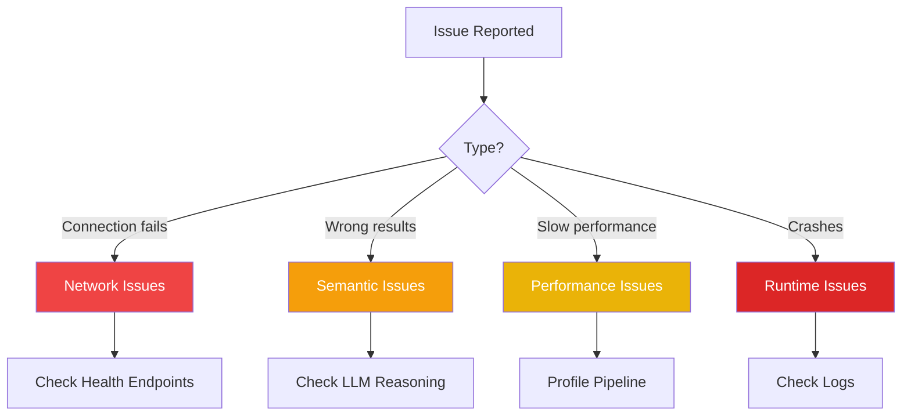

# Troubleshooting Guide

**Reading Time:** ~30 minutes
**Audience:** Senior developers, DevOps
**Prerequisites:** [Extending the Listener](05-extending-listener.md)
**Goal:** Diagnose and fix common issues

---

## Diagnostic Workflow



---

## Category 1: Connection Issues

### Issue: Cannot connect to Listener

**Symptoms:**

```text
curl: (7) Failed to connect to localhost port 8002: Connection refused
```

**Diagnosis:**

```bash
# 1. Check if Listener is running
lsof -i :8002

# 2. Check Listener logs
tail -f logs/listener.log

# 3. Try starting Listener
cd listener
source .venv/bin/activate
uvicorn app.main:app --port 8002
```

**Solutions:**

| Cause | Solution |
|-------|----------|
| Listener not started | Run `uvicorn app.main:app --port 8002` |
| Port already in use | Kill process: `kill $(lsof -t -i:8002)` |
| Wrong port | Check `.env` for correct port |
| Firewall blocking | Check firewall rules |

---

### Issue: Ollama connection fails

**Symptoms:**

```text
httpx.ConnectError: [Errno 61] Connection refused
Error connecting to Ollama at http://localhost:11434
```

**Diagnosis:**

```bash
# 1. Check if Ollama is running
curl http://localhost:11434/api/tags

# 2. Check Ollama process
ps aux | grep ollama

# 3. Check Ollama logs
journalctl -u ollama -f  # Linux
log show --predicate 'process == "ollama"' --info  # macOS
```

**Solutions:**

```bash
# Start Ollama
ollama serve

# Or as background service (macOS)
brew services start ollama

# Or as systemd service (Linux)
sudo systemctl start ollama
```

---

### Issue: Redis connection fails

**Symptoms:**

```text
redis.exceptions.ConnectionError: Error connecting to Redis
```

**Diagnosis:**

```bash
# 1. Test Redis
redis-cli ping
# Should return: PONG

# 2. Check Redis is running
ps aux | grep redis

# 3. Check Redis port
redis-cli -p 6379 ping
```

**Solutions:**

```bash
# Start Redis (macOS)
brew services start redis

# Start Redis (Linux)
sudo systemctl start redis

# Start Redis manually
redis-server
```

---

## Category 2: Semantic Analysis Issues

### Issue: Wrong Connection Values

**Symptoms:**

```text
Expected: Pity → Connection < 0
Actual: Pity → Connection = 0.3  # WRONG!
```

**Diagnosis:**

```python
# 1. Check LLM reasoning
result = analyzer.analyze_sync("I feel sorry for them")
print(f"Connection: {result.vac.connection}")
print(f"Reasoning: {result.reasoning}")

# 2. Test with known examples
test_pity_vs_compassion()  # Run the sacred test

# 3. Check prompt
print(analyzer.prompt.format_messages(input_text="test")[0].content)
```

**Solutions:**

| Cause | Solution |
|-------|----------|
| LLM model too small | Upgrade: `phi-3` → `llama3.1:8b` |
| Prompt lacks examples | Add pity/compassion examples |
| Temperature too high | Set `temperature=0.0` in config |
| Model not loaded | Run `ollama pull llama3.1:8b-instruct-q4_0` |

---

### Issue: Low Confidence Scores

**Symptoms:**

```text
confidence: 0.42  # Too low
```

**Diagnosis:**

```python
# Check input quality
if len(text) < 10:
    print("Input too short!")

# Check LLM reasoning
print(result.reasoning)
# Look for: "ambiguous", "unclear", "insufficient context"

# Test with clearer input
result2 = analyzer.analyze_sync("I feel very clearly happy and joyful")
print(f"Confidence: {result2.confidence}")  # Should be higher
```

**Solutions:**

1. **Input too short:** Encourage longer input
2. **Ambiguous text:** "I'm fine" → "I'm genuinely feeling good"
3. **Mixed emotions:** Use multi-emotion analyzer
4. **Model issue:** Try larger model

---

### Issue: Incorrect Emotion Classification

**Symptoms:**

```text
Input: "I'm grateful"
Expected: Gratitude
Actual: Joy  # Wrong but similar
```

**Diagnosis:**

```python
# 1. Check if emotion is in prompt examples
# Does prompt include Gratitude example?

# 2. Check Atlas category
print(result.category)
# Is it in correct category?

# 3. Compare similar emotions
joy = analyzer.analyze_sync("I'm happy")
gratitude = analyzer.analyze_sync("I'm grateful")
print(f"Joy VAC: {joy.vac}")
print(f"Gratitude VAC: {gratitude.vac}")
# Are they too similar?
```

**Solutions:**

1. **Add specific example** for the emotion in prompt
2. **Use contrastive pair:** Show Joy vs. Gratitude difference
3. **Enhance reasoning:** Explain distinction in example

---

## Category 3: Performance Issues

### Issue: Analysis is slow (> 5s)

**Symptoms:**

```text
Analysis took 6.3 seconds (target: <3s)
```

**Diagnosis:**

```python
# Profile the pipeline
import time

start = time.time()
# Transcription
t1 = time.time()
transcription = transcribe(audio)
print(f"Transcription: {time.time() - t1:.2f}s")

# Semantic analysis
t2 = time.time()
emotion = await analyzer.analyze(transcription.text)
print(f"Semantic: {time.time() - t2:.2f}s")

# Total
print(f"Total: {time.time() - start:.2f}s")
```

**Solutions:**

| Bottleneck | Solution |
|------------|----------|
| Transcription slow | Use smaller Whisper model (base.en → tiny.en) |
| LLM slow | Use smaller LLM (llama3.1:70b → 8b) |
| First request slow | Normal (model loading), subsequent faster |
| CPU maxed | Enable GPU or scale horizontally |

### Performance Tuning

```bash
# Use faster Whisper model
# In .env:
WHISPER_MODEL=tiny.en  # Fastest (but less accurate)

# Use faster LLM
OLLAMA_MODEL=phi-3:mini  # 2x faster

# Enable GPU (if available)
# Ollama automatically uses GPU
nvidia-smi  # Check GPU usage
```

---

### Issue: High Memory Usage

**Symptoms:**

```text
Memory: 8.5GB (container limit: 4GB)
OOMKilled
```

**Diagnosis:**

```python
import psutil

process = psutil.Process()
memory_mb = process.memory_info().rss / 1024 / 1024
print(f"Memory: {memory_mb:.1f} MB")

# Check model sizes
import os
print(f"Model directory: {os.path.expanduser('~/.ollama/models/')}")
# Large models consume more RAM
```

**Solutions:**

1. **Use quantized models:** q8_0 → q4_0 (saves ~50% RAM)
2. **Unload unused models:** `ollama rm unused-model`
3. **Increase container limits:** Update docker-compose.yml
4. **Use smaller models:** llama3.1:70b → 8b

---

## Category 4: Runtime Issues

### Issue: Pydantic Validation Errors

**Symptoms:**

```text
ValidationError: valence must be between -1.0 and 1.0 (got 1.5)
```

**Diagnosis:**

```python
# Check LLM raw output
logger.debug(f"LLM response: {response}")

# The LLM returned invalid values
# {"vac": {"valence": 1.5, ...}}  # Out of range!
```

**Solutions:**

```python
# Add clamping before validation
def clamp(value, min_val=-1.0, max_val=1.0):
    return max(min_val, min(max_val, value))

result_dict["vac"]["valence"] = clamp(result_dict["vac"]["valence"])
result_dict["vac"]["arousal"] = clamp(result_dict["vac"]["arousal"])
result_dict["vac"]["connection"] = clamp(result_dict["vac"]["connection"])
```

---

### Issue: JSON Decode Errors

**Symptoms:**

```text
json.JSONDecodeError: Expecting property name enclosed in double quotes
```

**Diagnosis:**

```python
# Print raw LLM response
print(f"Raw response: {response}")

# LLM returned invalid JSON
# Common issues:
# - Trailing commas
# - Single quotes instead of double
# - Missing closing braces
```

**Solutions:**

1. **Improve cleaning:**

   ```python
   # Remove markdown code blocks
   # Handle single quotes
   # Fix trailing commas
   ```

2. **Use Ollama's `format="json"`:**

   ```python
   self.llm = Ollama(..., format="json")
   # Forces structured output
   ```

3. **Retry with explicit instruction:**

   ```python
   prompt += "\n\nIMPORTANT: Respond with ONLY valid JSON, no other text."
   ```

---

### Issue: Worker Job Failures

**Symptoms:**

```text
Arq job failed: KeyError: 'audio_path'
```

**Diagnosis:**

```bash
# 1. Check Redis
redis-cli KEYS "arq:*"

# 2. Check worker logs
tail -f logs/worker.log

# 3. Inspect failed job
python inspect_arq.py  # Utility script
```

**Solutions:**

```python
# Add defensive checks in worker
async def process_audio(ctx, audio_path=None, text=None, **kwargs):
    # Validate inputs
    if not audio_path and not text:
        raise ValueError("Either audio_path or text required")

    if audio_path and not os.path.exists(audio_path):
        raise FileNotFoundError(f"Audio file not found: {audio_path}")

    # ... rest of processing
```

---

## Category 5: Integration Issues

### Issue: Observer Integration Fails

**Symptoms:**

```text
WARNING: Failed to record state to Observer: Connection refused
```

**Diagnosis:**

```bash
# 1. Check Observer health
curl http://localhost:8000/health

# 2. Test Observer manually
curl http://localhost:8000/observer/emotions

# 3. Check Observer logs
tail -f ../observer/logs/observer.log
```

**Solutions:**

1. **Observer not running:**

   ```bash
   cd observer
   source .venv/bin/activate
   uvicorn app.main:app --port 8000
   ```

2. **Wrong URL in config:**

   ```bash
   # In listener/.env
   OBSERVER_URL=http://localhost:8000  # Check this!
   ```

3. **Non-blocking design (already implemented):**

   ```python
   try:
       await observer.record_state(...)
   except Exception as e:
       logger.warning(f"Observer failed: {e}")
       # Continue anyway - Observer failure shouldn't block response
   ```

---

## Debugging Techniques

### 1. Enable Debug Logging

```bash
# In .env
LOG_LEVEL=DEBUG

# Restart Listener
uvicorn app.main:app --reload --port 8002
```

You'll see much more detail:

```text
DEBUG: Calling Ollama LLM...
DEBUG: LLM response: {"primary_emotion": "Joy"...
DEBUG: Parsing JSON response...
DEBUG: Pydantic validation successful
INFO: ✅ Analysis complete: Joy (VAC: 0.8, 0.6, 0.7)
```

### 2. Interactive Debugging

```python
# Add breakpoint
import pdb; pdb.set_trace()

# Or use ipdb (better UI)
import ipdb; ipdb.set_trace()
```

### 3. Request/Response Logging

```python
@app.middleware("http")
async def log_requests(request: Request, call_next):
    """Log all requests and responses"""
    start = time.time()

    logger.info(f"→ {request.method} {request.url}")

    response = await call_next(request)

    duration = time.time() - start
    logger.info(f"← {response.status_code} ({duration:.3f}s)")

    return response
```

---

## Common Error Messages

### Error: "Model not found"

```text
Error: model 'llama3.1:8b-instruct-q4_0' not found
```

**Solution:**

```bash
ollama pull llama3.1:8b-instruct-q4_0
```

---

### Error: "Address already in use"

```text
OSError: [Errno 48] Address already in use
```

**Solution:**

```bash
# Find and kill process on port 8002
lsof -i :8002
kill -9 <PID>

# Or use different port
uvicorn app.main:app --port 8003
```

---

### Error: "No module named 'app'"

```text
ModuleNotFoundError: No module named 'app'
```

**Solution:**

```bash
# Ensure you're in listener/ directory
pwd  # Should show .../listener

# Ensure .venv is activated
source .venv/bin/activate

# Reinstall if needed
pip install -r requirements.txt
```

---

### Error: "Spacy model not found"

```text
OSError: [E050] Can't find model 'en_core_web_sm'
```

**Solution:**

```bash
python -m spacy download en_core_web_sm
```

---

## Health Check Debugging

### Check All Services

```bash
#!/bin/bash
# check-health.sh

echo "Checking Listener..."
curl -f http://localhost:8002/health || echo "❌ Listener down"

echo "Checking Ollama..."
curl -f http://localhost:11434/api/tags || echo "❌ Ollama down"

echo "Checking Redis..."
redis-cli ping || echo "❌ Redis down"

echo "Checking Observer (optional)..."
curl -f http://localhost:8000/health || echo "⚠️  Observer down (optional)"

echo "\n✅ Health check complete"
```

---

## The Sacred Test Failures

### Issue: test_pity_vs_compassion fails

```text
FAILED tests/semantic/test_connection_axis.py::test_pity_vs_compassion

AssertionError: Pity should have negative Connection! Got 0.2
```

**This is CRITICAL!** The core innovation is broken.

**Diagnosis:**

```python
# 1. Run test with verbose output
pytest tests/semantic/test_connection_axis.py::test_pity_vs_compassion -vv -s

# 2. Check what the LLM is thinking
result = analyzer.analyze_sync("I feel sorry for them")
print(f"Connection: {result.vac.connection}")
print(f"Reasoning: {result.reasoning}")

# 3. Check prompt
# Is the pity example still in the prompt?
# Did someone modify it?
```

**Solutions:**

1. **Prompt was modified:**

   ```bash
   git diff app/services/semantic_analyzer.py
   # Revert changes if needed
   ```

2. **Wrong model:**

   ```bash
   # In .env
   OLLAMA_MODEL=llama3.1:8b-instruct-q4_0  # Use correct model
   # NOT: phi-3:mini (too small)
   ```

3. **Model not downloaded:**

   ```bash
   ollama pull llama3.1:8b-instruct-q4_0
   ```

4. **Temperature changed:**

   ```python
   # In semantic_analyzer.py
   temperature=0.0  # Must be 0.0 for consistency
   ```

---

## Production Issues

### Issue: High Error Rate

**Symptoms:**

- 5% of requests failing
- Intermittent timeouts

**Diagnosis:**

```bash
# Check error logs
grep "ERROR" logs/listener.log | tail -20

# Check Prometheus metrics (if available)
curl http://localhost:8002/metrics | grep error

# Check resource usage
top  # CPU/memory
df -h  # Disk space
```

**Solutions:**

1. **Timeout issues:** Increase timeout in config
2. **Resource exhaustion:** Scale horizontally
3. **Ollama crashes:** Increase Ollama memory limit
4. **Redis queue full:** Add more workers

---

### Issue: Memory Leak

**Symptoms:**

- Memory usage grows over time
- Eventually OOMKilled

**Diagnosis:**

```python
import tracemalloc

# Enable memory tracking
tracemalloc.start()

# Run operations
for i in range(100):
    await analyzer.analyze("Test")

# Check top memory consumers
snapshot = tracemalloc.take_snapshot()
top_stats = snapshot.statistics('lineno')

for stat in top_stats[:10]:
    print(stat)
```

**Solutions:**

1. **Caching issue:** Limit cache size
2. **Model not unloading:** Force garbage collection
3. **Connection leak:** Close HTTP clients properly

```python
# Fix: Limit cache size
cache = LRUCache(maxsize=256)  # Bounded

# Fix: Cleanup
import gc
gc.collect()

# Fix: Close connections
await client.aclose()
```

---

## Quick Fixes Checklist

When something's wrong, try these in order:

- [ ] Check all services are running (Listener, Ollama, Redis)
- [ ] Check logs for errors
- [ ] Run health check endpoints
- [ ] Run the sacred test: `pytest tests/semantic/test_connection_axis.py`
- [ ] Check configuration (.env file)
- [ ] Verify models are downloaded
- [ ] Restart services
- [ ] Check resource usage (CPU, memory, disk)

---

## Getting Help

### Information to Provide

When asking for help, include:

1. **What you're trying to do**
2. **What's happening** (exact error message)
3. **What you've tried**
4. **Environment:**

   ```bash
   python --version
   ollama --version
   cat .env | grep -v SECRET  # Don't share secrets!
   ```

5. **Logs:**

   ```bash
   tail -50 logs/listener.log
   ```

---

## Key Takeaways

✅ **Check services first:** Ollama, Redis, Observer
✅ **Sacred test failing:** Critical priority
✅ **Read LLM reasoning:** Understand why it chose values
✅ **Profile before optimizing:** Find real bottleneck
✅ **Enable debug logging:** See what's happening
✅ **Check configuration:** Often the culprit

---

**Next:** [Architecture Decision Records →](07-architecture-decisions.md)
