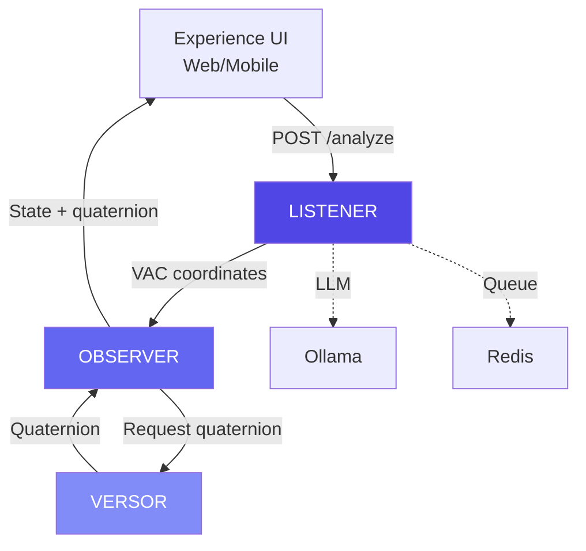

# Integration Points

**Reading Time:** ~15 minutes  
**Audience:** Engineering managers, technical leads  
**Prerequisites:** [Architecture Overview](00-high-level-overview.md)  
**Goal:** Understand how the Listener integrates with other L.O.V.E. modules

---

## Integration Map



---

## Upstream Integration (Who Calls Listener)

### 1. Experience Module (Web UI)

**Endpoint:** `POST /listener/analyze`

**Use Case:** Interactive emotion input

```typescript
// experience/shared/src/api/listener.ts
const response = await fetch('http://localhost:8002/listener/analyze', {
  method: 'POST',
  body: formData  // text, user_id, session_id
});

const {emotion, vac, confidence} = await response.json();
```

**SLA:** < 3s response time  
**Volume:** ~100 requests/day per active user  
**Failure Mode:** Non-blocking (client shows error, user retries)

---

### 2. Mobile Application

**Endpoint:** `POST /listener/analyze-audio`

**Use Case:** Voice input from mobile devices

```kotlin
// Mobile app (React Native)
val audioFile = recordAudio()

val response = api.post("/listener/analyze-audio") {
    file("audio", audioFile)
    parameter("user_id", userId)
    parameter("session_id", sessionId)
}
```

**SLA:** < 3s response time  
**Volume:** ~50 requests/day per active user  
**Failure Mode:** Retry with exponential backoff

---

### 3. Admin Dashboard

**Endpoint:** `POST /listener/analyze-multi-emotion`

**Use Case:** Clinical analysis (Deep Feeling mode)

```typescript
const response = await fetch('/listener/analyze-multi-emotion', {
  method: 'POST',
  body: new FormData({
    text: journalEntry,
    user_id: patientId
  })
});

const {emotions, relationships, aggregate_vac} = await response.json();
```

**SLA:** < 5s (more complex analysis)  
**Volume:** ~10-20 requests/day  
**Failure Mode:** Show error, therapist reviews manually

---

## Downstream Integration (Who Listener Calls)

### 1. Observer Module (Data Storage)

**Endpoint:** `POST /observer/state`

**Purpose:** Store emotional state for history tracking

```python
# listener/app/services/observer_client.py
await observer_client.record_state(
    user_id=user_id,
    session_id=session_id,
    text=sanitized_text,
    emotion=emotion.primary_emotion,
    vac=emotion.vac,
    timestamp=datetime.utcnow()
)
```

**Failure Handling:** **Non-blocking**

```python
try:
    await observer.record_state(...)
except Exception as e:
    logger.warning(f"Observer failed: {e}")
    # Continue anyway - Listener still returns result
```

**Why non-blocking:**

- Observer downtime shouldn't break Listener
- User gets analysis even if storage fails
- Can retry storage later

---

### 2. Ollama (LLM Inference)

**Endpoint:** `POST http://localhost:11434/api/generate`

**Purpose:** Semantic VAC extraction

**Dependency:** **Critical**

```python
# If Ollama is down, Listener fails hard
response = await self.llm.ainvoke(prompt)
# Raises: ConnectionError if Ollama unavailable
```

**Mitigation:**

- Health check before accepting requests
- Graceful error messages to users
- Auto-restart Ollama on crash

---

### 3. Redis (Job Queue)

**Endpoint:** `redis://localhost:6379`

**Purpose:** Async job processing

**Dependency:** **Medium**

```python
# Async endpoint requires Redis
job = await redis.enqueue_job('process_audio', ...)

# Sync endpoints work without Redis
```

**Failure Mode:**

- Async endpoints return 503 error
- Sync endpoints continue working

---

## API Contracts

### Listener → Observer

```python
# Request
POST /observer/state
{
  "user_id": "uuid",
  "session_id": "uuid",
  "text": "[sanitized]",
  "emotion": "Overwhelm",
  "vac": {
    "valence": -0.6,
    "arousal": 0.9,
    "connection": -0.3
  },
  "timestamp": "2026-01-02T19:00:00Z"
}

# Response
{
  "status": "recorded",
  "state_id": "uuid"
}
```

### Experience → Listener

```python
# Request
POST /listener/analyze
{
  "text": "I'm feeling overwhelmed",
  "user_id": "uuid",
  "session_id": "uuid"
}

# Response
{
  "emotion": "Overwhelm",
  "category": "Places We Go When Things Are Uncertain",
  "vac": {
    "valence": -0.6,
    "arousal": 0.9,
    "connection": -0.3
  },
  "confidence": 0.88,
  "reasoning": "...",
  "processing_time_ms": 1847
}
```

---

## Dependency Health Checks

### Monitoring Dependencies

```python
@router.get("/health/dependencies")
async def check_dependencies():
    """Check health of all dependencies"""
    
    return {
        "ollama": await check_ollama_health(),
        "redis": await check_redis_health(),
        "observer": await check_observer_health()
    }

async def check_ollama_health() -> dict:
    """Check if Ollama is responsive"""
    try:
        response = await httpx.get("http://localhost:11434/api/tags", timeout=2.0)
        return {"status": "healthy", "latency_ms": response.elapsed.total_seconds() * 1000}
    except Exception as e:
        return {"status": "unhealthy", "error": str(e)}
```

### Alerting Strategy

| Dependency | Check Frequency | Alert Threshold |
|------------|----------------|-----------------|
| Ollama | Every 30s | 2 consecutive failures |
| Redis | Every 30s | 2 consecutive failures |
| Observer | Every 60s | 5 consecutive failures (non-critical) |

---

## Integration Testing

### End-to-End Tests

```python
@pytest.mark.integration
async def test_full_pipeline():
    """Test complete flow: Listener → Observer"""
    
    # 1. Analyze with Listener
    response = await client.post("/listener/analyze", data={
        "text": "I'm feeling hopeful",
        "user_id": "test-user",
        "session_id": "test-session"
    })
    
    assert response.status_code == 200
    vac = response.json()["vac"]
    
    # 2. Verify Observer received it
    observer_response = await observer_client.get_recent_states("test-user")
    
    assert len(observer_response) > 0
    assert observer_response[0]["vac"] == vac
```

**Run weekly:** Validates all integrations work together

---

## Versioning & Compatibility

### API Versioning Strategy

**Current:** No versioning (v0, pre-1.0)

**Future Plan:**

```text
/v1/listener/analyze  # Version 1
/v2/listener/analyze  # Version 2 (breaking changes)
```

### Backward Compatibility

**Commitment:** Maintain compatibility for 6 months after deprecation notice.

**Process:**

1. Announce deprecation (Release Notes + Email)
2. Add deprecation warnings to old endpoints
3. Maintain both old and new for 6 months
4. Remove old endpoint

---

## Error Handling Across Modules

### Listener Errors → Experience

```python
# Listener returns error
{
  "status": "error",
  "code": "LLM_TIMEOUT",
  "message": "Analysis timed out after 10s",
  "retry_after": 5
}

# Experience handles it
if (response.status === "error") {
  showToast(response.message);
  if (response.retry_after) {
    setTimeout(retry, response.retry_after * 1000);
  }
}
```

### Observer Errors → Listener

```python
# Observer is down
try:
    await observer.record_state(...)
except ConnectionError:
    logger.warning("Observer unavailable, state not recorded")
    # Return analysis anyway (non-blocking)
```

---

## Key Takeaways

✅ **Listener is the entry point** for all emotional input  
✅ **Ollama dependency is critical** - must be highly available  
✅ **Observer integration is non-blocking** - Listener works standalone  
✅ **Three client types:** Web UI, mobile, admin panel  
✅ **API contracts are stable** - versioning planned for v1.0  

---

**Next:** [Monitoring & Operations →](../operations/01-monitoring.md)
