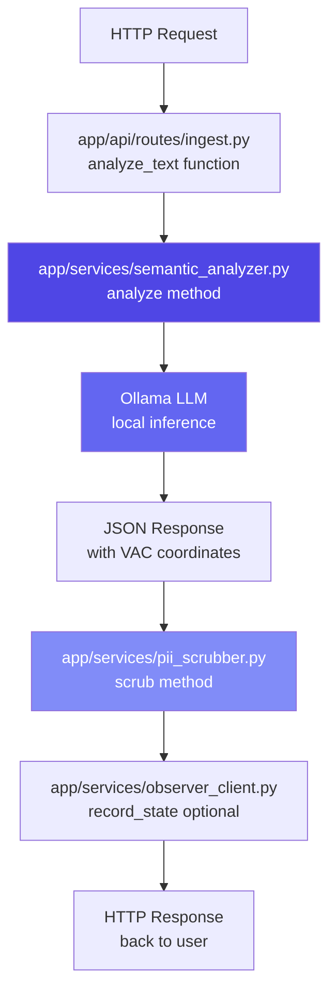

# Codebase Tour

**Reading Time:** ~20 minutes  
**Audience:** New developers  
**Prerequisites:** [Getting Started](01-getting-started.md) complete  
**Goal:** Understand the Listener's file structure and where to find things

---

## Overview

The Listener module is organized following **FastAPI best practices** with clear separation of concerns. Let's explore it room by room, like touring a house! 🏠

---

## The Big Picture

```text
listener/
├── app/                    # 🏠 The main house (application code)
│   ├── api/               # 🚪 Front door (API endpoints)
│   ├── services/          # 🧠 Brain (business logic)
│   ├── models/            # 📋 Blueprints (data models)
│   ├── utils/             # 🔧 Tool shed (utilities)
│   └── workers/           # 👷 Workers (async jobs)
│
├── tests/                  # 🧪 Lab (testing)
├── docs/                   # 📚 Library (documentation)
├── requirements.txt        # 📦 Shopping list (dependencies)
└── .env                    # 🔐 Secrets (configuration)
```

---

## The Entrance: `app/`

This is where all the application code lives. Let's walk through each room:

### 🚪 Front Door: `app/api/`

**What it does:** Handles incoming HTTP requests

```text
app/api/
├── __init__.py
└── routes/
    ├── __init__.py
    ├── health.py           # Health check endpoint
    ├── ingest.py           # Main analysis endpoints
    └── ai_models.py        # Model management
```

#### Key Files

**`routes/health.py`** - Simple health check

```python
@router.get("/health")
async def health_check():
    return {"status": "healthy", "service": "listener"}
```

**`routes/ingest.py`** - The main endpoints:

- `POST /listener/analyze` - Analyze text synchronously
- `POST /listener/analyze-audio` - Analyze audio synchronously  
- `POST /listener/analyze-multi-emotion` - Multi-emotion analysis
- `POST /listener/ingest` - Queue audio for async processing

!!! tip "Start here when adding new endpoints"
    If you want to add a new API endpoint, start in `routes/`

---

### 🧠 The Brain: `app/services/`

**What it does:** Contains all the business logic

```text
app/services/
├── semantic_analyzer.py      # 🎯 THE CORE: VAC extraction
├── transcription.py           # 🎤 Audio → text
├── multi_emotion_analyzer.py  # 🎭 Multiple emotions
├── prosody_analyzer.py        # 🎵 Voice features
├── pii_scrubber.py            # 🔐 Privacy protection
├── observer_client.py         # 🔗 Talk to Observer
├── ollama_manager.py          # 🤖 Manage LLM models
└── model_fetcher.py           # 📥 Fetch model assignments
```

#### The Most Important File: `semantic_analyzer.py`

This is **THE HEART** of the Listener. It's where the magic happens!

```python
class SemanticAnalyzer:
    """Extract VAC from text using LLM"""
    
    def __init__(self):
        self.llm = Ollama(model="llama3.1:8b-instruct-q4_0")
        self.prompt = self._create_prompt()  # The critical prompt!
    
    async def analyze(self, text: str) -> EmotionalClassification:
        """Transform text → VAC coordinates"""
        # This is where natural language becomes math!
```

**Key Responsibilities:**

1. Creates the few-shot prompt with examples
2. Calls the LLM (Ollama)
3. Parses the structured JSON response
4. Returns VAC coordinates + emotion + reasoning

!!! example "Want to improve emotion detection?"
    Modify the prompt in `semantic_analyzer.py` → `_create_prompt()`

---

### 📋 Blueprints: `app/models/`

**What it does:** Defines data structures (Pydantic models)

```text
app/models/
├── vac_response.py            # VAC vector, emotion classification
└── multi_emotion_response.py  # Multi-emotion structures
```

#### Example: `vac_response.py`

```python
class VACVector(BaseModel):
    """The three-dimensional emotional coordinate"""
    valence: float = Field(ge=-1.0, le=1.0)
    arousal: float = Field(ge=-1.0, le=1.0)
    connection: float = Field(ge=-1.0, le=1.0)  # THE INNOVATION!

class EmotionalClassification(BaseModel):
    """Complete emotion analysis result"""
    primary_emotion: str
    category: str
    vac: VACVector
    confidence: float
    reasoning: str
```

!!! info "Pydantic = Type Safety"
    These models ensure data is valid. If you try to set `valence=2.0`, Pydantic will raise an error!

---

### 🔧 Tool Shed: `app/utils/`

**What it does:** Helper functions

```text
app/utils/
└── audio_utils.py     # Audio processing utilities
```

These are small, reusable functions that don't fit elsewhere.

---

### 👷 Workers: `app/workers/`

**What it does:** Background job processing

```text
app/workers/
└── audio_processor.py  # Arq worker for async audio processing
```

When you use `POST /listener/ingest`, the audio is queued in Redis and processed by this worker in the background.

**Why?** Audio processing can take 2-3 seconds. With async workers, the API responds immediately with a job ID, and the user can check status later.

---

### 🎬 The Director: `app/main.py`

**What it does:** The entry point that ties everything together

```python
# app/main.py
from fastapi import FastAPI
from app.api.routes import health, ingest, ai_models

app = FastAPI(title="Listener API")

# Register routes
app.include_router(health.router, tags=["Health"])
app.include_router(ingest.router, prefix="/listener", tags=["Ingestion"])
app.include_router(ai_models.router, prefix="/listener", tags=["AI Models"])

@app.on_event("startup")
async def startup_event():
    logger.info("🎧 Listener API starting up...")

@app.on_event("shutdown")
async def shutdown_event():
    logger.info("Listener API shutting down...")
```

!!! tip "Starting point for debugging"
    If something's not working, check `main.py` to see if routes are registered correctly

---

### ⚙️ Configuration: `app/config.py`

**What it does:** Manages environment variables

```python
class Settings(BaseSettings):
    """Application configuration from .env file"""
    
    ENVIRONMENT: str = "development"
    LOG_LEVEL: str = "INFO"
    
    # Ollama
    OLLAMA_BASE_URL: str = "http://localhost:11434"
    OLLAMA_MODEL: str = "llama3.1:8b-instruct-q4_0"
    
    # Redis
    REDIS_HOST: str = "localhost"
    REDIS_PORT: int = 6379
    
    class Config:
        env_file = ".env"

settings = Settings()  # Global instance
```

**Usage in code:**

```python
from app.config import settings

# Access any setting
model_name = settings.OLLAMA_MODEL
```

---

## 🧪 The Lab: `tests/`

**What it does:** Ensures everything works correctly

```text
tests/
├── conftest.py              # Shared test fixtures
├── unit/                    # Test individual functions
│   ├── test_pii_scrubber.py
│   ├── test_transcription.py
│   └── test_vac_models.py
├── semantic/                # 🚨 CRITICAL TESTS
│   └── test_connection_axis.py  # Pity vs. Compassion
└── integration/             # Test full pipeline
    └── test_full_pipeline.py
```

### The Most Critical Test

**`tests/semantic/test_connection_axis.py`**

This test validates the entire VAC model innovation:

```python
def test_pity_vs_compassion():
    """
    THE CRITICAL TEST
    
    If this fails, the Connection axis doesn't work,
    and the entire innovation is broken!
    """
    analyzer = get_semantic_analyzer()
    
    # Test Pity (separation)
    pity = analyzer.analyze_sync("I feel sorry for them")
    assert pity.vac.connection < 0, "Pity should have negative Connection!"
    
    # Test Compassion (alignment)
    compassion = analyzer.analyze_sync("I feel their pain with them")
    assert compassion.vac.connection > 0.5, "Compassion should have high Connection!"
```

!!! warning "Never remove this test!"
    This test is sacred. It validates the core innovation.

---

## 📚 Documentation: `docs/`

You're reading it right now! 😊

```text
docs/
├── 00-overview.md
├── 01-architecture.md
├── 02-edge-transcription.md
├── 03-cloud-processing.md
├── 04-semantic-analysis.md
└── ...
```

These are technical specifications—more detailed than the main docs.

---

## Common Workflows: Where to Look

### "I want to add a new endpoint"

1. Create route in `app/api/routes/`
2. Register route in `app/main.py`
3. Add tests in `tests/`

### "I want to improve emotion detection"

1. Modify prompt in `app/services/semantic_analyzer.py`
2. Test with `POST /listener/analyze`
3. Run semantic tests: `pytest tests/semantic/`

### "I want to add a new emotion to the Atlas"

1. Update prompt examples in `semantic_analyzer.py`
2. (Future) Update Observer's emotion database

### "The Listener is giving wrong VAC values"

1. Check the LLM's reasoning field in the response
2. Look at prompt in `semantic_analyzer.py` → `_create_prompt()`
3. Add debugging logs in `analyze()` method
4. Test with known examples

### "I want to add a new dependency"

1. Add to `requirements.txt`
2. Run `pip install -r requirements.txt`
3. Update documentation if it's a major change

---

## Data Flow Through the Code

Let's trace what happens when you call `POST /listener/analyze`:



**Step by step:**

1. **Request arrives** at `ingest.py` → `analyze_text()` function
2. **Semantic analyzer** called with text
3. **LLM inference** happens (the magic! ✨)
4. **JSON parsed** into `EmotionalClassification` object
5. **PII scrubbed** from text
6. **Observer called** (if available) to record state
7. **Response sent** back to user

---

## Important Files Quick Reference

| File | Purpose | Edit frequency |
|------|---------|----------------|
| `app/services/semantic_analyzer.py` | 🎯 Core VAC extraction | Medium |
| `app/api/routes/ingest.py` | 🚪 Main endpoints | Low-Medium |
| `app/models/vac_response.py` | 📋 Data structures | Low |
| `app/config.py` | ⚙️ Configuration | Low |
| `app/main.py` | 🎬 Application entry | Rare |
| `tests/semantic/test_connection_axis.py` | 🚨 Critical test | Rare (sacred) |

---

## File Naming Conventions

The Listener follows Python best practices:

- **Snake case** for files: `semantic_analyzer.py`
- **Pascal case** for classes: `SemanticAnalyzer`
- **Snake case** for functions: `analyze_text()`
- **UPPER SNAKE** for constants: `OLLAMA_BASE_URL`

---

## Next Steps

Now that you know where everything is:

1. **[Key Concepts](03-key-concepts.md)** - Deep dive into VAC model
2. **[Common Tasks](04-common-tasks.md)** - Recipes for common changes
3. **[Testing Guide](05-testing-guide.md)** - How to write tests

---

## Quick Quiz

Test your understanding! (Answers below)

1. Where would you add a new API endpoint?
2. Where is the VAC extraction logic?
3. What file contains the critical Pity vs. Compassion test?
4. Where would you change the Ollama model being used?

<details>
<summary>Click for answers</summary>

1. `app/api/routes/` (create a new file or add to existing)
2. `app/services/semantic_analyzer.py` → `analyze()` method
3. `tests/semantic/test_connection_axis.py`
4. `.env` file (change `OLLAMA_MODEL` setting)

</details>

---

**Ready to understand the concepts?** Continue to [Key Concepts →](03-key-concepts.md)
