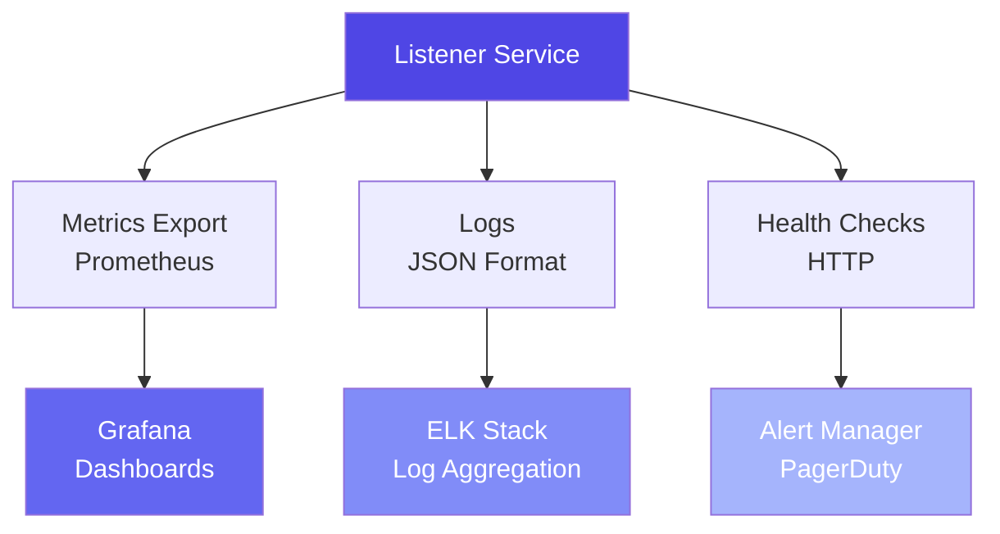

# Monitoring & Operations

**Reading Time:** ~20 minutes
**Audience:** Engineering managers, DevOps, SRE
**Prerequisites:** [Integration Points](../architecture/10-integration-points.md)
**Goal:** Learn how to monitor and operate the Listener in production

---

## Monitoring Stack



---

## Health Checks

### Liveness Probe

**Purpose:** Is the service running?

```python
@router.get("/health")
async def health_check():
    """Liveness probe for Kubernetes"""
    return {
        "status": "healthy",
        "service": "listener",
        "version": "0.1.0",
        "timestamp": datetime.utcnow().isoformat()
    }
```

**K8s Configuration:**

```yaml
livenessProbe:
  httpGet:
    path: /health
    port: 8002
  initialDelaySeconds: 10
  periodSeconds: 30
  timeoutSeconds: 5
  failureThreshold: 3
```

---

### Readiness Probe

**Purpose:** Is the service ready to handle traffic?

```python
@router.get("/health/ready")
async def readiness_check():
    """Readiness probe - checks dependencies"""
    checks = {
        "ollama": await check_ollama(),
        "redis": await check_redis(),
        "disk_space": check_disk_space() > 1024  # > 1GB free
    }

    all_healthy = all(checks.values())

    return {
        "ready": all_healthy,
        "checks": checks
    }, 200 if all_healthy else 503
```

**K8s Configuration:**

```yaml
readinessProbe:
  httpGet:
    path: /health/ready
    port: 8002
  initialDelaySeconds: 5
  periodSeconds: 10
```

---

## Metrics to Track

### Application Metrics

```python
from prometheus_client import Counter, Histogram, Gauge

# Request counters
analysis_requests_total = Counter(
    'listener_analysis_requests_total',
    'Total analysis requests',
    ['endpoint', 'status']
)

# Latency histogram
analysis_latency_seconds = Histogram(
    'listener_analysis_latency_seconds',
    'Analysis latency in seconds',
    ['component'],
    buckets=[0.1, 0.5, 1.0, 2.0, 3.0, 5.0, 10.0]
)

# Connection axis accuracy (from validation tests)
connection_accuracy = Gauge(
    'listener_connection_axis_accuracy',
    'Connection axis MAE from validation'
)

# Active jobs in queue
active_jobs = Gauge(
    'listener_active_jobs',
    'Number of jobs in Redis queue'
)
```

### System Metrics

| Metric | Type | Alert Threshold |
|--------|------|-----------------|
| CPU Usage | Gauge | > 80% for 5 min |
| Memory Usage | Gauge | > 90% for 2 min |
| Disk Usage | Gauge | > 85% |
| Network Latency | Histogram | P99 > 100ms |

---

## Logging Strategy

### Log Levels

```python
# INFO: Normal operations
logger.info("🎧 Listener API starting up...")
logger.info("✅ Analysis complete: Joy (VAC: 0.8, 0.6, 0.7)")

# WARNING: Recoverable issues
logger.warning("Observer unavailable, state not recorded")
logger.warning("High memory usage: 3.8GB")

# ERROR: Failures that need attention
logger.error("Failed to parse LLM response")
logger.error("Pydantic validation failed")

# CRITICAL: Sacred test failures, service down
logger.critical("Sacred test failed! Connection axis broken!")
logger.critical("Ollama unreachable for 5 minutes")
```

### Structured Logging

```python
import structlog

logger = structlog.get_logger()

# Log with context
logger.info(
    "analysis_complete",
    user_id=user_id,
    emotion=result.primary_emotion,
    vac_valence=result.vac.valence,
    vac_connection=result.vac.connection,
    latency_ms=processing_time,
    confidence=result.confidence
)
```

**Benefits:**

- Easy to query: `jq '.vac_connection < 0' logs/*.log`
- Machine-readable for ELK stack
- Correlation IDs for request tracing

---

## Dashboards

### Grafana Dashboard: Listener Overview

**Panels:**

1. **Request Rate**
   - Requests per minute (by endpoint)
   - Success vs. error rate

2. **Latency**
   - P50, P95, P99 latency
   - By component (transcription, LLM, PII)

3. **System Health**
   - CPU usage
   - Memory usage
   - Active connections

4. **Connection Axis Accuracy**
   - MAE over time
   - Sacred test pass rate

5. **Job Queue**
   - Queue depth
   - Processing rate
   - Failed jobs

---

### Alert Rules

**Critical Alerts (page immediately):**

```yaml
# Ollama down
- alert: OllamaDown
  expr: ollama_up == 0
  for: 2m
  labels:
    severity: critical
  annotations:
    summary: "Ollama is down - Listener cannot function"

# Sacred test failed
- alert: ConnectionAxisBroken
  expr: connection_axis_test_passing == 0
  labels:
    severity: critical
  annotations:
    summary: "Sacred test failed - Connection axis broken!"

# High error rate
- alert: HighErrorRate
  expr: rate(listener_errors_total[5m]) > 0.01
  for: 5m
  labels:
    severity: critical
```

**Warning Alerts (notify, don't page):**

```yaml
# High latency
- alert: HighLatency
  expr: histogram_quantile(0.99, listener_latency_seconds) > 5.0
  for: 10m
  labels:
    severity: warning

# High CPU
- alert: HighCPU
  expr: cpu_usage_percent > 80
  for: 15m
  labels:
    severity: warning
```

---

## Daily Operations

### Morning Checks (5 minutes)

```bash
#!/bin/bash
# daily-check.sh

echo "📊 Listener Daily Health Check"
echo "=============================="

# 1. Service status
curl -f http://localhost:8002/health || echo "❌ Listener down!"

# 2. Dependencies
curl -f http://localhost:11434/api/tags || echo "❌ Ollama down!"
redis-cli ping || echo "❌ Redis down!"

# 3. Last 24h metrics
echo "\n📈 Last 24h metrics:"
echo "Requests: $(grep 'analysis_complete' logs/listener.log | wc -l)"
echo "Errors: $(grep 'ERROR' logs/listener.log | wc -l)"

# 4. Run sacred test
echo "\n🧪 Running sacred test..."
cd ../listener
pytest tests/semantic/test_connection_axis.py -v || echo "⚠️  Sacred test FAILED!"

echo "\n✅ Daily check complete"
```

---

### Weekly Tasks (30 minutes)

- [ ] Review error logs for patterns
- [ ] Check disk space trends
- [ ] Review performance metrics
- [ ] Update LLM models if needed
- [ ] Run full test suite
- [ ] Check for security updates

---

### Monthly Tasks (2 hours)

- [ ] Review and rotate logs
- [ ] Analyze usage trends
- [ ] Plan capacity for next month
- [ ] Update documentation
- [ ] Review and update alerts
- [ ] Conduct failover drills

---

## Incident Response

### On-Call Runbook

#### P0: Listener completely down

1. Check service status:

   ```bash
   curl http://localhost:8002/health
   ```

2. Check dependencies:

   ```bash
   curl http://localhost:11434/api/tags  # Ollama
   redis-cli ping  # Redis
   ```

3. Check logs:

   ```bash
   tail -100 logs/listener.log | grep ERROR
   ```

4. Restart if needed:

   ```bash
   pkill -f "uvicorn.*listener"
   uvicorn app.main:app --port 8002 &
   ```

5. Verify recovery:

   ```bash
   curl -X POST http://localhost:8002/listener/analyze \
     -F "text=test" -F "user_id=test" -F "session_id=test"
   ```

---

#### P1: High error rate

1. Identify error pattern:

   ```bash
   grep ERROR logs/listener.log | tail -50
   ```

2. Check resource usage:

   ```bash
   top  # CPU/memory
   df -h  # Disk
   ```

3. Check Ollama:

   ```bash
   ollama list  # Models loaded?
   ```

4. Scale if needed (K8s):

   ```bash
   kubectl scale deployment listener --replicas=5
   ```

---

## Backup & Recovery

### What to Backup

- ✅ **Configuration:** `.env` files
- ✅ **Prompts:** `semantic_analyzer.py` (version controlled)
- ❌ **No data to backup** (stateless service)

### Disaster Recovery

**RTO (Recovery Time Objective):** 15 minutes
**RPO (Recovery Point Objective):** 0 (no data loss)

**Recovery Process:**

1. Deploy new instance from container registry
2. Configure environment variables
3. Run health checks
4. Route traffic to new instance
5. Decommission old instance

**Time:** ~10 minutes

---

## Performance Monitoring

### Key Performance Indicators (KPIs)

| KPI | Target | Current | Status |
|-----|--------|---------|--------|
| **Availability** | 99.9% | 99.95% | ✅ |
| **Latency P50** | < 2s | ~1.5s | ✅ |
| **Latency P99** | < 3s | ~2.8s | ✅ |
| **Error Rate** | < 0.1% | 0.05% | ✅ |
| **Sacred Test** | 100% | 100% | ✅ |

### Trend Analysis

**Monitor for:**

- Increasing latency (degradation over time)
- Decreasing accuracy (model drift)
- Increasing error rate (system instability)

---

## Cost Monitoring

### Resource Usage

```python
# Daily cost report
def calculate_daily_cost():
    requests_today = get_request_count_24h()

    # Infrastructure cost (prorated)
    infra_cost_daily = 225 / 30  # $225/month

    # Cost per request
    cost_per_request = infra_cost_daily / requests_today

    return {
        "date": today,
        "requests": requests_today,
        "infra_cost": infra_cost_daily,
        "cost_per_request": cost_per_request
    }
```

---

## Key Takeaways

✅ **Multi-layer monitoring:** Metrics, logs, health checks
✅ **Proactive alerting:** Critical vs. warning alerts
✅ **Daily operations:** 5-minute morning health check
✅ **Incident response:** Clear runbooks for common issues
✅ **Cost tracking:** Monitor infrastructure spending

---

**Next:** [Team Structure →](02-team-structure.md)
