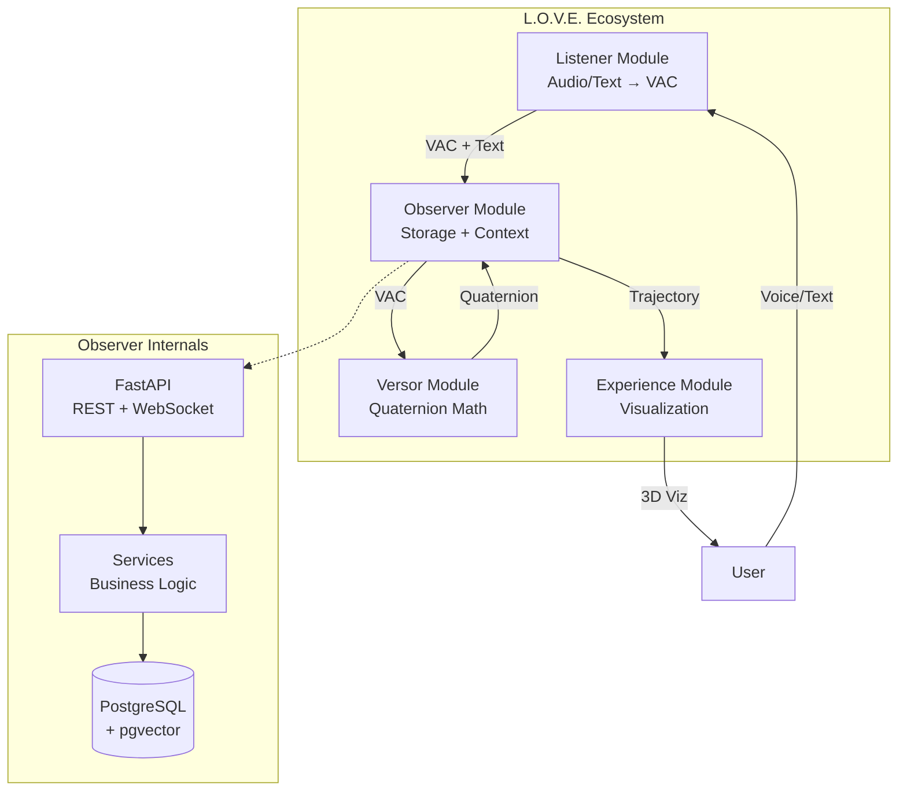

# Architecture Overview

**Reading Time:** ~20 minutes  
**Audience:** Engineering managers, technical leads  
**Prerequisites:** Basic understanding of microservices  
**Goal:** Understand Observer's high-level architecture and technology stack

---

## Executive Summary

**Observer** is the memory and context engine of the L.O.V.E. platform—a FastAPI microservice that:

- Stores emotional trajectories in PostgreSQL with vector search
- Manages a 87-emotion atlas based on Brené Brown's research
- Provides A* pathfinding for therapeutic emotional transitions
- Calculates temporal metrics (elasticity, rigidity)
- Supports real-time chat via WebSockets

**Key Metrics:**

- API response time: < 100ms (P95)
- Vector search: < 50ms (1M+ vectors)
- Concurrent users: 1000+
- Uptime target: 99.9%

---

## System Architecture



---

## Technology Stack

| Layer | Technology | Purpose | Version |
|-------|------------|---------|---------|
| **API Framework** | FastAPI | REST + WebSocket endpoints | 0.104+ |
| **Language** | Python | Application code | 3.11+ |
| **Database** | PostgreSQL | Relational + vector storage | 16+ |
| **Vector Search** | pgvector | Semantic similarity | 0.6.0+ |
| **ORM** | SQLAlchemy (Async) | Database access | 2.0+ |
| **Migrations** | Alembic | Schema version control | 1.12+ |
| **Validation** | Pydantic | Request/response schemas | 2.0+ |
| **Server** | Uvicorn | ASGI server | 0.24+ |
| **Container** | Docker | Deployment | 24+ |

---

## Core Components

### 1. API Layer

**Responsibilities:**

- HTTP REST endpoints
- WebSocket chat connections
- Request validation (Pydantic)
- Response serialization
- Error handling

**Key endpoints:**

- `/atlas/*` - Emotion atlas queries
- `/state` - Store/retrieve emotional states
- `/transitions/*` - Pathfinding
- `/history/*` - User trajectory
- `/ws/{session_id}` - WebSocket chat

### 2. Service Layer

**Services:**

- `EmotionMapper` - Find nearest emotions (weighted fusion)
- `PathPlanner` - A* pathfinding with constraints
- `MetricsCalculator` - Elasticity and rigidity
- `EmbeddingService` - Generate semantic embeddings
- `ChatService` - WebSocket session management
- `InsightGenerator` - Natural language insights

### 3. Data Layer

**Models:**

- `AtlasDefinition` - 87 emotions
- `UserTrajectory` - Emotional journey over time
- `TransitionStrategy` - 107 therapeutic strategies
- `ChatSession` / `ChatMessage` - Chat functionality
- `ClinicalAlert` - Risk detection
- `SessionAnalytics` - Metrics aggregation

---

## Data Flow

### Typical Request: Store Emotional State

```text
1. Listener sends VAC + text → Observer
2. Observer validates request (Pydantic)
3. EmotionMapper finds nearest emotion:
   - Calculate VAC distance
   - Generate embedding
   - Calculate semantic distance
   - Weighted fusion
4. QuaternionBuilder converts VAC → quaternion
5. Create UserTrajectory record in database
6. Calculate elasticity/rigidity
7. Trigger alerts if needed
8. Return response to Listener
9. Notify Experience module (if needed)
```

**Latency breakdown:**

```text
Total: ~80ms (P95)
├─ Validation: 1ms
├─ Emotion matching: 15ms
│  ├─ Generate embedding: 10ms
│  └─ Vector search: 5ms
├─ Quaternion conversion: 5ms
├─ Database insert: 10ms
├─ Metrics calculation: 20ms
└─ Response serialization: 1ms
```

---

## Scalability Design

### Horizontal Scaling

**Observer is stateless** (except WebSocket connections):

- Run multiple instances behind load balancer
- PostgreSQL handles data consistency
- WebSocket sticky sessions required

```text
┌─────────────┐
│Load Balancer│
└──────┬──────┘
       │
   ┌───┴───────┬───────────┐
   │           │           │
┌──▼──┐    ┌──▼──┐    ┌──▼──┐
│Obs 1│    │Obs 2│    │Obs 3│  (Stateless instances)
└──┬──┘    └──┬──┘    └──┬──┘
   │           │           │
   └───────────┴───────────┘
               │
         ┌─────▼─────┐
         │PostgreSQL │  (Single source of truth)
         │+ pgvector │
         └───────────┘
```

### Vertical Scaling

**Database scaling:**

- Connection pooling (20 connections × 3 instances = 60)
- Read replicas for analytics
- Partitioning for large trajectory tables
- HNSW index optimization

**Application scaling:**

- Async I/O handles 1000+ concurrent requests per instance
- CPU: 2-4 cores recommended
- Memory: 2-4GB per instance
- Vector search is memory-intensive

---

## Integration Points

### Upstream: Listener

**Receives from Listener:**

```json
POST /state
{
  "user_id": "user123",
  "session_id": "session456",
  "vac": [-0.3, 0.7, -0.2],
  "transcription": "I'm feeling overwhelmed",
  "metadata": {...}
}
```

**Returns to Listener:**

```json
{
  "id": "trajectory-id",
  "emotion": "Overwhelm",
  "category": "When Things Are Uncertain",
  "elasticity": 1.2,
  "alert": null
}
```

### Peer: Versor

**Calls Versor for:**

- VAC → Quaternion conversion (optional, can use local math)
- Quaternion validation

**Endpoint:** `POST /convert`

### Downstream: Experience

**Provides to Experience:**

- User trajectory (for 3D path rendering)
- Current emotional state
- Metrics (elasticity, rigidity)
- Historical patterns

**Endpoints:**

- `GET /history/{user_id}` - Full trajectory
- `GET /current/{user_id}` - Latest state
- `GET /metrics/{user_id}` - Temporal metrics

---

## Operational Requirements

### Infrastructure

**Production:**

- **Compute:** 2 vCPU, 4GB RAM per instance
- **Database:** PostgreSQL 16+ with 20GB storage (grows with usage)
- **Network:** Load balancer with health checks
- **Monitoring:** Prometheus + Grafana

**Development:**

- **Compute:** 2 vCPU, 2GB RAM
- **Database:** Local PostgreSQL
- **Tools:** Docker Compose for local stack

### Dependencies

**Critical:**

- PostgreSQL 16+ (with pgvector 0.6.0+)
- Python 3.11+

**Optional:**

- Versor module (for quaternion conversion)
- Redis (for distributed caching - future)

### Monitoring

**Key metrics:**

- API latency (target: P95 < 100ms)
- Error rate (target: < 0.1%)
- Database connections (alert if > 25)
- Vector search performance (target: < 50ms)
- Active WebSocket connections

---

## Security Considerations

### Data Protection

- **Row-Level Security (RLS)** - Users see only their own data
- **No PII in logs** - Sanitized transcriptions only
- **Encrypted at rest** - PostgreSQL TDE (optional)
- **Encrypted in transit** - TLS for all connections

### API Security

- **Authentication** - JWT tokens (provided by Experience)
- **Rate limiting** - 60 requests/minute per user
- **Input validation** - Pydantic schemas
- **SQL injection prevention** - SQLAlchemy parameterization

---

## Disaster Recovery

### Backup Strategy

- **Frequency:** Daily full backup + continuous WAL archiving
- **Retention:** 30 days
- **RTO:** 1 hour (recovery time objective)
- **RPO:** 5 minutes (recovery point objective)

### Failure Scenarios

| Scenario | Impact | Recovery Time | Mitigation |
|----------|--------|---------------|------------|
| Single instance down | Reduced capacity | 0s (load balancer) | Run 3+ instances |
| Database down | Complete outage | 5-10 min | PostgreSQL HA |
| Versor unavailable | Degraded (no quaternions) | 0s (use local math) | Fallback computation |
| Vector index corrupted | Slow searches | 10-30 min | Rebuild index |

---

## Team Structure Recommendations

**For small teams (< 5 engineers):**

- 1 Backend engineer (Observer + Listener)
- 1 Frontend engineer (Experience)
- 1 Full-stack engineer (glue + DevOps)

**For medium teams (5-15 engineers):**

- 2 Backend engineers (Observer focus)
- 1 Database specialist (PostgreSQL + pgvector)
- 2 Frontend engineers (Experience)
- 1 DevOps engineer
- 1 QA engineer

**Skills needed:**

- Python (async programming)
- PostgreSQL (advanced queries, indexing)
- Vector databases (pgvector, embeddings)
- Algorithms (A*, graph search)
- FastAPI / Web APIs

---

## Next Steps

**For deeper technical details:**

- [Integration Points](../architecture/10-integration-points.md)
- [Monitoring & Operations](../operations/01-monitoring.md)

**For team planning:**

- [Team Structure](../operations/02-team-structure.md)
- [Incident Response](../operations/03-incident-response.md)

**For technical deep dives:**

- [Senior Dev: Deep Dive Architecture](../architecture/01-deep-dive.md)
