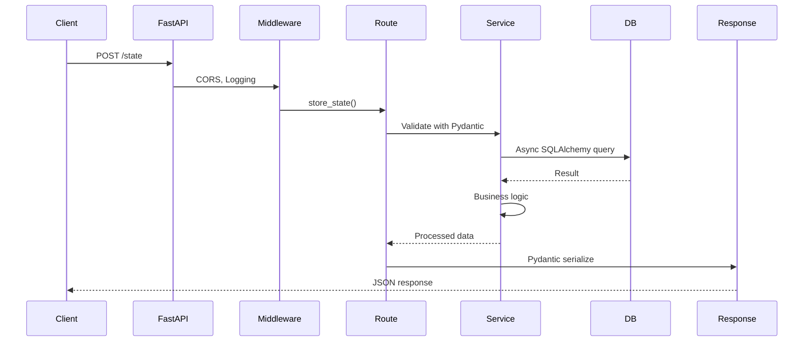

# Deep Dive Architecture

**Reading Time:** ~40 minutes
**Audience:** Senior developers, architects
**Prerequisites:** Understanding of async Python, databases, RESTful APIs
**Goal:** Master Observer's architectural patterns and design decisions

---

## Architectural Overview

Observer is a **FastAPI microservice** with an async-first architecture, implementing a clean separation of concerns through layers:

```text
┌─────────────────────────────────────────────────────────┐
│                     API Layer                            │
│  FastAPI Routes + Pydantic Schemas + OpenAPI Docs       │
└────────────────────┬────────────────────────────────────┘
                     │ Dependency Injection
┌────────────────────▼────────────────────────────────────┐
│                  Service Layer                           │
│  Business Logic + Algorithms + Orchestration            │
└────────────────────┬────────────────────────────────────┘
                     │ Async SQLAlchemy
┌────────────────────▼────────────────────────────────────┐
│                   Data Layer                             │
│  SQLAlchemy Models + PostgreSQL + pgvector              │
└─────────────────────────────────────────────────────────┘
```

---

## Core Architectural Patterns

### 1. Async-First Design

**Every I/O operation is async**, enabling high concurrency:

```python
# Database operations
async def find_emotion(db: AsyncSession, name: str) -> AtlasDefinition:
    result = await db.execute(
        select(AtlasDefinition).where(AtlasDefinition.name == name)
    )
    return result.scalar_one_or_none()

# HTTP calls to Versor
async def get_quaternion(vac: List[float]) -> List[float]:
    async with httpx.AsyncClient() as client:
        response = await client.post(
            f"{VERSOR_URL}/convert",
            json={"vac": vac}
        )
        return response.json()["quaternion"]

# File I/O
async def load_seed_data():
    async with aiofiles.open("data/atlas.json") as f:
        data = await f.read()
        return json.loads(data)
```

**Benefits:**

- Handle 1000s of concurrent requests
- Non-blocking I/O operations
- Better resource utilization
- Responsive under load

### 2. Dependency Injection

FastAPI's DI system provides loose coupling and testability:

```python
from fastapi import Depends
from app.database import get_db
from app.services.emotion_mapper import EmotionMapper

@router.post("/similar")
async def find_similar(
    request: SimilarityRequest,
    db: AsyncSession = Depends(get_db),  # Injected
    mapper: EmotionMapper = Depends(get_emotion_mapper)  # Injected
):
    results = await mapper.find_nearest(
        vac=request.vac,
        text=request.text,
        k=5
    )
    return {"results": results}

# Dependency providers
async def get_db():
    async with AsyncSessionLocal() as session:
        yield session

def get_emotion_mapper(db: AsyncSession = Depends(get_db)):
    return EmotionMapper(db)
```

**Testing becomes trivial:**

```python
# Override dependencies for tests
app.dependency_overrides[get_db] = get_test_db
app.dependency_overrides[get_emotion_mapper] = get_mock_mapper
```

### 3. Service Layer Pattern

**Controllers stay thin, services encapsulate logic:**

```python
# ❌ BAD: Fat controller
@router.post("/path")
async def find_path(request: PathRequest, db: AsyncSession = Depends(get_db)):
    # 200 lines of A* algorithm...
    # Category validation...
    # Bridge emotion logic...
    # Strategy recommendation...
    return path

# ✅ GOOD: Thin controller, fat service
@router.post("/path")
async def find_path(
    request: PathRequest,
    planner: PathPlanner = Depends(get_path_planner)
):
    path = await planner.find_transition_path(
        from_emotion=request.from_emotion,
        to_emotion=request.to_emotion,
        user_id=request.user_id
    )
    return PathResponse.from_path(path)
```

**Service encapsulates complexity:**

```python
class PathPlanner:
    def __init__(self, db: AsyncSession):
        self.db = db
        self._category_graph = None

    async def find_transition_path(
        self,
        from_emotion: str,
        to_emotion: str,
        user_id: str
    ) -> TransitionPath:
        # All logic here, testable independently
        start = await self._get_emotion(from_emotion)
        goal = await self._get_emotion(to_emotion)
        path = await self._astar_search(start, goal)
        enhanced = await self._validate_and_enhance_path(path, user_id)
        return enhanced
```

---

## Data Flow Architecture

### Request Lifecycle



### Detailed Example: Storing Emotional State

```python
# 1. API Route (controller)
@router.post("/", status_code=201)
async def store_state(
    state: StateCreate,  # Pydantic validation
    db: AsyncSession = Depends(get_db),
    mapper: EmotionMapper = Depends(get_emotion_mapper),
    quat_builder: QuaternionBuilder = Depends(get_quaternion_builder)
) -> StateResponse:
    # 2. Find nearest emotion
    emotion = await mapper.find_nearest(
        vac=state.vac,
        text=state.transcription
    )

    # 3. Convert VAC to quaternion
    quaternion = await quat_builder.from_vac(state.vac)

    # 4. Generate embedding
    embedding = await mapper.embedding_service.generate_embedding(
        state.transcription
    )

    # 5. Create trajectory record
    trajectory = UserTrajectory(
        user_id=state.user_id,
        session_id=state.session_id,
        vac=state.vac,
        quaternion=quaternion,
        emotion_id=emotion.id,
        transcription=state.transcription,
        embedding=embedding,
        timestamp=datetime.utcnow()
    )

    db.add(trajectory)
    await db.commit()
    await db.refresh(trajectory)

    # 6. Calculate metrics if needed
    if await should_calculate_metrics(db, state.user_id):
        metrics_calc = MetricsCalculator(db)
        elasticity = await metrics_calc.calculate_elasticity(
            user_id=state.user_id,
            current_quat=quaternion
        )

        if metrics_calc.detect_flooding(elasticity):
            # Trigger alert
            await trigger_flooding_alert(state.user_id)

    return StateResponse.from_trajectory(trajectory, emotion)
```

---

## Database Layer Architecture

### Connection Management

```python
from sqlalchemy.ext.asyncio import (
    create_async_engine,
    AsyncSession,
    async_sessionmaker
)

# Engine with connection pooling
engine = create_async_engine(
    DATABASE_URL,
    echo=False,
    pool_size=20,          # Max concurrent connections
    max_overflow=10,       # Allow 10 more under load
    pool_pre_ping=True,    # Verify connections before use
    pool_recycle=3600      # Recycle connections hourly
)

# Session factory
AsyncSessionLocal = async_sessionmaker(
    engine,
    class_=AsyncSession,
    expire_on_commit=False,  # Don't expire after commit
    autoflush=False          # Manual flush control
)

# Dependency for routes
async def get_db():
    async with AsyncSessionLocal() as session:
        try:
            yield session
            await session.commit()
        except Exception:
            await session.rollback()
            raise
        finally:
            await session.close()
```

### Model Design

**Rich domain models with methods:**

```python
from sqlalchemy.orm import DeclarativeBase, Mapped, mapped_column
from sqlalchemy import ARRAY, Float
from pgvector.sqlalchemy import Vector

class Base(DeclarativeBase):
    pass

class AtlasDefinition(Base):
    __tablename__ = "atlas_definitions"

    id: Mapped[uuid.UUID] = mapped_column(primary_key=True, default=uuid.uuid4)
    name: Mapped[str] = mapped_column(unique=True, index=True)
    category: Mapped[str] = mapped_column(index=True)
    vac: Mapped[List[float]] = mapped_column(ARRAY(Float))
    embedding: Mapped[List[float]] = mapped_column(Vector(384))
    description: Mapped[str]

    # Computed properties
    @property
    def valence(self) -> float:
        return self.vac[0]

    @property
    def arousal(self) -> float:
        return self.vac[1]

    @property
    def connection(self) -> float:
        return self.vac[2]

    # Domain methods
    def distance_to(self, other: 'AtlasDefinition') -> float:
        """Calculate Euclidean distance to another emotion"""
        return math.sqrt(
            (self.vac[0] - other.vac[0])**2 +
            (self.vac[1] - other.vac[1])**2 +
            (self.vac[2] - other.vac[2])**2
        )

    def is_similar_category(self, other: 'AtlasDefinition') -> bool:
        """Check if emotions are in related categories"""
        return self.category == other.category
```

### Vector Operations with pgvector

```python
from sqlalchemy import select, text

# Nearest neighbor search
async def find_similar_trajectories(
    db: AsyncSession,
    query_embedding: List[float],
    user_id: str,
    limit: int = 10
) -> List[UserTrajectory]:
    # Using pgvector's <=> operator (cosine distance)
    stmt = (
        select(UserTrajectory)
        .where(UserTrajectory.user_id == user_id)
        .order_by(UserTrajectory.embedding.cosine_distance(query_embedding))
        .limit(limit)
    )
    result = await db.execute(stmt)
    return result.scalars().all()

# Distance threshold search
async def find_within_distance(
    db: AsyncSession,
    query_embedding: List[float],
    max_distance: float = 0.3
) -> List[UserTrajectory]:
    stmt = text("""
        SELECT * FROM user_trajectory
        WHERE embedding <=> :query_emb < :max_dist
        ORDER BY embedding <=> :query_emb
    """)
    result = await db.execute(
        stmt,
        {
            "query_emb": query_embedding,
            "max_dist": max_distance
        }
    )
    return result.all()
```

---

## Service Layer Deep Dive

### EmotionMapper: Weighted Fusion Algorithm

#### Core innovation: Combines geometric + semantic similarity

```python
class EmotionMapper:
    def __init__(
        self,
        db: AsyncSession,
        embedding_service: EmbeddingService = None
    ):
        self.db = db
        self.embedding_service = embedding_service or get_embedding_service()

    async def find_nearest(
        self,
        vac: List[float],
        text: str,
        k: int = 5
    ) -> List[EmotionMatch]:
        # Get all emotions from atlas
        emotions = await self._load_atlas()

        # Generate embedding for input text
        text_embedding = await self.embedding_service.generate_embedding(text)

        # Calculate both distances
        results = []
        for emotion in emotions:
            vac_dist = self._calculate_vac_distance(vac, emotion.vac)
            sem_dist = self._calculate_semantic_distance(
                text_embedding,
                emotion.embedding
            )

            # Weighted fusion based on text length
            final_dist = self._weighted_fusion(vac_dist, sem_dist, text)

            results.append(EmotionMatch(
                emotion=emotion,
                vac_distance=vac_dist,
                semantic_distance=sem_dist,
                final_distance=final_dist
            ))

        # Sort by final distance, return top k
        results.sort(key=lambda x: x.final_distance)
        return results[:k]

    def _weighted_fusion(
        self,
        vac_distance: float,
        semantic_distance: float,
        word_count: int
    ) -> float:
        """
        Adaptive weighting based on text length.

        Short text (< 10 words): Trust VAC more (LLM gave clear signal)
        Long text (>= 10 words): Trust semantics more (rich context)

        Weights are configurable via settings:
          EMOTION_MATCHING_VAC_WEIGHT_SHORT (default: 0.8)
          EMOTION_MATCHING_SEMANTIC_WEIGHT_SHORT (default: 0.2)
          EMOTION_MATCHING_VAC_WEIGHT_LONG (default: 0.4)
          EMOTION_MATCHING_SEMANTIC_WEIGHT_LONG (default: 0.6)
        """
        if word_count < settings.EMOTION_MATCHING_SHORT_TEXT_THRESHOLD:  # default: 10
            vac_weight = settings.EMOTION_MATCHING_VAC_WEIGHT_SHORT      # default: 0.8
            semantic_weight = settings.EMOTION_MATCHING_SEMANTIC_WEIGHT_SHORT  # default: 0.2
        else:
            vac_weight = settings.EMOTION_MATCHING_VAC_WEIGHT_LONG       # default: 0.4
            semantic_weight = settings.EMOTION_MATCHING_SEMANTIC_WEIGHT_LONG   # default: 0.6

        vac_normalized = vac_distance / settings.EMOTION_MATCHING_VAC_MAX_DISTANCE
        semantic_normalized = semantic_distance / settings.EMOTION_MATCHING_SEMANTIC_MAX_DISTANCE

        return (vac_weight * vac_normalized) + (semantic_weight * semantic_normalized)
```

### PathPlanner: A* Implementation

**Sophisticated pathfinding with therapeutic constraints:**

```python
class PathPlanner:
    async def _astar_search(
        self,
        start: AtlasDefinition,
        goal: AtlasDefinition
    ) -> List[AtlasDefinition]:
        """
        A* pathfinding with therapeutic constraints.

        g(n) = actual distance from start
        h(n) = heuristic (straight-line distance to goal)
        f(n) = g(n) + h(n)
        """
        # Priority queue: (f_score, emotion)
        open_set = [(0, start.id, start)]
        came_from = {}
        g_score = {start.id: 0}
        f_score = {start.id: self._heuristic_cost(start, goal)}

        while open_set:
            _, current_id, current = heapq.heappop(open_set)

            if current.id == goal.id:
                return self._reconstruct_path(came_from, current)

            # Get valid neighbors
            neighbors = await self._get_valid_neighbors(current, goal)

            for neighbor in neighbors:
                # Calculate tentative g_score
                tentative_g = g_score[current_id] + self._calculate_g_cost(
                    current, neighbor
                )

                if neighbor.id not in g_score or tentative_g < g_score[neighbor.id]:
                    # This path is better
                    came_from[neighbor.id] = current
                    g_score[neighbor.id] = tentative_g
                    f_score[neighbor.id] = tentative_g + self._heuristic_cost(
                        neighbor, goal
                    )

                    heapq.heappush(open_set, (
                        f_score[neighbor.id],
                        neighbor.id,
                        neighbor
                    ))

        # No path found - use fallback
        return await self._fallback_path(start, goal)

    async def _get_valid_neighbors(
        self,
        current: AtlasDefinition,
        goal: AtlasDefinition
    ) -> List[AtlasDefinition]:
        """Get therapeutically valid transitions from current emotion"""
        # Load category transition rules
        if not self._category_graph:
            await self._load_category_transitions()

        # Get all emotions
        all_emotions = await self._load_atlas()

        # Filter by validity
        valid = []
        for emotion in all_emotions:
            if emotion.id == current.id:
                continue

            # Check category transition is allowed
            if not self._is_category_transition_valid(
                current.category,
                emotion.category
            ):
                continue

            # Check VAC distance isn't too large (max 1.5 in one step)
            if current.distance_to(emotion) > 1.5:
                continue

            # Check arousal doesn't change too rapidly
            arousal_change = abs(current.arousal - emotion.arousal)
            if arousal_change > 0.6:
                continue

            valid.append(emotion)

        return valid
```

---

## WebSocket Architecture

### Connection Management

```python
from fastapi import WebSocket
from typing import Dict, Set

class ConnectionManager:
    def __init__(self):
        # session_id -> Set of WebSocket connections
        self.active_connections: Dict[str, Set[WebSocket]] = {}

    async def connect(self, websocket: WebSocket, session_id: str):
        await websocket.accept()
        if session_id not in self.active_connections:
            self.active_connections[session_id] = set()
        self.active_connections[session_id].add(websocket)

    def disconnect(self, websocket: WebSocket, session_id: str):
        if session_id in self.active_connections:
            self.active_connections[session_id].discard(websocket)
            if not self.active_connections[session_id]:
                del self.active_connections[session_id]

    async def broadcast_to_session(self, session_id: str, message: dict):
        if session_id in self.active_connections:
            disconnected = set()
            for connection in self.active_connections[session_id]:
                try:
                    await connection.send_json(message)
                except Exception:
                    disconnected.add(connection)

            # Clean up dead connections
            for conn in disconnected:
                self.disconnect(conn, session_id)

# Global instance
manager = ConnectionManager()

# WebSocket endpoint
@router.websocket("/ws/{session_id}")
async def websocket_endpoint(
    websocket: WebSocket,
    session_id: str,
    chat_service: ChatService = Depends(get_chat_service)
):
    await manager.connect(websocket, session_id)
    try:
        while True:
            # Receive message
            data = await websocket.receive_json()

            # Process message
            if data["type"] == "user_message":
                await chat_service.save_user_message(
                    session_id=session_id,
                    content=data["content"]
                )

                # Broadcast to all connections in session
                await manager.broadcast_to_session(
                    session_id,
                    {
                        "type": "message_received",
                        "timestamp": datetime.utcnow().isoformat()
                    }
                )
    except WebSocketDisconnect:
        manager.disconnect(websocket, session_id)
```

---

## Error Handling Strategy

### Layered Exception Handling

```python
# Custom exceptions
class ObserverException(Exception):
    """Base exception for Observer"""
    pass

class EmotionNotFoundError(ObserverException):
    """Emotion doesn't exist in atlas"""
    pass

class InvalidVACError(ObserverException):
    """VAC coordinates out of range"""
    pass

class PathNotFoundException(ObserverException):
    """No valid path between emotions"""
    pass

# Exception handlers
@app.exception_handler(EmotionNotFoundError)
async def emotion_not_found_handler(request: Request, exc: EmotionNotFoundError):
    return JSONResponse(
        status_code=404,
        content={
            "error": "emotion_not_found",
            "message": str(exc),
            "emotion_name": exc.emotion_name
        }
    )

@app.exception_handler(InvalidVACError)
async def invalid_vac_handler(request: Request, exc: InvalidVACError):
    return JSONResponse(
        status_code=400,
        content={
            "error": "invalid_vac",
            "message": str(exc),
            "vac": exc.vac,
            "valid_range": [-1.0, 1.0]
        }
    )

# Service layer raises exceptions
class EmotionMapper:
    async def find_nearest(self, vac: List[float], text: str):
        # Validate VAC
        for value in vac:
            if not -1.0 <= value <= 1.0:
                raise InvalidVACError(
                    f"VAC value {value} out of range [-1.0, 1.0]",
                    vac=vac
                )

        # ... rest of logic
```

---

## Performance Considerations

### Query Optimization

```python
# ❌ BAD: N+1 query problem
async def get_trajectories_with_emotions(user_id: str):
    trajectories = await db.execute(
        select(UserTrajectory).where(UserTrajectory.user_id == user_id)
    )
    result = []
    for traj in trajectories.scalars():
        # This hits DB for EACH trajectory!
        emotion = await db.execute(
            select(AtlasDefinition).where(AtlasDefinition.id == traj.emotion_id)
        )
        result.append((traj, emotion.scalar()))
    return result

# ✅ GOOD: Eager loading with join
async def get_trajectories_with_emotions(user_id: str):
    stmt = (
        select(UserTrajectory)
        .options(selectinload(UserTrajectory.emotion))  # Eager load
        .where(UserTrajectory.user_id == user_id)
    )
    result = await db.execute(stmt)
    return result.scalars().all()
```

### Caching Strategy

```python
from functools import lru_cache
from cachetools import TTLCache
import asyncio

# In-memory cache for atlas (rarely changes)
atlas_cache = TTLCache(maxsize=1, ttl=3600)  # 1 hour TTL

async def get_atlas_cached(db: AsyncSession) -> List[AtlasDefinition]:
    cache_key = "atlas_emotions"

    if cache_key in atlas_cache:
        return atlas_cache[cache_key]

    result = await db.execute(select(AtlasDefinition))
    emotions = result.scalars().all()

    atlas_cache[cache_key] = emotions
    return emotions
```

---

## Testing Architecture

### Layered Testing Strategy

```python
# Unit tests: Pure logic, no DB
def test_vac_distance_calculation():
    mapper = EmotionMapper(db=None)
    distance = mapper._calculate_vac_distance([0, 0, 0], [1, 0, 0])
    assert distance == 1.0

# Integration tests: With test DB
@pytest.mark.asyncio
async def test_find_nearest_emotion(test_db):
    mapper = EmotionMapper(test_db)
    results = await mapper.find_nearest(
        vac=[0.8, 0.6, 0.7],
        text="I feel joyful"
    )
    assert results[0].emotion.name == "Joy"

# E2E tests: Full HTTP stack
@pytest.mark.asyncio
async def test_store_state_endpoint():
    async with AsyncClient(app=app, base_url="http://test") as client:
        response = await client.post("/state", json={
            "user_id": "test",
            "vac": [0.8, 0.6, 0.7],
            "transcription": "I'm happy"
        })
    assert response.status_code == 201
```

---

## Next Steps

**Continue exploring:**

- [Database Architecture](02-database-architecture.md) - Deep dive into PostgreSQL + pgvector
- [Vector Search](03-vector-search.md) - HNSW algorithm and optimization
- [Transition System](04-transition-system.md) - A* pathfinding in detail

**For specific topics:**

- [Performance Optimization](06-performance-optimization.md)
- [Extending Observer](07-extending-observer.md)
- [Troubleshooting](08-troubleshooting.md)
