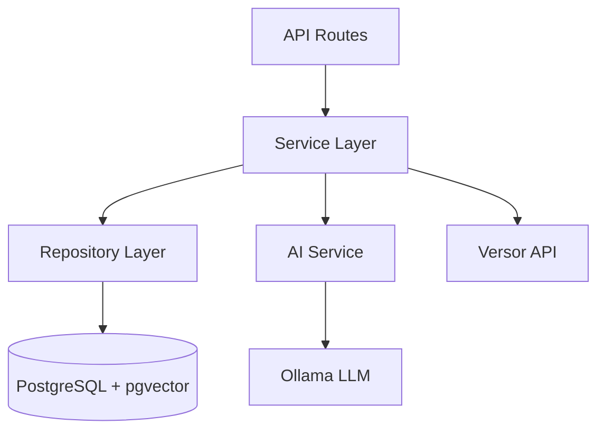

# Observer Service Layer Architecture

**Last Updated:** February 2026
**Audience:** Developers

---

## Overview

The Observer module uses a **service layer pattern** to encapsulate business logic separate from API routes and database access. Services are organized by domain concern into 14 directories containing 62 Python files.

```text
observer/app/services/
├── admin/          # Admin dashboard operations
├── ai/             # AI model management & embeddings
├── analytics/      # Session & metrics analytics
├── chat/           # WebSocket chat service
├── clinical/       # Clinical alerts & risk assessment
├── emotions/       # Emotion mapping, resolution, relationships
├── insights/       # Warm insights, clinical analysis, prosody
├── math/           # Quaternion building
├── matrix/         # Path matrix batch computation & caching
├── memory/         # Memory association patterns
├── observer/       # Core observation pipeline
├── planning/       # A* pathfinding, waypoint explanation
└── recommendation/ # Strategy recommendation engine
```

---

## Service Details

### Emotions (`emotions/`)

The emotional intelligence core. 4 files, ~66KB total.

| File | Purpose |
|------|---------|
| `service.py` (22KB) | Primary emotion CRUD and search operations |
| `relationships.py` (23KB) | Emotion-to-emotion relationships, category bridging |
| `resolver.py` (11KB) | Resolves emotion names/IDs to full emotion objects |
| `mapper.py` (9KB) | Maps VAC coordinates to nearest atlas emotions |

**Key responsibilities:**
- CRUD operations on the 87-emotion atlas
- Nearest-neighbor search via pgvector HNSW index
- Category-based grouping and bridging
- VAC → emotion resolution with similarity scoring

### Planning (`planning/`)

A* pathfinding for therapeutic transitions. 7 files, ~50KB total.

| File | Purpose |
|------|---------|
| `core.py` (15KB) | Core path planning orchestration |
| `waypoint_explainer.py` (22KB) | AI-powered waypoint explanations |
| `astar.py` (5KB) | A* algorithm implementation |
| `graph.py` (5KB) | Emotion graph construction |
| `harmonics.py` (1KB) | Harmonic cost calculations |
| `definitions.py` (<1KB) | Type definitions for planning |
| `types.py` (<1KB) | Common type aliases |

**Key responsibilities:**
- A* pathfinding between emotional states
- Graph construction from emotion atlas
- Cost function: VAC angular distance + connection weighting
- AI-powered natural language explanations of each waypoint

### Recommendation (`recommendation/`)

Strategy recommendations for emotional transitions. 5 files, ~41KB total.

| File | Purpose |
|------|---------|
| `strategies.py` (28KB) | Strategy matching and scoring |
| `discovery.py` (5KB) | Emotion discovery recommendations |
| `engine.py` (3KB) | Recommendation engine orchestration |
| `curation.py` (3KB) | Curated recommendation sets |
| `spatial.py` (2KB) | Spatial (VAC distance) recommendations |

**Key responsibilities:**
- Match strategies to transitions based on VAC distance
- Score strategy relevance for specific emotional movements
- 7 strategy categories: ACT, DBT, CBT, Mindfulness, Somatic, Creative, Social

### AI (`ai/`)

AI model management and embeddings. 4 files, ~39KB total.

| File | Purpose |
|------|---------|
| `models.py` (19KB) | Model assignment management (which model for which function) |
| `embeddings.py` (12KB) | Text → vector embeddings via Ollama |
| `prompts.py` (5KB) | Prompt template management |
| `renderer.py` (3KB) | Prompt rendering with context variables |

**Key responsibilities:**
- Model-function mapping (e.g., emotion_analysis → llama3.1)
- Vector embedding generation for semantic search
- Prompt template CRUD and rendering
- Model health checking

### Chat (`chat/`)

WebSocket-based emotional check-in chat. 5 files, ~29KB total.

| File | Purpose |
|------|---------|
| `messages.py` (9KB) | Message handling and storage |
| `analysis.py` (9KB) | Chat-based emotional analysis |
| `service.py` (7KB) | Chat session orchestration |
| `session.py` (4KB) | Session lifecycle management |
| `types.py` (<1KB) | WebSocket message types |

**Key responsibilities:**
- WebSocket connection management
- Real-time emotional analysis during chat
- Session history persistence
- Insight generation from chat context

### Analytics (`analytics/`)

Session analytics and metrics. 2 files, ~28KB total.

| File | Purpose |
|------|---------|
| `session.py` (20KB) | Session-level analytics (duration, emotions, trajectories) |
| `metrics.py` (8KB) | Aggregate metrics and trend calculations |

### Clinical (`clinical/`)

Clinical alert system. 1 file, 15KB.

| File | Purpose |
|------|---------|
| `alerts.py` (15KB) | Risk assessment, clinical alerts, threshold monitoring |

**Key responsibilities:**
- Monitor emotional patterns for risk indicators
- Generate clinical alerts for therapist review
- Track severity and escalation patterns

### Insights (`insights/`)

Multi-modal insight generation. 4 files, ~36KB total.

| File | Purpose |
|------|---------|
| `warm.py` (14KB) | Warm/empathetic insight generation |
| `prosody.py` (9KB) | Voice prosody analysis insights |
| `clinical.py` (8KB) | Clinical-grade insights |
| `core.py` (4KB) | Core insight types and base logic |
| `utils.py` (2KB) | Insight formatting utilities |

### Matrix (`matrix/`)

Path matrix computation and caching. 4 files, ~19KB total.

| File | Purpose |
|------|---------|
| `batch.py` (7KB) | Batch all-pairs path computation |
| `cache.py` (6KB) | Path cache management |
| `service.py` (3KB) | Matrix service orchestration |
| `jobs.py` (3KB) | Background job management |

**Key responsibilities:**
- Compute all possible emotion-to-emotion paths (87×86 = 7,482 paths)
- Cache computed paths for fast retrieval
- Background job tracking for batch computation

### Math (`math/`)

Quaternion utilities. 1 file, 13KB.

| File | Purpose |
|------|---------|
| `quaternion_builder.py` (13KB) | Build quaternions from VAC, interpolate, convert |

### Observer Core (`observer/`)

Core observation pipeline. 1 file, 9KB.

| File | Purpose |
|------|---------|
| `pipeline.py` (9KB) | End-to-end observation and state storage pipeline |

### Memory (`memory/`)

Memory patterns. 1 file, 6KB.

| File | Purpose |
|------|---------|
| `association.py` (6KB) | Find similar past emotional moments |

### Admin (`admin/`)

Admin dashboard operations. 1 file, 6KB.

| File | Purpose |
|------|---------|
| `service.py` (6KB) | Admin CRUD for users, sessions, strategies, bootstrap data |

---

## Dependency Injection

Services are instantiated via FastAPI's dependency injection. Each service receives:

- **Database session** — Async SQLAlchemy session from a shared pool
- **Other services** — Services can depend on other services
- **Configuration** — Settings from environment variables

```python
# Example: route using service dependency
@router.get("/emotions")
async def list_emotions(
    service: EmotionService = Depends(get_emotion_service)
):
    return await service.get_all()
```

---

## Data Flow



---

## See Also

- [API Reference](../reference/api-reference.md) — Full endpoint documentation
- [Architecture Deep Dive](01-deep-dive.md) — Detailed architecture patterns
