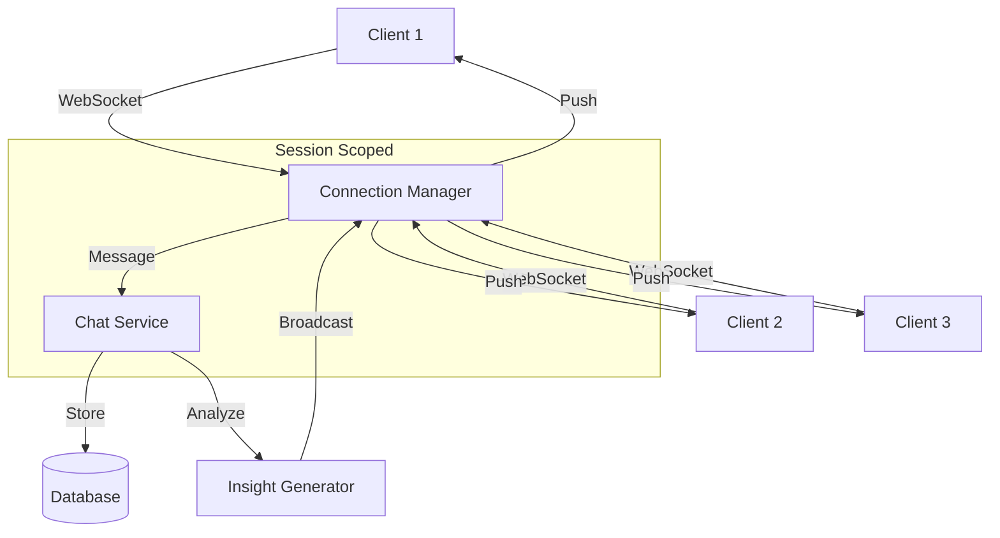

# WebSocket & Real-time Architecture

**Reading Time:** ~35 minutes  
**Audience:** Senior developers  
**Prerequisites:** [Deep Dive Architecture](01-deep-dive.md), WebSocket basics  
**Goal:** Master Observer's real-time communication layer and chat functionality

---

## Overview

Observer implements **WebSocket-based real-time chat** for:

- Continuous emotional guidance during sessions
- Real-time insight delivery
- Deep Feeling Mode conversations
- Multi-client session support

**Technology:** FastAPI WebSockets + Connection Manager pattern

---

## WebSocket Architecture



---

## Connection Manager

### Core Implementation

```python
from fastapi import WebSocket, WebSocketDisconnect
from typing import Dict, Set
import asyncio

class ConnectionManager:
    """
    Manages WebSocket connections per session.
    
    Architecture:
    - One session can have multiple connections (multi-device)
    - Messages broadcast to all connections in a session
    - Automatic cleanup on disconnect
    """
    
    def __init__(self):
        # session_id -> Set[WebSocket]
        self.active_connections: Dict[str, Set[WebSocket]] = {}
        
        # Lock for thread-safe operations
        self._lock = asyncio.Lock()
    
    async def connect(self, websocket: WebSocket, session_id: str):
        """
        Accept new WebSocket connection.
        
        Args:
            websocket: FastAPI WebSocket instance
            session_id: Chat session ID
        """
        await websocket.accept()
        
        async with self._lock:
            if session_id not in self.active_connections:
                self.active_connections[session_id] = set()
            
            self.active_connections[session_id].add(websocket)
        
        # Send welcome message
        await websocket.send_json({
            "type": "connected",
            "session_id": session_id,
            "timestamp": datetime.utcnow().isoformat()
        })
    
    def disconnect(self, websocket: WebSocket, session_id: str):
        """Remove connection and cleanup if session empty"""
        if session_id in self.active_connections:
            self.active_connections[session_id].discard(websocket)
            
            # Remove session if no connections left
            if not self.active_connections[session_id]:
                del self.active_connections[session_id]
    
    async def send_to_connection(
        self,
        websocket: WebSocket,
        message: dict
    ) -> bool:
        """
        Send message to specific connection.
        
        Returns:
            bool: True if sent successfully, False if connection dead
        """
        try:
            await websocket.send_json(message)
            return True
        except Exception as e:
            logger.error(f"Failed to send message: {e}")
            return False
    
    async def broadcast_to_session(
        self,
        session_id: str,
        message: dict,
        exclude: WebSocket = None
    ):
        """
        Broadcast message to all connections in session.
        
        Args:
            session_id: Target session
            message: JSON-serializable message
            exclude: Optional websocket to exclude (e.g., sender)
        """
        if session_id not in self.active_connections:
            return
        
        # Track failed connections
        disconnected = set()
        
        # Send to all connections
        for connection in self.active_connections[session_id]:
            if connection == exclude:
                continue
            
            success = await self.send_to_connection(connection, message)
            if not success:
                disconnected.add(connection)
        
        # Cleanup dead connections
        async with self._lock:
            for conn in disconnected:
                self.disconnect(conn, session_id)
    
    async def broadcast_to_all(self, message: dict):
        """Broadcast to all active sessions (admin use)"""
        for session_id in list(self.active_connections.keys()):
            await self.broadcast_to_session(session_id, message)
    
    def get_session_count(self) -> int:
        """Get number of active sessions"""
        return len(self.active_connections)
    
    def get_connection_count(self, session_id: str) -> int:
        """Get number of connections for a session"""
        return len(self.active_connections.get(session_id, set()))

# Global instance
manager = ConnectionManager()
```

---

## WebSocket Endpoint

```python
from fastapi import APIRouter, WebSocket, WebSocketDisconnect, Depends
from app.websocket.connection_manager import manager
from app.services.chat_service import ChatService

router = APIRouter()

@router.websocket("/ws/{session_id}")
async def websocket_endpoint(
    websocket: WebSocket,
    session_id: str,
    chat_service: ChatService = Depends(get_chat_service)
):
    """
    WebSocket endpoint for real-time chat.
    
    Message Types (client → server):
    - user_message: User sends text
    - request_insight: User requests analysis
    - toggle_deep_feeling: Toggle deep feeling mode
    - ping: Keep-alive
    
    Message Types (server → client):
    - connected: Connection established
    - message_received: Ack user message
    - analysis: Emotional analysis result
    - insight: Generated insight
    - similar_moment: Historical match
    - pong: Keep-alive response
    - error: Error occurred
    """
    # Connect
    await manager.connect(websocket, session_id)
    
    try:
        # Create or get session
        session = await chat_service.get_or_create_session(session_id)
        
        # Message loop
        while True:
            # Receive message
            data = await websocket.receive_json()
            
            # Route by message type
            if data["type"] == "user_message":
                await handle_user_message(
                    websocket, session_id, data, chat_service
                )
            
            elif data["type"] == "request_insight":
                await handle_insight_request(
                    websocket, session_id, data, chat_service
                )
            
            elif data["type"] == "toggle_deep_feeling":
                await handle_toggle_deep_feeling(
                    websocket, session_id, data, chat_service
                )
            
            elif data["type"] == "ping":
                await websocket.send_json({"type": "pong"})
            
            else:
                await websocket.send_json({
                    "type": "error",
                    "message": f"Unknown message type: {data['type']}"
                })
    
    except WebSocketDisconnect:
        manager.disconnect(websocket, session_id)
        logger.info(f"Client disconnected from session {session_id}")
    
    except Exception as e:
        logger.error(f"WebSocket error: {e}")
        manager.disconnect(websocket, session_id)
        raise


async def handle_user_message(
    websocket: WebSocket,
    session_id: str,
    data: dict,
    chat_service: ChatService
):
    """Process user message and generate insights"""
    # Save user message
    await chat_service.save_user_message(
        session_id=session_id,
        content=data["content"]
    )
    
    # Acknowledge receipt
    await websocket.send_json({
        "type": "message_received",
        "timestamp": datetime.utcnow().isoformat()
    })
    
    # Analyze emotion (if VAC provided)
    if "vac" in data:
        analysis = await chat_service.analyze_emotion(
            session_id=session_id,
            vac=data["vac"],
            text=data["content"]
        )
        
        # Send analysis
        await manager.broadcast_to_session(
            session_id,
            {
                "type": "analysis",
                "emotion": analysis["emotion"],
                "vac": analysis["vac"],
                "confidence": analysis["confidence"]
            }
        )
    
    # Generate insight
    insight = await chat_service.generate_insight(
        session_id=session_id,
        content=data["content"]
    )
    
    # Broadcast insight
    await manager.broadcast_to_session(
        session_id,
        {
            "type": "insight",
            "content": insight["text"],
            "suggestions": insight["suggestions"]
        }
    )
```

---

## Chat Service Integration

```python
class ChatService:
    """Service for managing chat sessions and messages"""
    
    def __init__(self, db: AsyncSession):
        self.db = db
        self.emotion_mapper = EmotionMapper(db)
        self.insight_generator = InsightGenerator(db)
    
    async def get_or_create_session(
        self,
        session_id: str,
        user_id: str
    ) -> ChatSession:
        """Get existing session or create new one"""
        # Try to get existing
        result = await self.db.execute(
            select(ChatSession).where(ChatSession.id == session_id)
        )
        session = result.scalar_one_or_none()
        
        if not session:
            # Create new
            session = ChatSession(
                id=session_id,
                user_id=user_id,
                started_at=datetime.utcnow(),
                status='active',
                tone_preference='warm',
                deep_feeling_mode=False
            )
            self.db.add(session)
            await self.db.commit()
        
        return session
    
    async def save_user_message(
        self,
        session_id: str,
        content: str
    ) -> ChatMessage:
        """Save user message to database"""
        # Generate embedding
        embedding = await self.embedding_service.generate_embedding(content)
        
        message = ChatMessage(
            session_id=session_id,
            message_type='user',
            content=content,
            embedding=embedding,
            timestamp=datetime.utcnow()
        )
        
        self.db.add(message)
        await self.db.commit()
        return message
    
    async def save_analysis_message(
        self,
        session_id: str,
        emotion_name: str,
        vac: List[float],
        content: str
    ) -> ChatMessage:
        """Save analysis message"""
        # Get emotion ID
        emotion = await self._find_emotion(emotion_name)
        
        # Generate embedding
        embedding = await self.embedding_service.generate_embedding(content)
        
        message = ChatMessage(
            session_id=session_id,
            message_type='analysis',
            content=content,
            emotion_id=emotion.id,
            vac=vac,
            embedding=embedding,
            timestamp=datetime.utcnow()
        )
        
        self.db.add(message)
        await self.db.commit()
        return message
```

---

## Deep Feeling Mode

### What is Deep Feeling Mode?

#### Extended emotional exploration with deeper questioning

Normal mode:

- Quick insights
- Surface-level analysis
- Action-oriented

Deep Feeling Mode:

- Exploratory questions
- Layered emotional analysis
- Process-oriented

### Implementation

```python
class ChatSession(Base):
    __tablename__ = "chat_sessions"
    
    deep_feeling_mode: Mapped[bool] = mapped_column(default=False)
    
    # Deep feeling metadata
    exploration_depth: Mapped[int] = mapped_column(default=0)
    current_focus: Mapped[str] = mapped_column(nullable=True)


async def toggle_deep_feeling_mode(
    session_id: str,
    enabled: bool
) -> ChatSession:
    """Toggle deep feeling mode for session"""
    session = await get_session(session_id)
    
    session.deep_feeling_mode = enabled
    
    if enabled:
        session.exploration_depth = 0
        session.current_focus = None
    
    await db.commit()
    
    return session


class InsightGenerator:
    async def generate_insights(
        self,
        session_id: str,
        emotion_data: Dict,
        tone: str = 'warm'
    ) -> Dict:
        """Generate insights based on mode"""
        session = await self.get_session(session_id)
        
        if session.deep_feeling_mode:
            return await self._generate_deep_feeling_insights(
                session, emotion_data, tone
            )
        else:
            return await self._generate_standard_insights(
                emotion_data, tone
            )
    
    async def _generate_deep_feeling_insights(
        self,
        session: ChatSession,
        emotion_data: Dict,
        tone: str
    ) -> Dict:
        """
        Deep feeling mode: Layered exploration
        
        Depth levels:
        0: Surface emotion
        1: Underlying feelings
        2: Core needs/values
        3: Integration
        """
        depth = session.exploration_depth
        
        if depth == 0:
            # Surface: What are you feeling?
            questions = [
                "What does this emotion feel like in your body?",
                "When did you first notice this feeling?",
                "On a scale of 1-10, how intense is it?"
            ]
        elif depth == 1:
            # Underlying: What's beneath that?
            questions = [
                "What might be underneath this feeling?",
                "Is there another emotion layered with this one?",
                "What triggered this particular response?"
            ]
        elif depth == 2:
            # Core: What do you need?
            questions = [
                "What does this emotion need from you?",
                "What value or need is connected to this feeling?",
                "What would help you feel more settled?"
            ]
        else:
            # Integration: Making meaning
            questions = [
                "What have you learned from exploring this?",
                "How does this connect to your larger story?",
                "What small step could honor this feeling?"
            ]
        
        # Increment depth for next interaction
        session.exploration_depth += 1
        await self.db.commit()
        
        return {
            "type": "deep_feeling",
            "depth": depth,
            "questions": questions,
            "guidance": self._get_depth_guidance(depth)
        }
```

---

## Message Flow

### Client → Server Messages

```typescript
// TypeScript client interface
interface UserMessage {
    type: "user_message";
    content: string;
    vac?: [number, number, number];
    metadata?: Record<string, any>;
}

interface InsightRequest {
    type: "request_insight";
    focus?: string;  // Specific aspect to explore
}

interface ToggleDeepFeeling {
    type: "toggle_deep_feeling";
    enabled: boolean;
}
```

### Server → Client Messages

```typescript
interface AnalysisMessage {
    type: "analysis";
    emotion: string;
    category: string;
    vac: [number, number, number];
    confidence: number;
    timestamp: string;
}

interface InsightMessage {
    type: "insight";
    content: string;
    suggestions: string[];
    tone: "warm" | "clinical";
}

interface SimilarMomentMessage {
    type: "similar_moment";
    past_transcription: string;
    past_emotion: string;
    similarity_score: number;
    timestamp: string;
}
```

---

## Handling Concurrency

### Multi-Device Support

```python
@router.websocket("/ws/{session_id}")
async def websocket_endpoint(
    websocket: WebSocket,
    session_id: str,
    user_id: str = Depends(get_current_user)
):
    """Support multiple devices per session"""
    await manager.connect(websocket, session_id)
    
    # Notify other connections
    await manager.broadcast_to_session(
        session_id,
        {
            "type": "connection_added",
            "total_connections": manager.get_connection_count(session_id)
        },
        exclude=websocket  # Don't send to new connection
    )
    
    try:
        async for message in websocket.iter_json():
            # Process message
            response = await process_message(message, session_id)
            
            # Broadcast to ALL connections (including sender)
            await manager.broadcast_to_session(session_id, response)
    
    except WebSocketDisconnect:
        manager.disconnect(websocket, session_id)
        
        # Notify remaining connections
        await manager.broadcast_to_session(
            session_id,
            {
                "type": "connection_removed",
                "total_connections": manager.get_connection_count(session_id)
            }
        )
```

### Message Ordering

```python
class OrderedMessageQueue:
    """Ensure message order within session"""
    
    def __init__(self):
        self.queues: Dict[str, asyncio.Queue] = {}
    
    async def enqueue(self, session_id: str, message: dict):
        """Add message to session queue"""
        if session_id not in self.queues:
            self.queues[session_id] = asyncio.Queue()
        
        await self.queues[session_id].put(message)
    
    async def process_queue(self, session_id: str):
        """Process messages in order"""
        queue = self.queues.get(session_id)
        if not queue:
            return
        
        while not queue.empty():
            message = await queue.get()
            await manager.broadcast_to_session(session_id, message)
            queue.task_done()
```

---

## Error Handling

### Connection Errors

```python
async def safe_websocket_send(
    websocket: WebSocket,
    message: dict,
    max_retries: int = 3
) -> bool:
    """Send with retry logic"""
    for attempt in range(max_retries):
        try:
            await websocket.send_json(message)
            return True
        except WebSocketDisconnect:
            logger.warning(f"Connection lost during send (attempt {attempt + 1})")
            return False
        except Exception as e:
            logger.error(f"Send failed: {e}")
            if attempt < max_retries - 1:
                await asyncio.sleep(0.1 * (attempt + 1))  # Exponential backoff
            else:
                return False
    
    return False
```

### Timeout Protection

```python
async def receive_with_timeout(
    websocket: WebSocket,
    timeout: int = 300  # 5 minutes
) -> dict:
    """Receive message with timeout"""
    try:
        message = await asyncio.wait_for(
            websocket.receive_json(),
            timeout=timeout
        )
        return message
    except asyncio.TimeoutError:
        logger.warning(f"WebSocket timeout after {timeout}s")
        await websocket.close(code=1000, reason="Timeout")
        raise WebSocketDisconnect
```

---

## Keep-Alive (Heartbeat)

### Server-Side Ping

```python
async def heartbeat_task(session_id: str):
    """Send periodic pings to keep connection alive"""
    while session_id in manager.active_connections:
        await manager.broadcast_to_session(
            session_id,
            {"type": "ping", "timestamp": datetime.utcnow().isoformat()}
        )
        await asyncio.sleep(30)  # Every 30 seconds

# Start heartbeat when session created
@router.websocket("/ws/{session_id}")
async def websocket_endpoint(websocket: WebSocket, session_id: str):
    await manager.connect(websocket, session_id)
    
    # Start heartbeat
    heartbeat = asyncio.create_task(heartbeat_task(session_id))
    
    try:
        # ... message loop
        pass
    finally:
        heartbeat.cancel()
```

---

## Testing WebSockets

### Manual Testing

```python
# tests/manual/test_websocket.py
import asyncio
import websockets
import json

async def test_websocket_connection():
    """Manual test of WebSocket connection"""
    uri = "ws://localhost:8000/ws/test-session-123"
    
    async with websockets.connect(uri) as websocket:
        # Receive welcome
        welcome = await websocket.recv()
        print(f"Connected: {welcome}")
        
        # Send user message
        await websocket.send(json.dumps({
            "type": "user_message",
            "content": "I'm feeling anxious about tomorrow",
            "vac": [-0.4, 0.7, -0.2]
        }))
        
        # Receive responses
        for _ in range(3):
            response = await websocket.recv()
            data = json.loads(response)
            print(f"Received: {data['type']}")
            
            if data['type'] == 'insight':
                print(f"Insight: {data['content']}")

if __name__ == "__main__":
    asyncio.run(test_websocket_connection())
```

### Integration Testing

```python
@pytest.mark.asyncio
async def test_websocket_broadcast():
    """Test message broadcasting to multiple connections"""
    from starlette.testclient import TestClient
    from starlette.websockets import WebSocket
    
    with TestClient(app) as client:
        # Connect two clients
        with client.websocket_connect("/ws/test-session") as ws1:
            with client.websocket_connect("/ws/test-session") as ws2:
                # Send from client 1
                ws1.send_json({
                    "type": "user_message",
                    "content": "Hello"
                })
                
                # Both should receive broadcast
                msg1 = ws1.receive_json()
                msg2 = ws2.receive_json()
                
                assert msg1["type"] == "message_received"
                assert msg2["type"] == "message_received"
```

---

## Performance Considerations

### Connection Limits

```python
class ConnectionManager:
    MAX_CONNECTIONS_PER_SESSION = 5  # Prevent abuse
    MAX_TOTAL_CONNECTIONS = 1000     # Server limit
    
    async def connect(self, websocket: WebSocket, session_id: str):
        # Check limits
        if len(self.active_connections.get(session_id, set())) >= self.MAX_CONNECTIONS_PER_SESSION:
            await websocket.close(code=1008, reason="Too many connections")
            raise ConnectionLimitError("Max connections per session exceeded")
        
        total = sum(len(conns) for conns in self.active_connections.values())
        if total >= self.MAX_TOTAL_CONNECTIONS:
            await websocket.close(code=1008, reason="Server at capacity")
            raise ConnectionLimitError("Server connection limit reached")
        
        # Proceed with connection
        await websocket.accept()
        # ...
```

### Message Rate Limiting

```python
from collections import defaultdict
from time import time

class RateLimiter:
    def __init__(self, max_messages: int = 60, window: int = 60):
        """Rate limiter: max_messages per window seconds"""
        self.max_messages = max_messages
        self.window = window
        self.message_timestamps: Dict[str, List[float]] = defaultdict(list)
    
    def check_rate_limit(self, session_id: str) -> bool:
        """Check if session is within rate limit"""
        now = time()
        
        # Remove timestamps outside window
        self.message_timestamps[session_id] = [
            ts for ts in self.message_timestamps[session_id]
            if now - ts < self.window
        ]
        
        # Check limit
        if len(self.message_timestamps[session_id]) >= self.max_messages:
            return False  # Rate limit exceeded
        
        # Add current timestamp
        self.message_timestamps[session_id].append(now)
        return True

# Usage
rate_limiter = RateLimiter(max_messages=60, window=60)

@router.websocket("/ws/{session_id}")
async def websocket_endpoint(websocket: WebSocket, session_id: str):
    await manager.connect(websocket, session_id)
    
    try:
        async for message in websocket.iter_json():
            # Check rate limit
            if not rate_limiter.check_rate_limit(session_id):
                await websocket.send_json({
                    "type": "error",
                    "message": "Rate limit exceeded. Please slow down."
                })
                continue
            
            # Process message
            await process_message(message, session_id)
    except WebSocketDisconnect:
        manager.disconnect(websocket, session_id)
```

---

## Next Steps

**Related guides:**

- [Deep Dive Architecture](01-deep-dive.md) - Service layer
- [Performance Optimization](06-performance-optimization.md) - Scaling WebSockets
- [Troubleshooting](08-troubleshooting.md) - Connection issues

**Integration:**

- [Extending Observer](07-extending-observer.md) - Add message types
