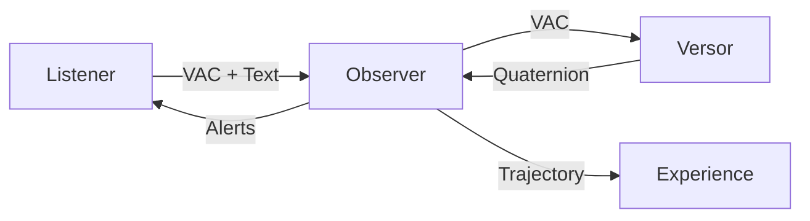

# Integration Points

**Reading Time:** ~20 minutes  
**Audience:** Engineering managers, integration leads  
**Prerequisites:** [Architecture Overview](00-high-level-overview.md)  
**Goal:** Understand how Observer integrates with other L.O.V.E. modules

---

## Overview

Observer sits at the **center** of the L.O.V.E. platform, receiving data from Listener, coordinating with Versor, and providing context to Experience.



---

## Listener Integration

### Data Flow: Listener → Observer

**Endpoint:** `POST /state`

**Request from Listener:**

```json
{
  "user_id": "user123",
  "session_id": "session456",
  "vac": [-0.3, 0.7, -0.2],
  "transcription": "I'm feeling overwhelmed by work deadlines",
  "confidence": 0.92,
  "metadata": {
    "source": "voice",
    "duration_seconds": 45
  }
}
```

**Observer Processing:**

1. Find nearest emotion from 87-emotion atlas
2. Generate semantic embedding
3. Calculate weighted fusion distance
4. Convert VAC to quaternion (via Versor or local)
5. Store in `user_trajectory` table
6. Calculate elasticity/rigidity
7. Check for clinical alerts

**Response to Listener:**

```json
{
  "id": "traj-uuid",
  "emotion": {
    "name": "Overwhelm",
    "category": "When Things Are Uncertain or Too Much",
    "vac": [-0.35, 0.75, -0.25]
  },
  "quaternion": [0.7, -0.2, 0.5, -0.15],
  "metrics": {
    "elasticity": 1.4,
    "rigidity": 2.1
  },
  "alert": null,
  "similar_moments": [
    {
      "timestamp": "2025-12-15T10:30:00Z",
      "emotion": "Stress",
      "similarity": 0.87
    }
  ]
}
```

### Error Handling

**Observer errors Listener must handle:**

- `400` - Invalid VAC coordinates
- `404` - Emotion not found in atlas
- `500` - Database unavailable
- `503` - Observer temporarily unavailable

**Retry strategy:**

```python
# Listener should retry with exponential backoff
max_retries = 3
for attempt in range(max_retries):
    try:
        response = await observer_client.store_state(...)
        break
    except ObserverUnavailable:
        if attempt < max_retries - 1:
            await asyncio.sleep(2 ** attempt)  # 1s, 2s, 4s
        else:
            # Fall back to local storage
            await local_cache.store(state)
```

---

## Versor Integration

### Data Flow: Observer ↔ Versor

**Observer calls Versor:**

**Endpoint:** `POST /convert`

**Request:**

```json
{
  "vac": [0.8, 0.6, 0.7]
}
```

**Response:**

```json
{
  "quaternion": [0.85, 0.35, 0.30, 0.28],
  "validated": true
}
```

### Fallback Strategy

**Observer can work without Versor:**

```python
class QuaternionBuilder:
    def __init__(self, versor_url: str = None, use_http: bool = True):
        self.versor_url = versor_url
        self.use_http = use_http
    
    async def from_vac(self, vac: List[float]) -> List[float]:
        if self.use_http and self.versor_url:
            try:
                # Try Versor first
                return await self._from_vac_http(vac)
            except Exception as e:
                logger.warning(f"Versor unavailable: {e}, using local")
                return self._from_vac_direct(vac)
        else:
            # Use local computation
            return self._from_vac_direct(vac)
```

**Decision matrix:**

- Versor available → Use it (more accurate)
- Versor down → Local computation (acceptable accuracy)
- Versor too slow → Cache + local computation

---

## Experience Integration

### Data Flow: Observer → Experience

**Experience queries Observer for:**

#### 1. Current State

```http
GET /current/{user_id}
```

Response:

```json
{
  "user_id": "user123",
  "current_emotion": "Calm",
  "vac": [0.4, 0.1, 0.5],
  "quaternion": [0.9, 0.2, 0.1, 0.3],
  "timestamp": "2026-01-02T21:00:00Z"
}
```

#### 2. Historical Trajectory

```http
GET /history/{user_id}?limit=100&since=2026-01-01
```

Response:

```json
{
  "user_id": "user123",
  "trajectory": [
    {
      "timestamp": "2026-01-02T09:00:00Z",
      "emotion": "Anxiety",
      "vac": [-0.4, 0.8, -0.3],
      "quaternion": [...]
    },
    // ... more points
  ],
  "total_points": 247,
  "has_more": true
}
```

#### 3. Transition Paths

```http
POST /transitions/path
{
  "from_emotion": "Anger",
  "to_emotion": "Calm",
  "user_id": "user123"
}
```

Response:

```json
{
  "waypoints": [
    {"name": "Anger", "vac": [-0.6, 0.8, -0.4]},
    {"name": "Frustration", "vac": [-0.5, 0.6, -0.2]},
    {"name": "Resignation", "vac": [-0.3, 0.2, 0.0]},
    {"name": "Acceptance", "vac": [0.0, 0.1, 0.3]},
    {"name": "Calm", "vac": [0.4, 0.0, 0.5]}
  ],
  "strategies": [...],
  "total_distance": 2.4,
  "estimated_days": 14
}
```

### WebSocket Integration

**Experience can subscribe to real-time updates:**

```typescript
// Experience connects to Observer's WebSocket
const ws = new WebSocket('ws://observer:8000/ws/session-123');

ws.onmessage = (event) => {
  const data = JSON.parse(event.data);
  
  if (data.type === 'state_update') {
    // Update 3D visualization
    updateSoulSphere(data.quaternion);
  } else if (data.type === 'path_computed') {
    // Render path animation
    animateTransition(data.waypoints);
  }
};
```

---

## API Contract Versioning

### Version Strategy

**Current:** All modules on v1

**Migration plan when breaking changes needed:**

```text
Observer v1: /v1/state, /v1/history (current)
Observer v2: /v2/state, /v2/history (future)

Maintain both for 6 months, then deprecate v1
```

**Semantic versioning for internal APIs:**

```text
1.0.0 → 1.1.0: Add optional fields (backward compatible)
1.1.0 → 2.0.0: Change required fields (breaking change)
```

---

## Integration Testing

### Cross-Module Tests

```python
@pytest.mark.integration
async def test_listener_to_observer_flow():
    """Test complete flow from Listener to Observer"""
    # Simulate Listener sending data
    async with AsyncClient(app=observer_app) as client:
        response = await client.post("/state", json={
            "user_id": "test-user",
            "session_id": "test-session",
            "vac": [-0.3, 0.7, -0.2],
            "transcription": "I'm anxious"
        })
    
    assert response.status_code == 201
    data = response.json()
    
    assert "emotion" in data
    assert "quaternion" in data
    assert len(data["quaternion"]) == 4

@pytest.mark.integration
async def test_observer_to_experience_flow():
    """Test Observer providing data to Experience"""
    # Store some states
    await store_test_trajectory()
    
    # Experience queries history
    async with AsyncClient(app=observer_app) as client:
        response = await client.get("/history/test-user?limit=10")
    
    assert response.status_code == 200
    data = response.json()
    
    assert "trajectory" in data
    assert len(data["trajectory"]) > 0
```

---

## Failure Modes

### Listener Unavailable

**Impact:** Observer can't receive new states  
**Mitigation:** N/A (Observer is passive receiver)  
**Recovery:** Automatic when Listener returns

### Observer Unavailable

**Impact:** Listener can't store states  
**Mitigation:** Listener caches locally, replays when Observer returns  
**Recovery:** Observer processes backlog on startup

### Versor Unavailable

**Impact:** Can't generate quaternions  
**Mitigation:** Observer uses local computation (slightly less accurate)  
**Recovery:** Automatic fallback, no user impact

### Experience Unavailable

**Impact:** Can't visualize data  
**Mitigation:** Observer continues storing (data preserved)  
**Recovery:** Experience re-syncs from Observer on startup

---

## Data Synchronization

### Eventual Consistency Model

**Observer is source of truth for:**

- Emotional trajectories
- Atlas definitions
- Therapeutic strategies

**Other modules cache Observer data:**

- Listener: Caches emotion names (TTL: 1 hour)
- Experience: Caches recent trajectory (TTL: 5 minutes)
- Versor: No caching (stateless computation)

**Cache invalidation:**

```python
# When Observer's atlas changes
await observer_client.notify_atlas_update()

# Listener/Experience invalidate their caches
cache.clear("atlas_emotions")
```

---

## Deployment Dependencies

### Startup Order

```text
1. PostgreSQL (with pgvector)
2. Observer (waits for DB)
3. Versor (independent)
4. Listener (waits for Observer health check)
5. Experience (waits for Observer health check)
```

**Health checks:**

```python
# Observer health endpoint
@router.get("/health")
async def health_check():
    # Check database
    try:
        await db.execute(text("SELECT 1"))
        db_status = "healthy"
    except:
        db_status = "unhealthy"
    
    # Check atlas loaded
    atlas_count = await get_atlas_count()
    
    return {
        "status": "healthy" if db_status == "healthy" else "degraded",
        "database": db_status,
        "atlas_emotions": atlas_count,
        "version": "1.0.0"
    }
```

---

## Monitoring Integration Points

### Metrics to Track

**Inter-module latency:**

- Listener → Observer: Target < 50ms
- Observer → Versor: Target < 30ms
- Observer → Experience: Target < 100ms

**Error rates:**

- Observer 4xx errors: Should be < 1%
- Observer 5xx errors: Should be < 0.1%
- Integration timeouts: Should be < 0.01%

**Data consistency:**

- Trajectory points stored: Should match Listener ingests
- Missing quaternions: Should be 0%
- Failed embeddings: Should be < 0.1%

### Distributed Tracing

```python
# Use OpenTelemetry for cross-module tracing
from opentelemetry import trace

tracer = trace.get_tracer(__name__)

@router.post("/state")
async def store_state(request: StateCreate):
    with tracer.start_as_current_span("observer.store_state") as span:
        span.set_attribute("user_id", request.user_id)
        
        # Emotion matching
        with tracer.start_as_current_span("emotion_matching"):
            emotion = await mapper.find_nearest(...)
        
        # Database write
        with tracer.start_as_current_span("database_write"):
            await db.commit()
        
        return response
```

**Trace visualization:**

```text
Listener.ingest ────────────────────────── 250ms
  └─ Observer.store_state ──────────────── 80ms
      ├─ emotion_matching ────────────── 15ms
      ├─ Versor.convert ──────────────── 30ms
      └─ database_write ──────────────── 10ms
```

---

## Next Steps

**Operational guides:**

- [Monitoring & Operations](../operations/01-monitoring.md)
- [Incident Response](../operations/03-incident-response.md)

**Team planning:**

- [Team Structure](../operations/02-team-structure.md)

**Technical details:**

- [Senior Dev: Deep Dive](../architecture/01-deep-dive.md)
