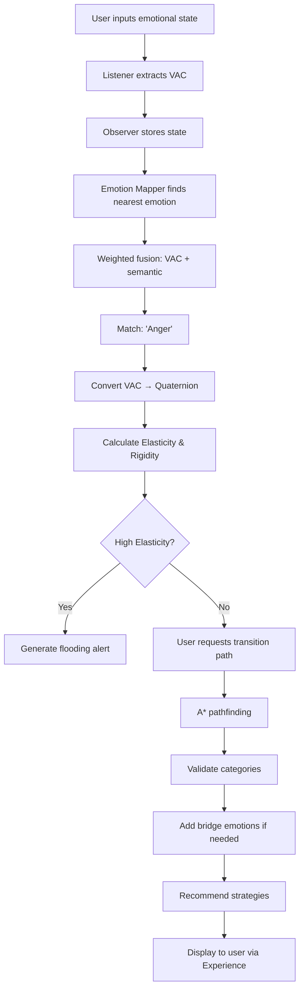

# Key Concepts

**Reading Time:** ~45 minutes
**Audience:** New developers
**Prerequisites:** [Getting Started](01-getting-started.md) and [Codebase Tour](02-codebase-tour.md)
**Goal:** Understand the core concepts that make Observer work

---

## Overview

Observer is built on several foundational concepts. Let's break them down from simple to complex:

1. **The VAC Model** - 3D emotional space
2. **The 87-Emotion Atlas** - Brené Brown's taxonomy
3. **Vector Similarity Search** - Finding similar moments
4. **A* Pathfinding** - Therapeutic navigation
5. **Temporal Metrics** - Elasticity and Rigidity
6. **Therapeutic Strategies** - Evidence-based interventions

---

## 1. The VAC Model

### What is VAC?

Traditional emotion models use **VAD** (Valence, Arousal, Dominance). L.O.V.E. replaces "Dominance" with **Connection** to better capture relational dynamics:

```text
VAC Model:
├─ V: Valence     (X-axis) → How pleasant/unpleasant
├─ A: Arousal     (Y-axis) → Energy level
└─ C: Connection  (Z-axis) → Relational alignment
```

### The Three Axes

#### Valence (X-axis)

**Range:** -1.0 to +1.0

Measures **pleasantness** vs. **unpleasantness**.

```text
-1.0 ←──────────────── 0.0 ──────────────→ +1.0
Miserable         Neutral           Joyful
Anguish           Calm              Delight
Despair           Bored             Ecstatic
```

**Examples:**

- Joy: `+0.8` (highly pleasant)
- Contentment: `+0.4` (mildly pleasant)
- Neutral: `0.0`
- Disappointment: `-0.3` (mildly unpleasant)
- Despair: `-0.9` (highly unpleasant)

#### Arousal (Y-axis)

**Range:** -1.0 to +1.0

Measures **energy level** (activation).

```text
-1.0 ←──────────────── 0.0 ──────────────→ +1.0
Exhausted         Calm            Energized
Sluggish          Steady          Excited
Lethargic         Balanced        Frantic
```

**Examples:**

- Panic: `+0.9` (extremely activated)
- Excitement: `+0.7` (highly activated)
- Contentment: `+0.2` (slightly activated)
- Calm: `0.0` (neutral)
- Sadness: `-0.3` (slightly deactivated)
- Despair: `-0.7` (highly deactivated)

#### Connection (Z-axis) - The Innovation

**Range:** -1.0 to +1.0

Measures **relational alignment** - feeling connected to or separated from others.

```text
-1.0 ←──────────────── 0.0 ──────────────→ +1.0
Isolated        Indifferent        Connected
Alienated       Alone              Belonging
Separated       Independent        United
```

**This is what makes L.O.V.E. different!**

**Examples:**

- Compassion: `+0.7` (deeply connected, shared humanity)
- Pity: `-0.5` (separated, condescension)
- Loneliness: `-0.8` (isolated, disconnected)
- Belonging: `+0.8` (deeply connected)
- Shame: `-0.6` (disconnected from self and others)

### Why Connection > Dominance?

Traditional VAD uses "Dominance" (control over situation):

- "I'm in control" vs. "I'm powerless"
- Works for anger, fear, but fails for social emotions

**Problem with Dominance:**

```text
Compassion: High dominance? Low dominance? Doesn't fit!
Pity: High dominance? Condescending... but not really about control
```

#### Solution: Connection

```text
Compassion: High connection (+0.7) ✅ Shared humanity
Pity: Low connection (-0.5) ✅ Separation, condescension
```

### Visualizing VAC Space

Imagine a 3D cube:

```text
      +V (Joy)
       |
       |     +C (Connected)
       |    /
       |   /
       |  /
       | /
       |/____________ +A (Energized)
      /|
     / |
    /  |
   /   |
-C    -A
(Isolated) (Calm)

-V (Anguish)
```

Every emotion has a specific coordinate in this 3D space!

---

## 2. The 87-Emotion Atlas

### What is the Atlas?

Based on Dr. Brené Brown's *Atlas of the Heart*, the Observer knows **87 distinct emotions** organized into **13 semantic categories**.

### The 13 Categories ("Places We Go")

1. **When Things Are Uncertain or Too Much**
   - Stress, Overwhelm, Anxiety, Fear, Vulnerability, Worry, Avoidance, etc.

2. **When We Compare**
   - Envy, Jealousy, Resentment, Admiration, Schadenfreude, Freudenfreude

3. **When Things Don't Go As Planned**
   - Disappointment, Regret, Discouragement, Resignation, Frustration

4. **When It's Beyond Us**
   - Awe, Wonder, Confusion, Curiosity, Interest, Surprise

5. **When Things Aren't What They Seem**
   - Bittersweetness, Nostalgia, Cognitive Dissonance, Paradox

6. **When We're Hurting**
   - Anguish, Hopelessness, Despair, Sadness, Grief

7. **When We Go With Others**
   - Compassion, Empathy, Pity, Sympathy, Boundaries

8. **When We Fall Short**
   - Shame, Self-Compassion, Perfectionism, Guilt, Humiliation, Embarrassment

9. **When We Search for Connection**
   - Belonging, Fitting In, Connection, Disconnection, Insecurity, Invisibility, Loneliness

10. **When the Heart Is Open**
    - Love, Lovelessness, Heartbreak, Trust, Self-Trust, Betrayal, Defensiveness, Flooding

11. **When Life Is Good**
    - Joy, Happiness, Calm, Contentment, Gratitude, Foreboding Joy, Relief, Tranquility

12. **When We Feel Wronged**
    - Anger, Contempt, Disgust, Dehumanization, Hate, Self-Righteousness

13. **When We Self-Assess**
    - Pride, Hubris, Humility

### Each Emotion Has

```python
{
  "id": "uuid",
  "name": "Compassion",
  "category": "When We Go With Others",
  "vac": [valence, arousal, connection],  # Precise coordinates
  "description": "Feeling with someone...",
  "embedding": [384-dimensional vector],  # For semantic search
  "quaternion": [w, x, y, z],            # Pre-calculated
  "citations": [...],                     # Research references
  "keywords": ["empathy", "care", ...]
}
```

### Why 87? Why Not More/Less?

**Too few (like 6 basic emotions):**

- ❌ Can't distinguish Compassion from Pity
- ❌ Can't distinguish Envy from Jealousy
- ❌ Loses therapeutic nuance

**Too many (like 1000s):**

- ❌ Overwhelming for users
- ❌ Overlapping definitions
- ❌ Hard to maintain

**87 is the "Goldilocks zone":**

- ✅ Captures therapeutic distinctions
- ✅ Evidence-based (Brené Brown's research)
- ✅ Manageable and memorable
- ✅ Covers the emotional spectrum

---

## 3. Vector Similarity Search

### The Problem

Given a new emotional state (VAC coordinates + text), how do we find the closest matching emotion from the 87-emotion atlas?

### Two Distance Metrics

#### Geometric Distance (VAC)

Euclidean distance in 3D space:

```python
def vac_distance(vac1, vac2):
    """
    Calculate Euclidean distance between two VAC coordinates.

    Example:
    vac1 = [0.8, 0.6, 0.7]  # Joy
    vac2 = [0.75, 0.55, 0.65]  # Happiness

    distance = sqrt((0.8-0.75)² + (0.6-0.55)² + (0.7-0.65)²)
             = sqrt(0.0025 + 0.0025 + 0.0025)
             = sqrt(0.0075)
             = 0.087
    """
    return sqrt(
        (vac1[0] - vac2[0])**2 +  # Valence difference
        (vac1[1] - vac2[1])**2 +  # Arousal difference
        (vac1[2] - vac2[2])**2    # Connection difference
    )
```

**Fast but:** Only considers numbers, ignores meaning.

#### Semantic Distance (Embeddings)

Uses 384-dimensional vectors from sentence-transformers:

```python
def semantic_distance(embedding1, embedding2):
    """
    Cosine distance between semantic embeddings.

    Captures meaning:
    "I feel compassionate" vs "I feel pity"
    → Different semantic meanings despite similar words
    """
    return 1 - cosine_similarity(embedding1, embedding2)
```

**Slow but:** Captures semantic meaning.

### Weighted Fusion (The Secret Sauce!)

Observer combines both approaches:

```python
def find_nearest_emotion(vac, text):
    # Count words
    word_count = len(text.split())

    if word_count < 10:
        # Short text: Trust VAC scalars more
        # (LLM had clear emotional signal)
        vac_weight = 0.8
        semantic_weight = 0.2
    else:
        # Long text: Trust semantic embedding more
        # (Richer semantic context)
        vac_weight = 0.4
        semantic_weight = 0.6

    # Calculate distances
    vac_dist = calculate_vac_distance(vac, emotion.vac)
    sem_dist = calculate_semantic_distance(text_emb, emotion.emb)

    # Weighted fusion
    final_distance = (vac_weight * vac_dist) + (semantic_weight * sem_dist)

    # Return emotion with minimum distance
    return min(emotions, key=lambda e: final_distance(e))
```

**Why this works:**

- Short text ("I'm angry") → VAC is reliable
- Long text (paragraph) → Semantic embedding captures nuance

### pgvector and HNSW Indexing

**Problem:** Searching through 87 emotions is fast. But searching through millions of trajectory points is slow!

**Solution:** pgvector with HNSW (Hierarchical Navigable Small Worlds) indexing.

```sql
-- Create HNSW index on embedding column
CREATE INDEX ON user_trajectory
USING hnsw (embedding vector_cosine_ops);

-- Now queries are sub-50ms even with 1M+ rows!
SELECT * FROM user_trajectory
ORDER BY embedding <=> query_embedding
LIMIT 5;
```

**HNSW is like:**

- A highway system for vector space
- Jump to approximate regions quickly
- Refine search locally
- 100x faster than brute force

---

## 4. A* Pathfinding for Emotional Transitions

### The Problem

How do you get from **Anger** to **Contentment** therapeutically?

You can't just teleport! There are emotional transitions that:

- ✅ Work well (Anger → Frustration → Resignation → Acceptance → Contentment)
- ❌ Don't work (Anger → Joy - too far, not sustainable)

### A* Algorithm Basics

**A\*** finds the optimal path through a graph. For Observer:

```text
Graph:
- Nodes = 87 Emotions
- Edges = Valid transitions between emotions
- Cost = VAC distance + therapeutic validity
```

**Formula:**

```text
f(n) = g(n) + h(n)

Where:
g(n) = Actual cost from start to current node
h(n) = Heuristic cost from current to goal
```

**Example:**

```text
Start: Anger [V:-0.6, A:0.8, C:-0.4]
Goal:  Contentment [V:0.6, A:0.1, C:0.5]

Step 1: At Anger
  Neighbors: Frustration, Contempt, Defensiveness

  Evaluate Frustration:
  g(Frustration) = distance(Anger → Frustration) = 0.3
  h(Frustration) = distance(Frustration → Contentment) = 1.2
  f(Frustration) = 0.3 + 1.2 = 1.5

Step 2: Move to Frustration (best f-score)
  Neighbors: Disappointment, Resignation, Stress

  Evaluate Resignation:
  g(Resignation) = 0.3 + distance(Frustration → Resignation) = 0.6
  h(Resignation) = distance(Resignation → Contentment) = 0.7
  f(Resignation) = 0.6 + 0.7 = 1.3  ← Best!

Continue until reaching Contentment...
```

**Final Path:**

```text
Anger → Frustration → Resignation → Acceptance → Calm → Contentment
```

### Constraints: Category Boundaries

Not all transitions are valid! The Observer respects **category boundaries**:

```python
# Some category transitions are allowed:
"When We Feel Wronged" → "When Things Don't Go As Planned" ✅
(Anger → Frustration)

# Others require bridge emotions:
"When We Feel Wronged" → "When Life Is Good" ❌
(Anger → Joy requires intermediate states)
```

### Bridge Emotions

**Bridge emotions** help with difficult transitions:

- **Curiosity** - Bridges many categories
- **Vulnerability** - Opens to deeper emotions
- **Self-Compassion** - Transforms shame
- **Bittersweetness** - Acknowledges complexity

**Example:**

```text
Shame → Self-Compassion → Vulnerability → Connection → Belonging
       ↑ Bridge emotion
```

### Arousal Regulation

The Observer can insert **arousal regulation waypoints**:

```text
High Arousal Path:
Panic [A:+0.9] → Overwhelm [A:+0.7] → Stress [A:+0.5] → Calm [A:0.0]
                 ↑ Gradual de-escalation
```

---

## 5. Temporal Metrics

### Elasticity: Speed of Change

**Formula:**

```text
E = θ / Δt

Where:
θ (theta) = Angular distance between quaternions
Δt = Time elapsed
```

**Interpretation:**

- **High elasticity (E > 2.0)**: Rapid emotional changes (possibly flooding)
- **Normal elasticity (0.5 < E < 2.0)**: Healthy emotional flow
- **Low elasticity (E < 0.5)**: Stable emotional state

**Example:**

```python
# State 1: Calm [0.3, 0.1, 0.4] at t=0s
# State 2: Panic [−0.7, 0.9, −0.3] at t=60s

# Angular distance (quaternion math):
theta = 2.8 radians (about 160°)

# Elasticity:
E = 2.8 / 60 = 0.047 rad/s

# But if this happened in 10 seconds:
E = 2.8 / 10 = 0.28 rad/s → High elasticity! ⚠️
```

**Clinical Use:**

- E > 2.0 → Flag for flooding, suggest grounding
- E < 0.1 for extended period → Flag for stuckness

### Rigidity: Resistance to Change

**Formula:**

```text
R = 1 / Variance(q₁, q₂, ..., qₙ)

Where:
q₁, q₂, ... = Sequence of quaternions
Variance = Spread of quaternion states
```

**Interpretation:**

- **High rigidity (R > 5.0)**: Stuck in emotional pattern
- **Normal rigidity (1.0 < R < 5.0)**: Healthy variation
- **Low rigidity (R < 1.0)**: High emotional flexibility

**Example:**

```python
# Last 10 states all around Shame [−0.6, −0.3, −0.7]
# Very low variance in quaternion space

variance = 0.02
R = 1 / 0.02 = 50 → Very high rigidity! ⚠️

# Clinical interpretation:
# "Stuck in shame spiral"
```

**Clinical Use:**

- High rigidity + negative valence → Depression/shame spiral alert
- High rigidity + positive valence → Possible denial/avoidance

---

## 6. Therapeutic Strategies

### What Are Strategies?

**107 evidence-based interventions** from:

- **ACT** (Acceptance and Commitment Therapy)
- **DBT** (Dialectical Behavior Therapy)
- **CBT** (Cognitive Behavioral Therapy)
- **Mindfulness** practices
- **Somatic** techniques
- **Creative** expression

### Strategy Categories

```python
STRATEGY_CATEGORIES = {
    "ACT": [
        "Cognitive Defusion",
        "Acceptance",
        "Present Moment Awareness",
        "Self-as-Context",
        "Values Clarification",
        "Committed Action"
    ],
    "DBT": [
        "Distress Tolerance",
        "Emotion Regulation",
        "Interpersonal Effectiveness",
        "Mindfulness"
    ],
    "CBT": [
        "Cognitive Restructuring",
        "Behavioral Activation",
        "Exposure Therapy"
    ],
    # ... more
}
```

### Strategy Matching

**Pattern-based matching:**

```python
# Example: Anger → Calm transition
pattern = identify_pattern(from_emotion="Anger", to_emotion="Calm")
# Returns: "anger_regulation"

strategies = get_pattern_strategies("anger_regulation")
# Returns:
# - Deep Breathing (Somatic)
# - Cognitive Restructuring (CBT)
# - Grounding Techniques (DBT)
# - Physical Movement (Somatic)
```

**Universal strategies:**

Some strategies work for many transitions:

- Mindful Breathing
- Grounding (5-4-3-2-1)
- Journaling
- Walking in Nature

### Evidence Base

Each strategy includes:

```python
{
  "name": "Cognitive Defusion",
  "description": "Notice thoughts without being controlled by them",
  "technique": "Observe your thoughts like clouds passing...",
  "evidence_base": "Hayes et al. (2006), RCT n=234",
  "effectiveness": 0.82,  # Effect size
  "when_to_use": ["rumination", "anxiety", "anger"],
  "contraindications": ["active psychosis"]
}
```

---

## 7. Putting It All Together

### A Complete Observer Flow



### Real-World Example

**Scenario:** User says "I'm furious at my coworker for taking credit for my work"

**Observer Processing:**

1. **Receive from Listener:**

   ```json
   {
     "vac": [-0.6, 0.8, -0.4],
     "text": "I'm furious at my coworker for taking credit for my work"
   }
   ```

2. **Find Nearest Emotion:**

   ```python
   # Calculate distances
   Anger: vac_dist=0.12, sem_dist=0.08 → final=0.11
   Contempt: vac_dist=0.25, sem_dist=0.15 → final=0.22
   Betrayal: vac_dist=0.35, sem_dist=0.12 → final=0.28

   # Match: Anger ✅
   ```

3. **Store in Trajectory:**

   ```sql
   INSERT INTO user_trajectory (
     user_id, vac, quaternion, emotion_id, ...
   ) VALUES (...);
   ```

4. **Calculate Metrics:**

   ```python
   # Previous state was Frustration 2 hours ago
   elasticity = calculate_elasticity(
     prev_quaternion, curr_quaternion, time_delta=7200
   )
   # E = 1.2 rad/s → Normal (no flooding)
   ```

5. **User Requests Path to Contentment:**

   ```python
   path = await path_planner.find_transition_path(
     from_emotion="Anger",
     to_emotion="Contentment",
     user_id="user123"
   )
   ```

6. **A* Returns Path:**

   ```text
   Anger → Frustration → Resignation → Acceptance → Calm → Contentment
   ```

7. **Recommend Strategies:**

   ```python
   # For Anger → Frustration:
   - Deep Breathing (calm arousal)
   - Physical Movement (discharge energy)
   - Journaling (process thoughts)

   # For Resignation → Acceptance:
   - ACT: Acceptance practice
   - Mindfulness: Present moment awareness
   ```

---

## Key Takeaways

1. **VAC Model**: 3D emotional space with Connection (not Dominance)
2. **87 Emotions**: Evidence-based taxonomy, therapeutically nuanced
3. **Weighted Fusion**: Combines geometric + semantic distance
4. **A* Pathfinding**: Respects category boundaries, uses bridges
5. **Temporal Metrics**: Elasticity (speed) and Rigidity (resistance)
6. **Therapeutic Strategies**: 107 evidence-based interventions

---

## Common Misconceptions

### ❌ "VAC is just a label"

✅ VAC is a precise coordinate in 3D space that enables mathematical operations

### ❌ "Emotions are discrete states"

✅ Emotions are continuous points in VAC space

### ❌ "You can transition from any emotion to any other"

✅ Some transitions require intermediate steps (bridge emotions)

### ❌ "Distance in VAC space = semantic similarity"

✅ We use weighted fusion because they measure different things

### ❌ "Observer just stores data"

✅ Observer actively calculates metrics, finds patterns, recommends paths

---

## Next Steps

Now you understand the concepts! Time to learn practical skills:

**Continue to:** [Common Tasks →](04-common-tasks.md)

You'll learn:

- How to add a new emotion
- How to modify strategies
- How to create database migrations
- How to test vector search
- And more!

---

**Questions?** The concepts are complex! Ask in Slack #observer-module or review the [Senior Developer Deep Dives](../architecture/01-deep-dive.md).
