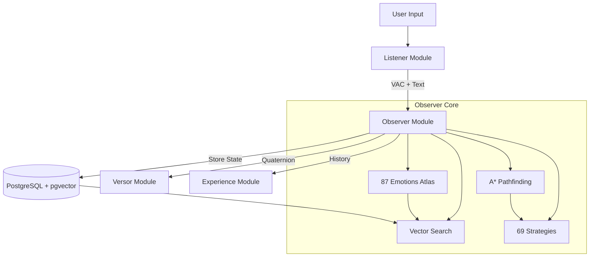

# Observer Module

**The Memory and Context Engine of L.O.V.E.**

---

## What is the Observer?

The **Observer** is the mnemonic core of the L.O.V.E. platform—the system's memory, context provider, and emotional navigator. If the Experience module is the visualization layer and the Listener is the sensory interface, the Observer serves as the **hippocampus**, maintaining:

- 🧠 **State Persistence** - Your emotional trajectory over time
- 🗺️ **Digital Atlas** - 87 emotions from Brené Brown's *Atlas of the Heart*
- 🔍 **Semantic Search** - Finding patterns and similar past moments
- 🎯 **Therapeutic Pathfinding** - A* navigation through emotional space with 69 evidence-based strategies across 7 categories

---

## Key Innovations

### The VAC Model

Observer implements the **Valence-Arousal-Connection (VAC)** model, replacing traditional "Dominance" with **Connection** to better capture relational dynamics:

| Axis | Range | Meaning |
|------|-------|---------|
| **Valence** (X) | -1.0 to +1.0 | Pleasure vs. displeasure |
| **Arousal** (Y) | -1.0 to +1.0 | Energy level (calm vs. activated) |
| **Connection** (Z) | -1.0 to +1.0 | Relational alignment (disconnected vs. connected) |

This enables critical distinctions like **Compassion** (+Connection) vs. **Pity** (-Connection).

### Unified Memory Architecture

Unlike systems that separate metadata (PostgreSQL) from vectors (Pinecone/Milvus), Observer uses **PostgreSQL + pgvector** as a single data store, eliminating:

- Dual-write consistency issues
- Network round-trips between systems
- Complex synchronization logic

### Therapeutic Navigation

Observer's **A* pathfinding** algorithm plans evidence-based emotional transitions, respecting:

- Category boundaries (13 semantic groupings)
- Bridge emotions for difficult transitions
- 69 therapeutic strategies from ACT, DBT, CBT, and more

---

## Technology Stack

- **Database:** PostgreSQL 18 with pgvector extension
- **Vector Search:** HNSW indexing for sub-50ms queries
- **Framework:** FastAPI with async SQLAlchemy
- **Language:** Python 3.12
- **Migrations:** Alembic
- **Real-time:** WebSocket for chat functionality

---

## Documentation by Audience

### 👨‍💼 For Executives

High-level overviews, business value, and strategic roadmap.

- [Overview](overview/01-executive-summary.md) - What is Observer and why it matters
- [Business Value](overview/02-business-value.md) - Key innovations and competitive advantages
- [Roadmap](overview/03-roadmap.md) - Current capabilities and future plans

### 👔 For Managers

Architecture, integration, and operational guidance.

- [Architecture Overview](architecture/00-high-level-overview.md) - High-level system design
- [Integration Points](operations/../architecture/10-integration-points.md) - How Observer connects to other modules
- [Monitoring & Operations](operations/01-monitoring.md) - Health metrics and monitoring
- [Team Structure](operations/02-team-structure.md) - Roles and responsibilities
- [Incident Response](operations/03-incident-response.md) - Troubleshooting and recovery

### 🎓 For Senior Developers

Deep technical dives, algorithms, and architecture decisions.

- [Deep Dive Architecture](architecture/01-deep-dive.md) - FastAPI + async patterns
- [Database Architecture](architecture/02-database-architecture.md) - PostgreSQL + pgvector design
- [Vector Search](architecture/03-vector-search.md) - HNSW and similarity algorithms
- [Transition System](architecture/04-transition-system.md) - A* pathfinding implementation
- [WebSocket & Real-time](architecture/05-websocket-realtime.md) - Chat and real-time features
- [Performance Optimization](architecture/06-performance-optimization.md) - Query tuning and caching
- [Extending Observer](architecture/07-extending-observer.md) - Adding features and emotions
- [Troubleshooting](architecture/08-troubleshooting.md) - Debugging and problem-solving
- [Architecture Decisions](architecture/09-architecture-decisions.md) - Why we chose what we did

### 👨‍💻 For Junior Developers

Getting started, concepts, and common tasks.

- [Getting Started](guides/01-getting-started.md) - Setup and first query
- [Codebase Tour](guides/02-codebase-tour.md) - File structure and organization
- [Key Concepts](guides/03-key-concepts.md) - VAC model, emotions, and pathfinding
- [Common Tasks](guides/04-common-tasks.md) - How to add emotions, strategies, etc.
- [Testing Guide](guides/05-testing-guide.md) - Writing and running tests
- [First Contribution](guides/06-first-contribution.md) - Making your first PR

### 📚 Reference Documentation

Complete API reference, configuration, and glossary.

- [API Reference](reference/api-reference.md) - All endpoints with examples
- [Configuration](reference/configuration.md) - Environment variables and settings
- [Error Codes](reference/error-codes.md) - Complete error catalog
- [Glossary](reference/glossary.md) - Observer-specific terminology

---

## Quick Links

### Getting Started

- [Installation](guides/01-getting-started.md#prerequisites-checklist)
- [Database Setup](guides/01-getting-started.md#step-2-database-setup)
- [First Query](guides/01-getting-started.md#step-4-install-dependencies)

### Core Concepts

- [87 Emotions Atlas](guides/03-key-concepts.md#2-the-87-emotion-atlas)
- [VAC Model](guides/03-key-concepts.md#1-the-vac-model)
- [Vector Search](guides/03-key-concepts.md#3-vector-similarity-search)
- [A* Pathfinding](guides/03-key-concepts.md#4-a-pathfinding-for-emotional-transitions)

### Integration

- [With Listener](operations/../architecture/10-integration-points.md#listener-integration)
- [With Versor](operations/../architecture/10-integration-points.md#versor-integration)
- [With Experience](operations/../architecture/10-integration-points.md#experience-integration)

---

## Architecture Diagram

---

## Key Metrics

The Observer tracks and calculates:

- **Elasticity (E)** - Speed of emotional change: `E = θ / Δt`
- **Rigidity (R)** - Resistance to change: `R = 1 / Variance(q₁, q₂, ..., qₙ)`
- **Flooding Detection** - High elasticity alerts
- **Stuckness Detection** - High rigidity in negative states

---

## Success Criteria

Observer is working correctly when:

1. ✅ **Compassion vs. Pity test passes** - Connection axis distinguishes them
2. ✅ **Vector search < 50ms** - Even with 1M+ trajectory points
3. ✅ **Path quality is therapeutic** - A* produces valid emotional transitions
4. ✅ **No data leakage** - Row-level security enforced
5. ✅ **Temporal continuity** - Can reconstruct emotional journey over any time range

---

## What Makes Observer Different

Traditional mood trackers:

- ❌ Store discrete ratings (1-10 scales)
- ❌ Use fixed labels (happy/sad/angry)
- ❌ Calculate simple averages

**Observer:**

- ✅ Stores continuous VAC vectors in 3D space
- ✅ Maps to 87 nuanced emotions dynamically
- ✅ Calculates quaternion-based "emotional work"
- ✅ Finds semantic similarities across time
- ✅ Provides therapeutic transition paths

---

## Contributing

Ready to contribute? Start with:

1. [Getting Started Guide](guides/01-getting-started.md) - Set up your development environment
2. [Codebase Tour](guides/02-codebase-tour.md) - Understand the structure
3. [First Contribution](guides/06-first-contribution.md) - Make your first PR

---

## Support

- **Issues:** [GitHub Issues](https://github.com/jrgochan/l_o_v_e/issues)
- **Discussions:** Project Slack #observer-module
- **Docs:** You're reading them! 📖

---

**Next Steps:** Choose your audience level above to dive into the documentation that's right for you!
