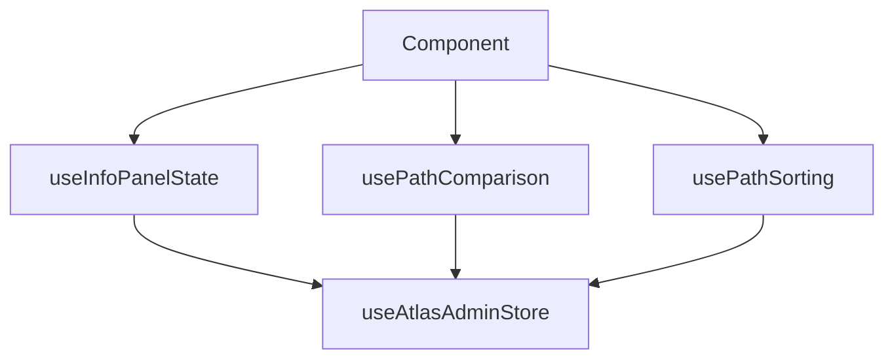

# Custom Hooks System

**L.O.V.E. Experience - React Custom Hooks**

---

## 📚 Hook Inventory

### Admin Hooks (`hooks/admin/`) - 6 hooks

**1. useInfoPanelState**

- **Purpose:** InfoPanel tab state, waypoint selection, display logic
- **Returns:** Tab state, selected waypoint, display path/emotion, selectedPaths
- **Use when:** Building InfoPanel features

**2. usePathComparison**

- **Purpose:** Compare multiple paths, find shortest/longest/easiest
- **Returns:** Comparison metrics, trade-off analysis
- **Use when:** Displaying multi-path comparisons

**3. usePathSorting**

- **Purpose:** Sort paths by distance with special badges
- **Returns:** Sorted paths, badge indicators
- **Use when:** Displaying path lists

**4. useEmotionSearch**

- **Purpose:** Filter emotions by search query
- **Returns:** Filtered emotions, search state
- **Use when:** Building search features

**5. useCategoryState**

- **Purpose:** Manage category expansion and grouping
- **Returns:** Expanded categories, emotion groups, selection states
- **Use when:** Building category browsers

**6. useStatistics** ⭐ NEW

- **Purpose:** Fetch path statistics from API, manage cache
- **Returns:** Stats data, loading state, cache operations
- **Use when:** Displaying statistics or metrics

---

### Chat Hooks (`hooks/chat/`) - 5 hooks

**7. useChatMessages**

- **Purpose:** Message state management, auto-scroll
- **Returns:** Messages array, add/clear functions
- **Use when:** Building chat message displays

**8. useHeartbeatProgress**

- **Purpose:** Progress tracking with simulation
- **Returns:** Progress state, stages, percentage
- **Use when:** Showing analysis progress

**9. useSessionMetrics**

- **Purpose:** Track session metrics (time, emotions, alerts)
- **Returns:** Metrics object, update functions
- **Use when:** Displaying session analytics

**10. useAnalysisState**

- **Purpose:** Manage current analysis data
- **Returns:** Current analysis, multi-emotion data, clear functions
- **Use when:** Coordinating analysis display

**11. useChatLayout**

- **Purpose:** Chat panel expansion/resize logic
- **Returns:** Layout state, resize handlers, toggle functions
- **Use when:** Managing chat panel layout

---

### Visualization Hooks (`hooks/visualization/`) - 1 hook

**12. useMatrixData**

- **Purpose:** Process data for path matrix visualization
- **Returns:** Sorted emotions, categories, cell colors, statistics
- **Use when:** Building matrix visualizations

---

## 🎯 When to Create a New Hook

### ✅ Create a Hook When:

1. **Complex State Logic** - Multiple useState/useEffect calls
2. **API Calls** - Fetching data from backend
3. **Reusable Logic** - Could be used in multiple components
4. **Testability** - Want to test logic independently
5. **Performance** - Need to optimize with useMemo/useCallback

### ❌ Don't Create a Hook When:

1. **Simple State** - Single useState is enough
2. **Component-Specific** - Only used once, not complex
3. **Pure UI** - Just rendering logic, no state
4. **Premature** - Wait until complexity warrants it

---

## 📖 Hook Patterns

### Pattern 1: State Management Hook

```typescript
export function useFeatureState() {
  const [state, setState] = useState(...);
  const [otherState, setOtherState] = useState(...);

  const derivedValue = useMemo(() => {
    return complexCalculation(state);
  }, [state]);

  return {
    state,
    otherState,
    derivedValue,
    updateState: setState
  };
}
```

**Examples:** useInfoPanelState, useCategoryState, useChatLayout

### Pattern 2: API Hook

```typescript
export function useAPIData() {
  const [data, setData] = useState(null);
  const [loading, setLoading] = useState(true);
  const [error, setError] = useState(null);

  useEffect(() => {
    fetchData().then(setData).catch(setError);
  }, []);

  return { data, loading, error, refetch };
}
```

**Examples:** useStatistics

### Pattern 3: Data Processing Hook

```typescript
export function useDataProcessing(input) {
  const processed = useMemo(() => {
    return heavyComputation(input);
  }, [input]);

  return { processed, helpers };
}
```

**Examples:** useMatrixData, usePathComparison, usePathSorting

---

## 🔧 Best Practices

### 1. Clear Return Interface

```typescript
// ✅ Good - clear, documented return
interface UseFeatureReturn {
  data: Data | null;
  loading: boolean;
  error: string | null;
  refresh: () => void;
}

export function useFeature(): UseFeatureReturn {
  // ...
}
```

### 2. Dependency Arrays

```typescript
// ✅ Good - specific dependencies
useEffect(() => {
  doSomething(specificValue);
}, [specificValue]);

// ❌ Avoid - missing dependencies or empty array when not appropriate
useEffect(() => {
  doSomething(value);
}, []); // Missing dependency!
```

### 3. Cleanup

```typescript
// ✅ Good - cleanup on unmount
useEffect(() => {
  const interval = setInterval(fetch, 1000);
  return () => clearInterval(interval);
}, []);
```

### 4. TypeScript

```typescript
// ✅ Good - fully typed
interface UseFeatureOptions {
  enabled: boolean;
  interval?: number;
}

export function useFeature(options: UseFeatureOptions): UseFeatureReturn {
  // ...
}
```

---

## 🧪 Testing Hooks

### Recommended Approach:

```typescript
import { renderHook, act } from "@testing-library/react";
import { useFeature } from "./useFeature";

describe("useFeature", () => {
  it("should initialize with default state", () => {
    const { result } = renderHook(() => useFeature());
    expect(result.current.data).toBeNull();
    expect(result.current.loading).toBe(true);
  });

  it("should fetch data on mount", async () => {
    const { result, waitForNextUpdate } = renderHook(() => useFeature());
    await waitForNextUpdate();
    expect(result.current.data).toBeDefined();
  });
});
```

### Priority Testing Targets:

1. **useStatistics** - API mocking, state management
2. **useMatrixData** - Data processing algorithms
3. **usePathComparison** - Comparison logic

---

## 📊 Hook Dependencies



Most hooks depend on Zustand stores for global state.

---

## 🚀 Adding a New Hook

### Step-by-Step:

1. **Determine Category**
   - Admin UI logic? → `hooks/admin/`
   - Chat feature? → `hooks/chat/`
   - Data processing? → `hooks/visualization/`
   - General utility? → `hooks/` (root)

2. **Name It Clearly**
   - `use` + `Feature` + `Purpose`
   - Examples: useEmotionSearch, useMatrixData, useStatistics

3. **Define Interface**

   ```typescript
   interface UseFeatureOptions {
     /* params */
   }
   interface UseFeatureReturn {
     /* returns */
   }
   ```

4. **Implement**
   - Extract logic from component
   - Add TypeScript types
   - Write JSDoc comments

5. **Test** (if critical)
   - Write unit tests
   - Mock API calls
   - Test edge cases

6. **Document**
   - Add to this README
   - Add JSDoc with examples
   - Update ARCHITECTURE.md if significant

---

## 💡 Pro Tips

1. **Start Simple** - Don't extract to hook prematurely
2. **Test Logic** - Hooks make business logic testable
3. **Compose Hooks** - Hooks can use other hooks
4. **Document Well** - Future you will appreciate it
5. **Keep Focused** - One concern per hook

---

**Hook System Status:** ✅ Well-Designed  
**Count:** 12 custom hooks  
**Quality:** ⭐⭐⭐⭐⭐ Production-Ready
